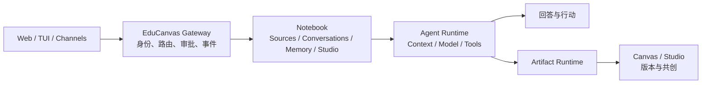
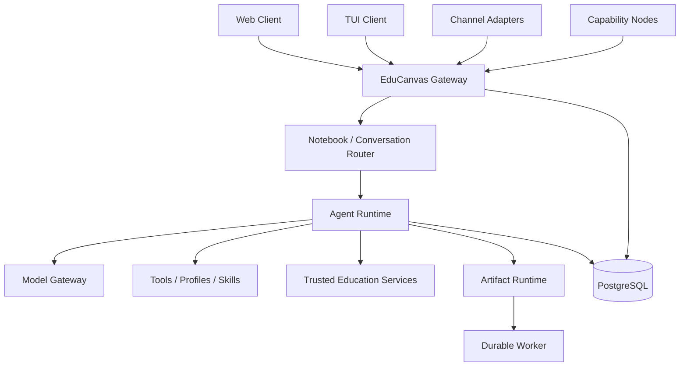
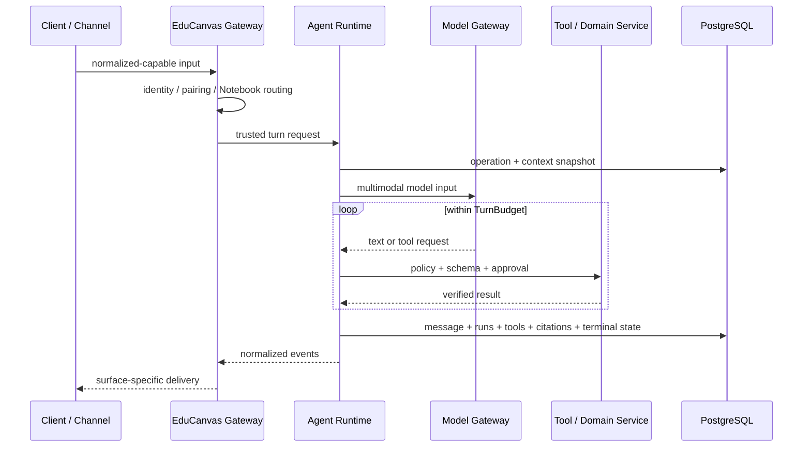
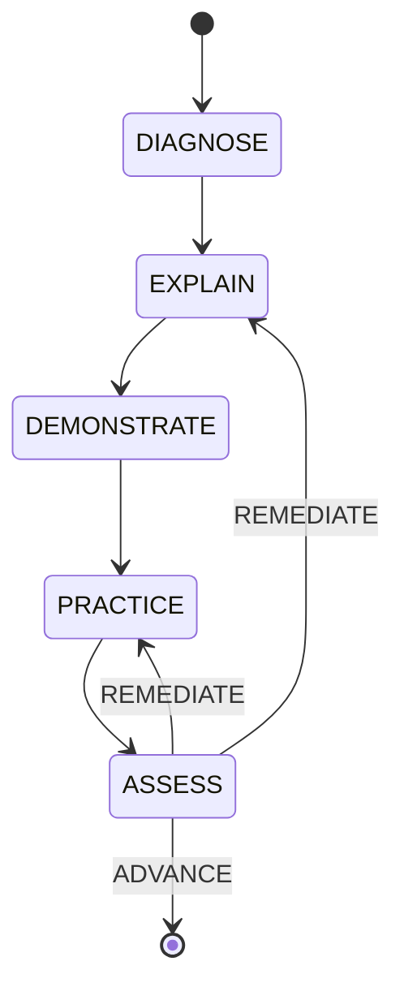

# EduCanvas

<p align="center">
  <strong>Education-first · Personal Agent · Gateway · Notebook · Safe Artifacts</strong>
</p>

<p align="center">
  
  
  
  
  
  <a href="https://github.com/Timcai06/EduCanvas/actions/workflows/ci.yml"></a>
</p>

EduCanvas 是一个**以教育能力为核心的通用个人 Agent 平台**。每个自然人用户拥有自己的长期 Agent，通过 Web、TUI 和受控消息渠道与它协作；家庭与班级通过共享 Notebook 和角色授权协作，但不共享 Agent 身份、私人记忆或默认工具权限。

仓库同时交付浙江省大学生人工智能竞赛 **JBGS-2026-02：多模态 K12 人工智能通识课教学助手对话智能体**。教育是平台默认且最完整的能力域；K12 是首个正式 Profile 和当前工程验证纵切，但通用 Gateway、Runtime、Notebook 与 Artifact 不依赖课程状态。

> **北极星目标**：用户可以从任意受信入口访问同一个长期个人 Agent，让它理解自己的资料和学习状态，使用受控工具完成任务，并持续沉淀可恢复的知识、记忆与产物。

## 当前状态

当前是一个可本地运行的模块化单体，已经越过静态原型阶段，但尚未进入 production。

| 已落地                                                    | 有意保留的兼容层                             | 尚未完成                                   |
| --------------------------------------------------------- | -------------------------------------------- | ------------------------------------------ |
| `gateway.v1`、云端 Gateway、持久 Operation/恢复/审批      | Web 继续输出原 `schemaVersion=1` SSE         | 正式用户 IdP 与自助账号恢复                |
| User/Personal Agent、私人/共享 Notebook Membership 与审计 | 匿名 Web 身份映射为受限兼容主体              | 摘要、长期学习者记忆和完整 Context Engine  |
| 唯一 `AgentLoopEngine`，通用与 K12 通过 Profile/回调配置  | K12 课程账本仍保留教育领域专用表             | 原生图片、音频、视频 Provider 输入         |
| Web、交互式 TUI、实验性 Telegram 私聊适配器               | Telegram 只有离线官方协议 Fixture，未做 live | 微信/QQ 等渠道的正式扫码授权与生产验证     |
| 可选 Capability Node：配对、心跳、撤销、只读文件能力      | Node 使用出站 bearer session；不开放主机入站 | L2/L3 高风险设备动作及审批后续执行         |
| Sources/引用、Artifact/Studio、Worker、可信学习事实       | Asset 与 Source/Chunk 仍有迁移期双链         | production SLO、外部指标后端与对象删除闭环 |

当前事实以 [开发文档中心](docs/README.md)、已接受 ADR 与 Schema 为准；2026-07-16 的长篇技术报告已转为[历史快照](docs/00-overview/snapshots/2026-07-16-project-technical-report.md)，不再双重维护当前状态。

## 产品交互模型



- Chat 是主要协作方式，但 Web 不是唯一入口；
- Web 提供完整 Sources、Studio 和 Canvas，TUI/渠道按能力返回摘要、媒体、卡片或深链接；
- 用户可以通过输入栏 `+` 添加本轮附件、长期资产或显式创建产物；
- Agent 只能调用 Runtime 暴露并授权的工具；
- Artifact 通过严格 Schema 和可信 Renderer 渲染，不执行模型生成的任意 HTML、JavaScript 或 GSAP；
- K12 状态、掌握度和判分只由可信服务端事件更新。

## 快速开始

### 环境要求

- Node.js 22；
- pnpm 10；
- Docker Desktop 或兼容 Docker Runtime。

### 1. 准备环境

```bash
git clone https://github.com/Timcai06/EduCanvas.git
cd EduCanvas
cp .env.example .env
```

`.env.example` 已包含本地 PostgreSQL 默认值。若要启用真实模型，在 `.env` 中填写服务端变量；不要使用 `NEXT_PUBLIC_*`，不要提交真实 Key。

```dotenv
EDUCANVAS_DEPLOYMENT_ENV=local
MODEL_GATEWAY_PROVIDER=deepseek
MODEL_GATEWAY_ALLOW_DEEPSEEK=true
MODEL_GATEWAY_BASE_URL=https://api.deepseek.com
MODEL_GATEWAY_API_KEY=<your-key>
MODEL_GATEWAY_PRIMARY_MODEL=<explicit-model-id>
```

### 2. 安装、迁移和启动

```bash
make setup
make all
```

- `make all`：启动全部已启用的非交互服务；
- `make dev`：进入 Web 验证环境，服务就绪后打开浏览器；
- `make tui`：进入交互式 TUI，不需要填写用户 ID、Conversation ID 或共享 bootstrap token；
- 三个入口都会确认数据库和迁移，并复用已经运行的正确服务；不会擅自终止占用端口的其他进程；
- Web：<http://localhost:3101>
- Gateway：<http://127.0.0.1:3200>（本地 loopback onboarding 自动开放第一方 Client；远程部署仍需正式认证）
- PostgreSQL：`localhost:5432`
- 停止数据库并保留数据：`make stop`
- 查看全部命令：`make help`

### Windows 原生启动

Windows 用户不需要安装 GNU make。首次运行在 PowerShell 执行：

```powershell
corepack enable
pnpm install --frozen-lockfile
Copy-Item .env.example .env
pnpm env:check
```

需要 DeepSeek 时，可参考 `.env.local.example.deepseek`，把变量合并到 `.env`，
再填写真实的 `MODEL_GATEWAY_API_KEY`。真实 Key 只放在本地 `.env`，不要提交。

之后双击根目录的 `Start EduCanvas.cmd`。它会检查端口、准备数据库、按迁移文件
指纹决定是否执行迁移，并把日志路径打印出来；`.env` 值允许使用成对的单引号或
双引号包裹。常用参数可以从命令行传入：

```powershell
.\start-educanvas.ps1 -NoOpen
.\start-educanvas.ps1 -SkipMigrate
.\start-educanvas.ps1 -Port 3102
```

停止 Web、Gateway、Worker 并停止数据库（数据卷保留）：

```powershell
.\stop-educanvas.ps1
```

如果只想停止应用、继续保留数据库运行，使用 `-KeepDb`。启动脚本只会停止
自己记录的进程树，不会误杀其他项目的 Node 服务。后台日志默认位于项目根目录
的 `.educanvas-local.log` 和 `.educanvas-local.err.log`。

如果启动失败，先运行：

```bash
make doctor
```

Windows 等价检查命令是 `pnpm env:check`；它会指出缺失的环境变量，而不会输出
任何密钥或供应商响应正文。跨平台项目脚本也可以直接使用：

```bash
pnpm setup:local
pnpm start:local
```

进入 TUI：

```bash
make tui
```

Web 是 K12 学生的主入口；TUI 是共享同一 Agent、Notebook 与 Conversation 的高级第一方客户端。渠道连接和停用已由 Web `/settings` 与 TUI `/channels` 共同管理同一份 Gateway 状态。Telegram 保留为实验性 Adapter，不默认启动；真实微信/QQ 因平台资格与凭据未就绪而明确 disabled，不用假二维码或手工数据库绑定冒充完成。

bootstrap token是管理员建联密钥，不是最终用户密码；不要放入命令历史或分发给学生。loopback local onboarding 只用于本地开发，生产仍需正式 IdP。

## 常用验证

```bash
make check        # lint + typecheck + unit tests
make integration  # 隔离 PostgreSQL 集成测试
make e2e          # production build + Playwright E2E
make build        # Next.js production build
```

集成测试和 E2E 使用独立数据库，不能指向开发库。CI 分为三层：

1. lint、typecheck、unit、build；
2. PostgreSQL integration；
3. Chromium E2E 与失败诊断上传。

测试数量会随主线演进，以当前分支 CI 和具体 PR 证据为准；通过现有门禁只证明当前纵切可回归，不代表 production 就绪。

## 目标架构



图中的核心边界已经落地：`apps/gateway` 是独立组合根，Web 通过兼容 Gateway 边界进入同一协议，TUI 和 Telegram 通过 Gateway HTTP 接入，可选 Node 只提供出站配对的受控能力。当前仍是共享 PostgreSQL 的模块化单体，不代表已经完成生产部署或需要立即拆成微服务。

### 一次 Agent Turn



Gateway 对外使用严格的 `gateway.v1` NDJSON 事件；当前 Web SSE 是兼容投影，以保持现有浏览器状态机、取消、刷新恢复和教学 UI 行为。Web 与 TUI Fixture 已证明可以通过 Gateway 到达同一 Notebook/Conversation。

## Workspace 结构

```text
EduCanvas/
├── apps/
│   ├── web/                  # Next.js Client + 迁移期兼容 BFF
│   ├── gateway/              # Gateway HTTP、身份/路由/事件/审批组合根
│   ├── tui/                  # 第一方终端客户端
│   ├── telegram/             # Telegram 私聊长轮询适配器
│   ├── node/                 # 可选出站 Capability Node 宿主
│   └── worker/               # 持久任务 worker（graphile-worker）
├── packages/
│   ├── agent-core/           # 通用 Asset、Message、Model 与 Tool 契约
│   ├── agent-runtime/        # 唯一 Agent Loop、Context、工具与模型流验证
│   ├── gateway-core/         # gateway.v1 纯协议、身份、能力与事件 Schema
│   ├── gateway-runtime/      # 路由、幂等、持久事件与终态应用服务
│   ├── gateway-client/       # TUI 等第一方客户端共享 HTTP/NDJSON Client
│   ├── channel-telegram/     # Telegram 原生 Update/Delivery 映射
│   ├── node-host/            # Node 只读能力安全执行器
│   ├── model-gateway/        # 可回滚native/AI SDK Provider Adapters
│   ├── telemetry/            # 可关闭OTel Trace Adapter与脱敏/采样边界
│   ├── canvas-protocol/      # Artifact Schema、交互事件与服务端判分
│   ├── teaching-core/        # K12 状态机、可信事件、掌握度与领域 Port
│   ├── teaching-runtime/     # 迁移期 K12 Loop/Tool；长期只保留 Profile/Workflow/领域适配
│   └── db/                   # Drizzle Schema、Repositories 与迁移
├── docs/                     # canonical 产品、架构、数据、工程、质量和 ADR
├── tests/e2e/                # 学习流、视觉和 Canvas Playwright 测试
└── Makefile                  # 本地统一开发入口
```

`apps/ + packages/` 的 Monorepo 结构继续保留：`apps/*` 是可运行组合根，`packages/*` 是无界面协议、应用服务和领域能力。当前目录已经按这一规则落位，不需要重排顶层；下一步只继续削薄 Web 兼容 BFF 和完善生产认证/运维，不做全仓改名。

| Package            | 可以依赖                                 | 不应依赖                                    |
| ------------------ | ---------------------------------------- | ------------------------------------------- |
| `agent-core`       | Zod                                      | Web、K12、数据库、供应商 SDK                |
| `gateway-core`     | Zod                                      | Next.js、K12、Drizzle、渠道/供应商 SDK      |
| `gateway-runtime`  | `gateway-core`                           | Next.js、K12、具体渠道和 Provider SDK       |
| `gateway-client`   | `gateway-core`                           | 数据库、Agent Runtime、Provider SDK         |
| `agent-runtime`    | `agent-core`                             | K12 教学状态                                |
| `model-gateway`    | `agent-core`、隔离的Provider Adapter SDK | Web、K12 领域                               |
| `telemetry`        | `agent-runtime`、隔离的OTel SDK          | 正文、Prompt、Credential、业务事实          |
| `canvas-protocol`  | Zod                                      | React 页面、模型供应商                      |
| `teaching-core`    | `agent-core`、Zod                        | Next.js、Drizzle、具体 Provider             |
| `teaching-runtime` | Agent/Canvas/Teaching Core               | 另一套 Agent Loop、React、具体 Provider SDK |
| `db`               | Core 协议与 Drizzle                      | UI、Prompt、供应商事件                      |

## 关键安全设计

### 分层信任 Canvas

Canvas 按“产物是否进入可信学习事实”分两级信任。Tier 1 判分型 Artifact：模型输出结构化 JSON，经 Zod 白名单校验后由预注册 React Renderer 渲染，公开题面与私有判分键物理分离，浏览器交互必须通过服务端验证才能提升为可信学习事件。Tier 2 沙箱探索型产物：模型生成的 HTML/JS 只允许在无 same-origin、禁网络的 sandboxed iframe 中运行，不产生可信学习事件（尚未实现）。任何 tier 都不在主页面直接执行模型代码。

已实现（均为 Tier 1）：

- `classification_game`：可判分；
- `quiz`：可判分；
- `pipeline_flow`：render-only 受控 GSAP Timeline。

详见 [Canvas 与 GSAP 架构](docs/02-architecture/canvas-and-gsap.md) 和 [ADR-0018](docs/09-decisions/0018-capability-trust-and-learning-evidence.md)。

### 可信 K12 课程状态



这套状态只在显式结构化课程中启用，不是普通教学问答的前置条件。模型和浏览器不能直接修改状态或掌握度；Runtime 只接受封闭候选信号，并结合服务端判分、历史事件和课程策略执行确定性 Guard。

### Provider 与 Secret

- Provider Key 只存在服务端 `.env`；
- 生产代码无 Provider 时返回诚实失败，不回退到脚本老师；
- DeepSeek 默认关闭，并禁止在 staging/production 解析；
- Provider 原始异常、供应商推理内容和 Secret 不进入浏览器；
- Scripted Gateway 只允许用于测试和明确标记的离线 Demo。

## 下一阶段

[Gateway-first 个人 Agent 计划](docs/plan/completed/2026-07-gateway-first-personal-agent.md)和[Web-first 产品入口计划](docs/plan/completed/2026-07-web-first-entrypoints-and-handoff.md)已经完成。当前架构线先进入[第二代研究与决策](docs/plan/active/2026-07-第二代架构研究.md)，不直接改写生产架构。后续产品与运维优先级是：

1. 接入正式 IdP，替换仅供管理员/本地 bootstrap 使用的共享令牌；
2. 完成统一 Context Engine：Notebook 摘要、长期学习者记忆、Artifact 上下文和原生多模态；
3. 为 Telegram 一次性自助绑定纵切补 live 账号 smoke，并完成 enabled Adapter 生命周期、degraded health、可靠部署与告警；
4. 完成对象删除 Outbox、外部指标/Trace 后端、SLO 与恢复演练；
5. 只有明确的成年/管理员场景通过安全评审后，才增加 L2/L3 Node 能力。

此前的 Gemini + NotebookLM 产品体验计划已经[结档](docs/plan/completed/2026-07-gemini-notebooklm-replica.md)；持久 Artifact、Notebook 来源/引用、轻产物、音频和 Canvas 共创已成为当前基线。

## 文档入口

| 内容                            | 入口                                                                                                                                   |
| ------------------------------- | -------------------------------------------------------------------------------------------------------------------------------------- |
| 文档索引                        | [docs/README.md](docs/README.md)                                                                                                       |
| 历史技术报告（2026-07-16 快照） | [docs/00-overview/snapshots/2026-07-16-project-technical-report.md](docs/00-overview/snapshots/2026-07-16-project-technical-report.md) |
| 产品定义                        | [docs/01-product/product-definition.md](docs/01-product/product-definition.md)                                                         |
| 学生 UI 规范                    | [docs/01-product/student-ui-spec.md](docs/01-product/student-ui-spec.md)                                                               |
| 系统架构现状                    | [docs/02-architecture/01-系统架构现状.md](docs/02-architecture/01-系统架构现状.md)                                                     |
| Gateway 与多入口                | [docs/02-architecture/02-Gateway与多入口.md](docs/02-architecture/02-Gateway与多入口.md)                                               |
| 第二代架构提案                  | [docs/02-architecture/03-第二代架构提案.md](docs/02-architecture/03-第二代架构提案.md)                                                 |
| Agent 编排边界                  | [docs/03-ai/01-Agent编排边界.md](docs/03-ai/01-Agent编排边界.md)                                                                       |
| 架构研究索引                    | [docs/research/00-研究说明.md](docs/research/00-研究说明.md)                                                                           |
| 数据设计                        | [docs/04-data/data-design.md](docs/04-data/data-design.md)                                                                             |
| API/SSE                         | [docs/05-engineering/api-conventions.md](docs/05-engineering/api-conventions.md)                                                       |
| 测试与安全                      | [docs/06-quality/testing-and-evaluation.md](docs/06-quality/testing-and-evaluation.md)                                                 |
| ADR                             | [docs/09-decisions/README.md](docs/09-decisions/README.md)                                                                             |
| 路线图                          | [docs/10-planning/roadmap.md](docs/10-planning/roadmap.md)                                                                             |

## 协作规则

1. 不直接修改 `main`；每项工作使用独立分支和 Pull Request；
2. 行为、协议、数据或架构发生变化时，同步更新 canonical 文档；
3. 不提交 `.env`、API Key、个人信息、上传数据或生成报告；
4. PR 必须记录真实验证命令和结果；
5. 新能力不能用 Fixture 或 UI 文案伪装为已经接通。

首次参与开发请阅读 [团队协作指南](docs/08-collaboration/team-guide.md)。
