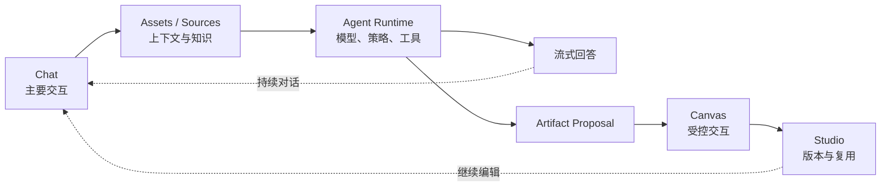
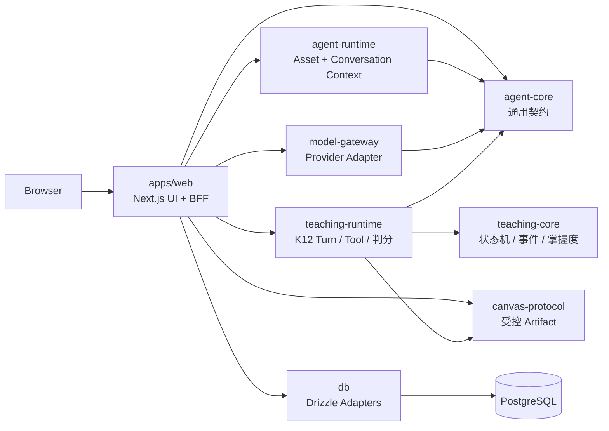
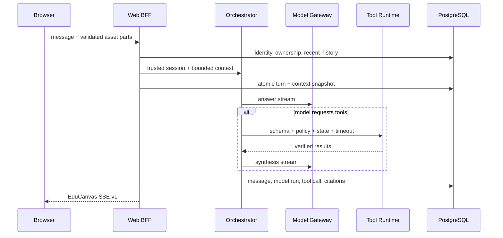
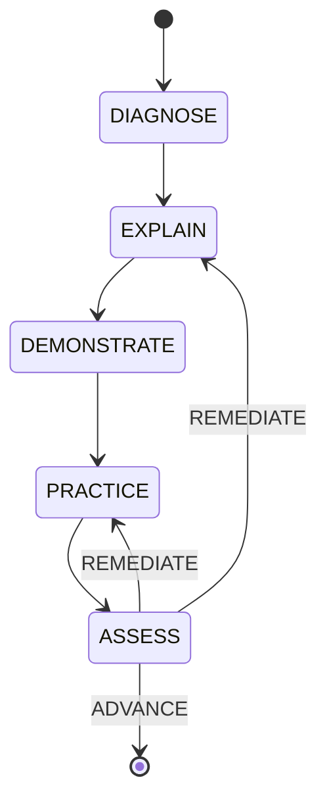

# EduCanvas

<p align="center">
  <strong>Chat-first · Multimodal Assets · Governed Agents · Safe Artifacts</strong>
</p>

<p align="center">
  
  
  
  
  
  <a href="https://github.com/Timcai06/EduCanvas/actions/workflows/ci.yml"></a>
</p>

EduCanvas 是一个以持续对话为核心的全模态 AI 工作空间。Chat 负责表达意图与维持上下文，文件和媒体沉淀为可复用资产，受控 Agent 使用工具完成任务，Canvas 与 Studio 承载可交互、可版本化的数字产物。

仓库同时交付浙江省大学生人工智能竞赛 **JBGS-2026-02：多模态 K12 人工智能通识课教学助手对话智能体**。K12 AI 教师是第一个垂直 Agent 和当前工程验证纵切，不是平台全部边界。

> **北极星目标**：用户通过一个可信、可恢复的对话入口组织多模态上下文，让 AI 使用受控工具生成能够继续编辑、交互和复用的产物。

## 当前状态

当前是一个可本地运行的模块化单体，已经越过静态原型阶段，但尚未进入 production。

| 已落地 | 部分落地 | 尚未完成 |
| --- | --- | --- |
| 通用 Chat 默认入口；K12 为显式 Vertical Agent | 通用 Turn 幂等、取消、持久化与刷新恢复 | 通用 Turn 租约与后台恢复 |
| 真实 Provider SSE 与诚实失败 | PDF/图片 Asset 已持久化 | 原生图片、音频、视频模型输入 |
| Answer → Tools → Synthesis | 有界跨轮历史与 Context Snapshot | 摘要、记忆与 Artifact 上下文 |
| Space/Conversation/Operation 通用数据主干 | 通用 Operation 尚未关联 Model Run/Trace 细账 | Asset/Source/Chunk 统一模型 |
| K12 取消、租约、幂等与刷新恢复 | K12 只接通首条可信状态推进 | 通用 Model Run 全量迁移 |
| Schema-first Canvas 与服务端判分 | Studio 当前只展示预置产物 | Artifact 提议、生成、版本与真实 Studio |
| 深色 Chat-first UI 与 GSAP 动效 | Registry 仍是编译期闭集 | 通用 Agent/Tool/Provider 插件装配 |

当前事实以 [开发文档中心](docs/README.md)、已接受 ADR 与 Schema 为准；2026-07-16 的长篇技术报告已转为[历史快照](docs/00-overview/snapshots/2026-07-16-project-technical-report.md)，不再双重维护当前状态。

## 产品交互模型



- Chat 始终是主叙事，Canvas 不在首屏默认展开；
- 用户可以通过输入栏 `+` 添加本轮附件、长期资产或显式创建产物；
- Agent 只能调用 Runtime 暴露并授权的工具；
- Artifact 通过严格 Schema 和可信 Renderer 渲染，不执行模型生成的任意 HTML、JavaScript 或 GSAP；
- K12 状态、掌握度和判分只由可信服务端事件更新。

## 快速开始

### 环境要求

- Node.js 22；
- pnpm 10；
- Docker Desktop 或兼容 Docker Runtime。

### 1. 准备环境

```bash
git clone https://github.com/Timcai06/EduCanvas.git
cd EduCanvas
cp .env.example .env
```

`.env.example` 已包含本地 PostgreSQL 默认值。若要启用真实模型，在 `.env` 中填写服务端变量；不要使用 `NEXT_PUBLIC_*`，不要提交真实 Key。

```dotenv
EDUCANVAS_DEPLOYMENT_ENV=local
MODEL_GATEWAY_PROVIDER=deepseek
MODEL_GATEWAY_ALLOW_DEEPSEEK=true
MODEL_GATEWAY_BASE_URL=https://api.deepseek.com
MODEL_GATEWAY_API_KEY=<your-key>
MODEL_GATEWAY_PRIMARY_MODEL=<explicit-model-id>
```

### 2. 安装、迁移和启动

```bash
make setup
make dev
```

- `make dev` 会再次确认数据库已启动并执行尚未应用的迁移，避免拉取新代码后本地 Schema 落后；
- Web：<http://localhost:3101>
- PostgreSQL：`localhost:5432`
- 停止数据库并保留数据：`make stop`
- 查看全部命令：`make help`

如果启动失败，先运行：

```bash
make doctor
```

## 常用验证

```bash
make check        # lint + typecheck + unit tests
make integration  # 隔离 PostgreSQL 集成测试
make e2e          # production build + Playwright E2E
make build        # Next.js production build
```

集成测试和 E2E 使用独立数据库，不能指向开发库。CI 分为三层：

1. lint、typecheck、unit、build；
2. PostgreSQL integration；
3. Chromium E2E 与失败诊断上传。

最近核对的本地基线为 289 项单元测试、46 项 PostgreSQL integration、23 项 Chromium E2E、TypeScript typecheck 与 production build 通过。该证据证明当前纵切可回归，不代表 production 就绪。

## 当前架构



当前采用模块化单体：Next.js 是 Web/BFF 与部署组合根，核心规则和适配器位于独立 Workspace Package。只有连接规模、长任务、团队发布边界或故障隔离产生可测需求后，才沿现有 Port 抽出独立服务。

### 一次 Agent Turn



当前 SSE 事件为 `turn.accepted`、`message.delta`、`message.citation`、`tool.*` 与 `turn.completed/failed/cancelled`。Artifact 生命周期事件尚未进入当前协议。

## Workspace 结构

```text
EduCanvas/
├── apps/
│   ├── web/                  # Next.js Chat、Assets、Canvas、BFF
│   └── worker/               # 持久任务 worker(graphile-worker,ADR-0012)
├── packages/
│   ├── agent-core/           # 通用 Asset、Message、Model、Gateway 契约
│   ├── agent-runtime/        # Asset/Conversation Context；目标承载通用 Turn/Tool/Policy
│   ├── model-gateway/        # OpenAI-compatible 原生 SSE Provider Adapter
│   ├── canvas-protocol/      # Artifact Schema、交互事件与服务端判分
│   ├── teaching-core/        # K12 状态机、可信事件、掌握度与领域 Port
│   ├── teaching-runtime/     # K12 Turn、Tool、判分和状态推进应用服务
│   └── db/                   # Drizzle Schema、Repositories 与迁移
├── docs/                     # canonical 产品、架构、数据、工程、质量和 ADR
├── tests/e2e/                # 学习流、视觉和 Canvas Playwright 测试
└── Makefile                  # 本地统一开发入口
```

| Package | 可以依赖 | 不应依赖 |
| --- | --- | --- |
| `agent-core` | Zod | Web、K12、数据库、供应商 SDK |
| `agent-runtime` | `agent-core` | K12 教学状态 |
| `model-gateway` | `agent-core` | Web、K12 领域 |
| `canvas-protocol` | Zod | React 页面、模型供应商 |
| `teaching-core` | `agent-core`、Zod | Next.js、Drizzle、具体 Provider |
| `teaching-runtime` | Agent/Canvas/Teaching Core | React、具体 Provider SDK |
| `db` | Core 协议与 Drizzle | UI、Prompt、供应商事件 |

## 关键安全设计

### 分层信任 Canvas

Canvas 按"产物是否进入可信学习事实"分两级信任（ADR-0010）。Tier 1 判分型 Artifact：模型输出结构化 JSON，经 Zod 白名单校验后由预注册 React Renderer 渲染，公开题面与私有判分键物理分离，浏览器交互必须通过服务端验证才能提升为可信学习事件。Tier 2 沙箱探索型产物：模型生成的 HTML/JS 只允许在无 same-origin、禁网络的 sandboxed iframe 中运行，不产生可信学习事件（尚未实现）。任何 tier 都不在主页面直接执行模型代码。

已实现（均为 Tier 1）：

- `classification_game`：可判分；
- `quiz`：可判分；
- `pipeline_flow`：render-only 受控 GSAP Timeline。

详见 [Canvas 与 GSAP 架构](docs/02-architecture/canvas-and-gsap.md) 和 [ADR-0010](docs/09-decisions/0010-canvas-trust-tiers.md)。

### 可信 K12 状态



模型和浏览器不能直接修改状态或掌握度。Runtime 只接受封闭候选信号，并结合服务端判分、历史事件和课程策略执行确定性 Guard。

### Provider 与 Secret

- Provider Key 只存在服务端 `.env`；
- 生产代码无 Provider 时返回诚实失败，不回退到脚本老师；
- DeepSeek 默认关闭，并禁止在 staging/production 解析；
- Provider 原始异常、供应商推理内容和 Secret 不进入浏览器；
- Scripted Gateway 只允许用于测试和明确标记的离线 Demo。

## 下一阶段

按 [Gemini + NotebookLM 产品复刻计划](docs/plan/active/2026-07-gemini-notebooklm-replica.md) 执行（阶段目标：复刻 Gemini + NotebookLM 的产品体验，Agent 编排优化与创新属于下一阶段）：

1. **M1 产物主干**：PostgreSQL 持久任务队列 + worker、Artifact/版本/生成任务一等公民、SSE 产物事件、对象存储 Port（[ADR-0012](docs/09-decisions/0012-artifact-runtime-durable-jobs.md)）；
2. **M2 轻产物**：思维导图、Slides、泛化测验/闪卡；
3. **M3 来源统一与网页搜索**：Asset/Source/Chunk 单链路、搜索 Provider、最小 Agent Runtime（maxToolRounds 策略 + Tool Registry）；
4. **M4 音频概览已完成**：勾选来源→脚本→TTS→可恢复音频Artifact；
   **M5视频成本闸门已评估并顺延**（[ADR-0013](docs/09-decisions/0013-video-overview-cost-gate.md)），当前不接入外部生成式视频Provider；
5. **下一开发项是UI蓝图PR-U3**：输入框工具芯片（Canvas/来源），随后推进Canvas共创化与`/learn`并入统一界面。

## 文档入口

| 内容 | 入口 |
| --- | --- |
| 文档索引 | [docs/README.md](docs/README.md) |
| 历史技术报告（2026-07-16 快照） | [docs/00-overview/snapshots/2026-07-16-project-technical-report.md](docs/00-overview/snapshots/2026-07-16-project-technical-report.md) |
| 产品定义 | [docs/01-product/product-definition.md](docs/01-product/product-definition.md) |
| 学生 UI 规范 | [docs/01-product/student-ui-spec.md](docs/01-product/student-ui-spec.md) |
| 系统架构 | [docs/02-architecture/system-architecture.md](docs/02-architecture/system-architecture.md) |
| Agent 编排 | [docs/03-ai/agent-orchestration.md](docs/03-ai/agent-orchestration.md) |
| 数据设计 | [docs/04-data/data-design.md](docs/04-data/data-design.md) |
| API/SSE | [docs/05-engineering/api-conventions.md](docs/05-engineering/api-conventions.md) |
| 测试与安全 | [docs/06-quality/testing-and-evaluation.md](docs/06-quality/testing-and-evaluation.md) |
| ADR | [docs/09-decisions/README.md](docs/09-decisions/README.md) |
| 路线图 | [docs/10-planning/roadmap.md](docs/10-planning/roadmap.md) |

## 协作规则

1. 不直接修改 `main`；每项工作使用独立分支和 Pull Request；
2. 行为、协议、数据或架构发生变化时，同步更新 canonical 文档；
3. 不提交 `.env`、API Key、个人信息、上传数据或生成报告；
4. PR 必须记录真实验证命令和结果；
5. 新能力不能用 Fixture 或 UI 文案伪装为已经接通。

首次参与开发请阅读 [团队协作指南](docs/08-collaboration/team-guide.md)。
