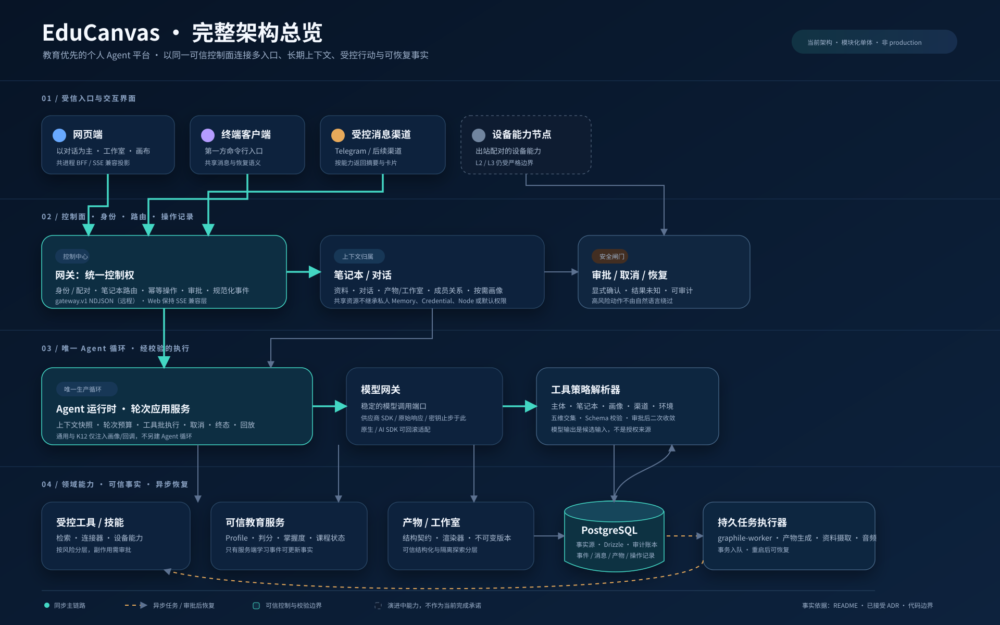
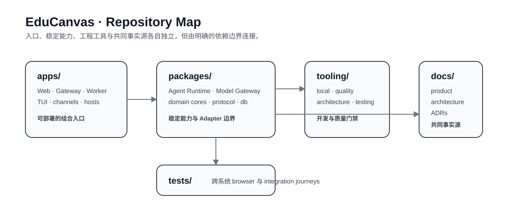

<p align="center">
  
</p>

<h1 align="center">EduCanvas</h1>

<p align="center">
  <strong>以教育能力为核心的通用个人 Agent 平台。</strong><br>
  用同一个 Agent 连接资料、对话、创作、互动学习与可信评价。
</p>

<p align="center">
  <a href="#快速开始"><strong>快速开始</strong></a>
  ·
  <a href="#架构"><strong>架构</strong></a>
  ·
  <a href="docs/README.md"><strong>文档中心</strong></a>
  ·
  <a href="CONTRIBUTING.md"><strong>贡献</strong></a>
</p>

<p align="center">
  <a href="https://github.com/Timcai06/EduCanvas/actions/workflows/ci.yml"></a>
  
  
  
</p>

## Why EduCanvas

EduCanvas 不把教育做成独立的聊天机器人或第二套 Agent。通用协作与教育场景共享同一条 Agent Runtime：教育能力以 Profile、Skills、Tools 与可信领域服务按需接入；学习状态、判分和掌握度只由确定性服务端代码更新。

这意味着资料、对话、Canvas 产物和学习过程可以在同一 Notebook 边界内协作，同时保持 Provider、权限、数据事实与高风险行动的明确边界。

## 架构



- `apps/gateway` 是 `gateway.v1` HTTP 组合根；`apps/web` 是第一方浏览器客户端与兼容 BFF；`apps/worker` 运行持久后台任务。
- `packages/agent-runtime` 拥有唯一 Agent Loop；功能 package 不得另建循环。
- `packages/model-gateway` 是唯一 Provider Adapter 边界；Provider SDK 类型、原始响应与密钥止步于此。
- `packages/db` 拥有 Drizzle schema、migrations 与 repositories；PostgreSQL 是业务事实源。

完整文字说明见[系统架构现状](docs/02-architecture/01-系统架构现状.md)、[Gateway 与多入口](docs/02-architecture/02-网关与多入口.md)和[Agent 编排边界](docs/03-ai/01-智能体编排边界.md)。

## Repository Map



| 区域 | 职责 |
| --- | --- |
| `apps/` | 可部署入口：Web、Gateway、Worker、TUI 与受控渠道 |
| `packages/` | 领域核心、运行时、协议、Provider/基础设施适配器与数据访问 |
| `tooling/` | 本地启动、质量门禁、架构检查、测试与格式化工具 |
| `docs/` | 产品、架构、工程、质量、运维、协作与 ADR 的共同事实源 |
| `tests/` | 跨系统 browser 与 integration journeys |

## Core Engineering Principles

- **Single Agent Runtime**：所有普通对话使用同一个 `AgentLoopEngine`；教育能力通过受控注入接入。
- **Gateway Contract Boundary**：远程客户端经严格的 `gateway.v1` 协议进入；Web 仅保留兼容投影。
- **Provider Isolation**：模型 Provider 是不可信输入，原始 Provider 数据与密钥不越过 Model Gateway。
- **Trusted Facts**：学习状态、权限、审批、账本和数据事实由服务端确定性边界维护。
- **Evidence Driven Development**：PR 必须记录边界、真实验证证据、回滚路径和非目标。

## 快速开始

### 环境要求

- Node.js 24.18.0 或更新的 Node 24 版本（`.nvmrc` 为准）
- pnpm 10
- Docker Desktop 或兼容 Docker Runtime

### 安装与启动

```bash
git clone https://github.com/Timcai06/EduCanvas.git
cd EduCanvas
pnpm env:init
make setup
make all
```

Web 默认位于 <http://localhost:3000>，Gateway 默认监听 <http://127.0.0.1:3200>。本地模型 Provider 是可选的；配置任一主 Provider 后，使用 `pnpm env:check` 验证完整配置而不打印密钥。

Windows 请先阅读[运行文档](docs/07-operations/)，并使用根目录的 `Start EduCanvas.cmd` 与 `Stop EduCanvas.cmd`。

## Development Workflow

```bash
make doctor       # 检查 Node、pnpm、Docker 与 .env
make dev          # 启动 Web 验证环境
make all          # 启动 Database、Gateway、Web、Worker
make status       # 查看本地服务状态
make stop         # 优雅停止当前 core 与本地数据库

pnpm file:check   # package、公开输出、文件治理与文档链接
pnpm lint         # workspace lint 与 Prettier
pnpm typecheck    # 全量类型检查
pnpm test:unit    # tooling 与 workspace unit tests
pnpm test:integration
pnpm build
pnpm test:e2e
```

常用命令、日志过滤、Provider 配置与平台注意事项见[开发与运维文档](docs/07-operations/)。

## Documentation Map

从[文档中心](docs/README.md)开始；它按产品、架构、AI、数据、工程、质量、运维、协作和 ADR 提供稳定阅读路径。

| 想了解什么 | 从这里开始 |
| --- | --- |
| 产品定位与用户路径 | [产品定义](docs/01-product/01-产品定义.md) |
| 系统与多端边界 | [系统架构现状](docs/02-architecture/01-系统架构现状.md) |
| Agent、RAG 与模型路由 | [AI 文档](docs/03-ai/) |
| 数据事实与可信学习事件 | [数据设计](docs/04-data/02-数据设计.md) |
| 开发、接口与文件治理 | [工程文档](docs/05-engineering/) |
| 质量、安全与测试 | [质量文档](docs/06-quality/) |
| 当前执行任务与路线图 | [计划索引](docs/plan/active/README.md) |
| 已接受的架构决定 | [ADR](docs/09-decisions/README.md) |

## Contributing

请阅读[贡献指南](CONTRIBUTING.md)。所有改动通过独立分支和 Pull Request 交付；PR 必须说明目标、边界、验证证据、回滚方式和明确不做的内容。

---

<p align="center">
  <strong>EduCanvas</strong> · 让通用 Agent 真正理解学习，也让学习过程留下可信证据。
</p>
