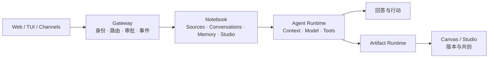
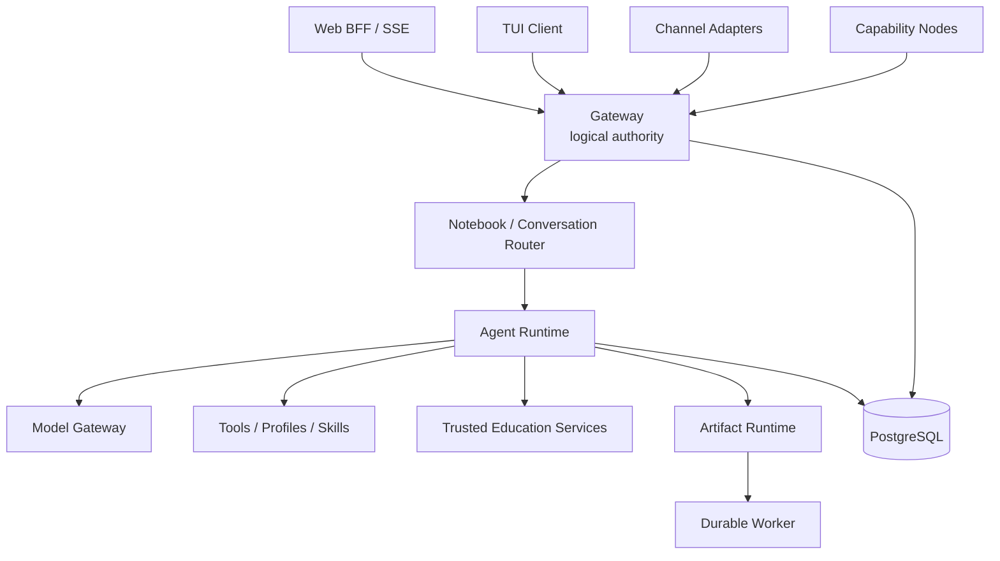
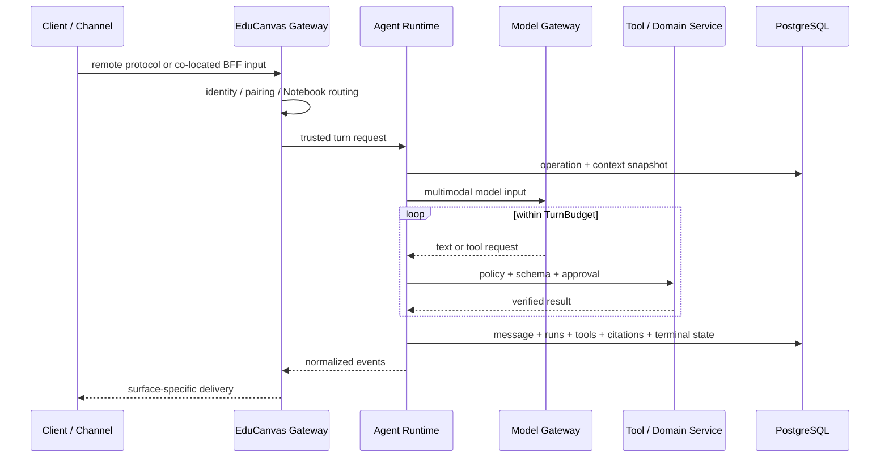

# EduCanvas

<p align="center">
  <strong>以教育能力为核心的通用个人 Agent 平台</strong>
</p>

<p align="center">
  
  
  
  
  
  <a href="https://github.com/Timcai06/EduCanvas/actions/workflows/ci.yml"></a>
</p>

**竞赛身份**：浙江省大学生人工智能竞赛 **JBGS-2026-02：多模态 K12 人工智能通识课教学助手对话智能体**

## 为什么是 EduCanvas

大多数 AI 教学工具只是"问答机器人"——学生提问，系统回答。EduCanvas 不同：

- **一个长期 Agent**：每个用户拥有同一个个人 Agent 身份与 Notebook/Conversation 事实；跨会话长期 Memory 仍是下一阶段能力
- **教育是核心能力**：Agent 具备年龄适配、资料学习、讲解追问、练习评测、可信判分和结构化课程，但不会在普通问答时强迫用户进入课程模式
- **Notebook 即上下文**：资料、对话、产物和运行记录归属同一个 Notebook；Notebook Memory 边界已接受但产品能力尚未开放
- **Canvas 即工作面**：来源阅读、产物共创和受控 Runtime 在统一 Canvas 中完成，不是分散的页面
- **可信学习事实**：判分、掌握度和课程状态由确定性服务端代码维护，模型不能自行宣布"学生学会了"

## 核心体验


```mermaid
flowchart LR
    Surfaces[Web / TUI / Channels] --> Gateway[Gateway\n身份 · 路由 · 审批 · 事件]
    Gateway --> Notebook[Notebook\nSources · Conversations · Memory · Studio]
    Notebook --> Agent[Agent Runtime\nContext · Model · Tools]
    Agent --> Answer[回答与行动]
    Agent --> Artifact[Artifact Runtime]
    Artifact --> Canvas[Canvas / Studio\n版本与共创]
```

| 能力                         | 说明                                                     | 状态                                      |
| ---------------------------- | -------------------------------------------------------- | ----------------------------------------- |
| **通用个人 Agent**           | 每个自然人拥有同一 Agent，支持研究、创作、资料整理       | 核心 Runtime 已实现；正式 IdP/Memory 待补 |
| **教育能力**                 | 年龄适配、资料学习、追问、示例、练习、可信判分           | 核心组件已实现；竞赛闭环仍需联合验收      |
| **Notebook / Sources / RAG** | 资料管理、引用、课程知识检索                             | 通用 Assets 已实现；K12 课程 RAG 已实现   |
| **Canvas / Artifacts**       | 统一工作面，支持导图、Slides、闪卡、音频、判分游戏       | 已实现                                    |
| **Memory**                   | 三层记忆（Personal / Notebook / Conversation）           | ADR accepted，尚未实现                    |
| **多模态输入**               | 图片输入（视觉 Provider）、PDF/音频解析                  | 图片已实现，语音待验证                    |
| **多模态输出**               | 图像生成、语音合成、Canvas 产物                          | 配置兼容 Provider 后可用                  |
| **Runtime**                  | 持久 Web Runtime（Tier 2）、Experiment Runtime（Tier 3） | Web Runtime 已实现，Experiment 待修订     |
| **多入口**                   | Web、TUI、Telegram（实验性）、Capability Node            | Web/TUI 已实现；其余为受限纵切            |

## 竞赛教学闭环

JBGS-2026-02 要求形成以下闭环：

```text
选择学段或课程 → 判断当前水平 → 对话讲解与主动引导 → Canvas 互动学习
→ 练习或编程实践 → 自动评价与反馈 → 更新学生掌握度 → 推荐下一步内容
```

EduCanvas 已落地下列闭环组件；完整竞赛演示仍需在同一真实流程中完成联合验收：

- **学习者画像**：显式年龄段、学段声明、教学偏好
- **Notebook Goal / 目标图**：6-12 节点冻结目标图
- **短诊断**：无答案短诊断，服务端确定性判分
- **五阶段状态机**：DIAGNOSE → EXPLAIN → DEMONSTRATE → PRACTICE → ASSESS
- **可信学习事件**：只追加事实，模型和浏览器不能直接修改掌握度
- **Canvas 互动**：分类游戏、测验、流程动画、Slides 等受控 Artifact

## 当前已实现 / 正在开发 / 尚未实现

| 已实现                                        | 正在开发                         | 尚未实现                  |
| --------------------------------------------- | -------------------------------- | ------------------------- |
| Gateway 身份/路由/审批/事件恢复               | Experiment Runtime（U13 修订中） | 正式用户 IdP 与账号恢复   |
| 唯一 AgentLoopEngine + TurnApplicationService | 三层 Memory（ADR accepted）      | Personal Memory UI        |
| Web / TUI / Telegram（实验性）                | 热词验证（V02 blocked）          | 微信/QQ 渠道              |
| Canvas 统一资源/Registry/打开链路             | per-capability Provider 配置     | 通用 Agent 产品知识 RAG   |
| 持久 Web Runtime（Tier 2）                    | 对象删除闭环收口（O03/O04）      | 生产 SLO/监控             |
| 媒体生成闭环（图像/音频/结构化）              |                                  | 教师课程发布              |
| 学习者画像/Goal/诊断/掌握度                   |                                  | 长期学习者记忆            |
| PostgreSQL FTS + pgvector 混合检索            |                                  | 中文真实教材评测/Reranker |

## 系统架构


```mermaid
flowchart TB
    Web[Web BFF / SSE] --> Gateway[Gateway\nlogical authority]
    TUI[TUI Client] --> Gateway
    Channels[Channel Adapters] --> Gateway
    Nodes[Capability Nodes] --> Gateway
    Gateway --> Router[Notebook / Conversation Router]
    Router --> Runtime[Agent Runtime]
    Runtime --> ModelGateway[Model Gateway]
    Runtime --> Tools[Tools / Profiles / Skills]
    Runtime --> Education[Trusted Education Services]
    Runtime --> Artifact[Artifact Runtime]
    Artifact --> Worker[Durable Worker]
    Gateway --> DB[(PostgreSQL)]
    Runtime --> DB
```

## 代表性 Agent Turn


```mermaid
sequenceDiagram
    participant U as Client / Channel
    participant G as EduCanvas Gateway
    participant R as Agent Runtime
    participant M as Model Gateway
    participant T as Tool / Domain Service
    participant D as PostgreSQL

    U->>G: remote protocol or co-located BFF input
    G->>G: identity / pairing / Notebook routing
    G->>R: trusted turn request
    R->>D: operation + context snapshot
    R->>M: multimodal model input
    loop within TurnBudget
        M-->>R: text or tool request
        R->>T: policy + schema + approval
        T-->>R: verified result
    end
    R->>D: message + runs + tools + citations + terminal state
    R-->>G: normalized events
    G-->>U: surface-specific delivery
```

## 快速开始

### 环境要求

- Node.js 22
- pnpm 10
- Docker Desktop 或兼容 Docker Runtime

### 安装与启动

```bash
git clone https://github.com/Timcai06/EduCanvas.git
cd EduCanvas
cp .env.example .env
make setup
make all
```

启动后：

- Web：<http://localhost:3101>
- Gateway：<http://127.0.0.1:3200>
- PostgreSQL：`localhost:5432`

常用命令：

```bash
make dev       # Web 验证环境
make tui       # 交互式 TUI
make check     # lint + typecheck + unit tests
make integration  # PostgreSQL 集成测试
make e2e       # Playwright E2E
make stop      # 停止数据库（保留数据）
make help      # 查看全部命令
```

> Windows 用户请参考 [operations 文档](docs/07-operations/)；首次运行执行 `corepack enable && pnpm install --frozen-lockfile && Copy-Item .env.example .env && pnpm env:check`，然后双击 `Start EduCanvas.cmd`。

## Provider 配置

在 `.env` 中配置模型 Provider：

```dotenv
EDUCANVAS_DEPLOYMENT_ENV=local
MODEL_GATEWAY_PROVIDER=deepseek
MODEL_GATEWAY_ALLOW_DEEPSEEK=true
MODEL_GATEWAY_BASE_URL=https://api.deepseek.com
MODEL_GATEWAY_API_KEY=<your-key>
MODEL_GATEWAY_PRIMARY_MODEL=<explicit-model-id>
```

图片输入需另配视觉 Provider（`MODEL_GATEWAY_VISION_*`），详见 [ADR-0017](docs/09-decisions/0017-文本与视觉提供商分离与图片输入路由.md)。语音、转录、图像生成和 Embedding 的独立 Provider 仍未实现；目标配置与继承规则见 [ADR-0021](docs/09-decisions/0021-模型能力独立Provider与继承规则.md)。

## 验证命令

```bash
pnpm lint          # workspace lint + Prettier
pnpm typecheck     # 全量类型检查
pnpm test:unit     # 单元测试
pnpm test:tooling  # 跨平台边界测试
pnpm test:integration  # PostgreSQL 集成测试
pnpm build         # Next.js production build
```

## Workspace 结构

```text
EduCanvas/
├── apps/
│   ├── web/           # Next.js Client + 迁移期兼容 BFF
│   ├── gateway/       # Gateway HTTP 组合根
│   ├── tui/           # 第一方终端客户端
│   ├── telegram/      # Telegram 私聊适配器（实验性）
│   ├── node/          # 可选 Capability Node 宿主
│   └── worker/        # 持久任务 worker
├── packages/
│   ├── agent-core/        # 通用 Asset、Message、Model 与 Tool 契约
│   ├── agent-runtime/     # 唯一 Agent Loop、Context、Tool Kernel
│   ├── gateway-core/      # gateway.v1 协议与 Schema
│   ├── gateway-runtime/   # 路由、幂等、持久事件
│   ├── gateway-client/    # 第一方客户端共享 Client
│   ├── channel-telegram/  # Telegram 适配器
│   ├── node-host/         # Node 只读能力执行器
│   ├── model-gateway/     # Provider Adapters
│   ├── telemetry/         # OTel Trace Adapter
│   ├── canvas-protocol/   # Artifact Schema 与服务端判分
│   ├── teaching-core/     # K12 状态机、掌握度与领域 Port
│   ├── teaching-runtime/  # K12 Profile、Workflow 与安全
│   └── db/                # Drizzle Schema 与迁移
├── docs/              # 产品、架构、数据、ADR
└── Makefile           # 本地统一开发入口
```

## 文档入口

| 内容             | 入口                                                                               |
| ---------------- | ---------------------------------------------------------------------------------- |
| 文档索引         | [docs/README.md](docs/README.md)                                                   |
| 产品定义         | [docs/01-product/01-产品定义.md](docs/01-product/01-产品定义.md)                   |
| 系统架构         | [docs/02-architecture/01-系统架构现状.md](docs/02-architecture/01-系统架构现状.md) |
| Agent 编排       | [docs/03-ai/01-智能体编排边界.md](docs/03-ai/01-智能体编排边界.md)                 |
| RAG 与 Embedding | [docs/03-ai/04-检索增强与嵌入.md](docs/03-ai/04-检索增强与嵌入.md)                 |
| 数据设计         | [docs/04-data/02-数据设计.md](docs/04-data/02-数据设计.md)                         |
| ADR              | [docs/09-decisions/README.md](docs/09-decisions/README.md)                         |
| 路线图           | [docs/10-planning/01-路线图.md](docs/10-planning/01-路线图.md)                     |
| Active 计划      | [docs/plan/active/README.md](docs/plan/active/README.md)                           |

## Roadmap

短期（当前阶段）：

1. 完成 U13 修订与 Experiment Runtime 最小纵切
2. 验证语音热词 before/after（V02）
3. 收口对象删除闭环（O03/O04）
4. 建立三层 Memory M0/M1

中期：

1. 通用 Agent 产品知识 RAG 接入
2. Per-capability Provider 配置落地
3. 教学质量评测体系
4. 正式 IdP 与 production hardening

长期：

1. 完整 Personal / Notebook / Conversation Memory
2. 代码与机器学习 Experiment Runtime
3. 微信/QQ 等渠道生产化
4. 在单一个人 Agent 内扩展受控 Skills、Profiles 与有界 Workflow

## 安全与贡献

- Provider Key 只存在服务端 `.env`，不提交到仓库
- 模型代码不在主页面执行；Tier 2 Runtime 使用无 same-origin、禁网络的 sandboxed iframe
- K12 状态、掌握度和判分只由可信服务端事件更新
- 不直接修改 `main`；每项工作使用独立分支和 Pull Request
- PR 必须记录真实验证命令和结果
- 新能力不能用 Fixture 或 UI 文案伪装为已经接通

首次参与开发请阅读 [团队协作指南](docs/08-collaboration/03-团队协作指南.md)。
