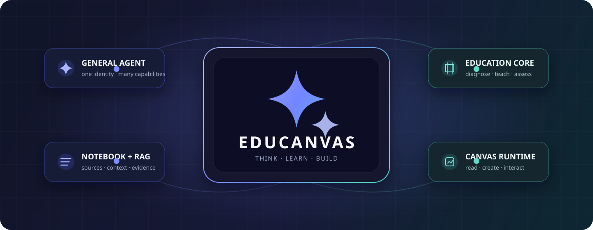
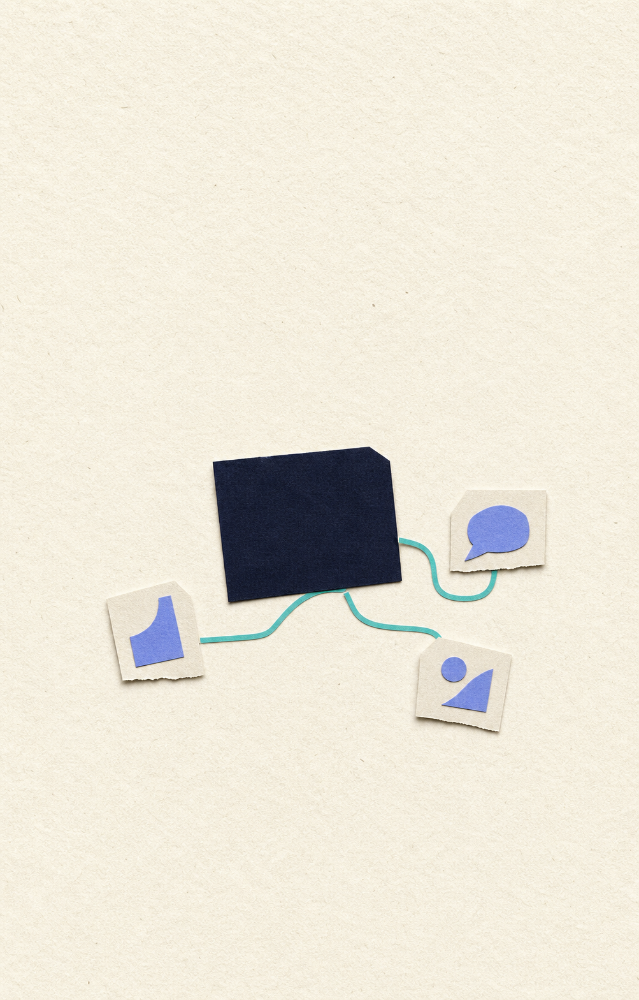
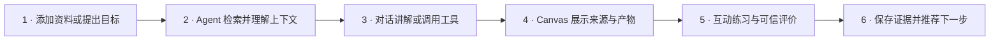
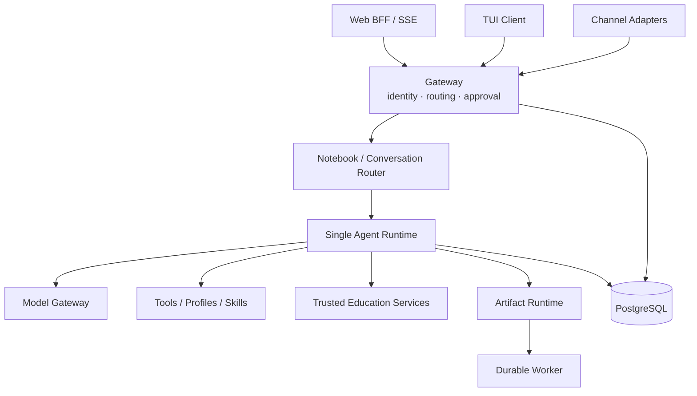

<p align="center">
  
</p>

<h1 align="center">EduCanvas</h1>

<p align="center">
  <strong>以教育能力为核心的通用个人 Agent 平台</strong><br>
  一个 Agent，连接资料、对话、创作、互动学习与可信评价。
</p>

<p align="center">
  <a href="#快速开始"><strong>快速开始</strong></a>
  ·
  <a href="docs/01-product/01-产品定义.md"><strong>产品定义</strong></a>
  ·
  <a href="docs/02-architecture/01-系统架构现状.md"><strong>系统架构</strong></a>
  ·
  <a href="docs/plan/active/README.md"><strong>开发计划</strong></a>
</p>

<p align="center">
  
  
  
  
  <a href="https://github.com/Timcai06/EduCanvas/actions/workflows/ci.yml"></a>
</p>

<p align="center">
  
</p>

<p align="center">
  <sub>浙江省大学生人工智能竞赛 JBGS-2026-02 · 多模态 K12 人工智能通识课教学助手对话智能体</sub>
</p>

<p align="center">
  
</p>

## 不止是问答机器人

<table>
  <tr>
    <td width="50%"><strong>🧠 一个长期 Agent</strong><br>每个用户拥有同一个个人 Agent 身份，在通用协作与教育场景间自然切换，不创建第二套 Agent Loop。</td>
    <td width="50%"><strong>📚 教育是核心能力</strong><br>年龄适配、诊断、讲解、练习、评价与下一步推荐按需组合，普通问答不会被强制变成课程。</td>
  </tr>
  <tr>
    <td width="50%"><strong>🗂️ Notebook 即上下文</strong><br>Sources、Conversations、Artifacts 与运行记录归属同一工作空间，RAG 检索始终服从用户与 Notebook 边界。</td>
    <td width="50%"><strong>✨ Canvas 即工作面</strong><br>阅读来源、打开产物、互动学习和受控 Runtime 汇聚在统一 Canvas，而不是散落在彼此割裂的页面。</td>
  </tr>
</table>

> **可信事实优先。** 判分、掌握度、课程状态与权限由确定性服务端代码维护；模型不能自行宣布“学生已经学会”，也不能越过 Notebook 读取私有数据。

## 30 秒理解一次体验


```mermaid
flowchart LR
    A[1 · 添加资料或提出目标] --> B[2 · Agent 检索并理解上下文]
    B --> C[3 · 对话讲解或调用工具]
    C --> D[4 · Canvas 展示来源与产物]
    D --> E[5 · 互动练习与可信评价]
    E --> F[6 · 保存证据并推荐下一步]
```

1. 在 Notebook 中添加 PDF、图片、音频或文本资料，也可以直接发起通用任务。
2. Agent 基于当前对话、Notebook Sources 和受控工具组织回答，不把 Provider 原始响应暴露给浏览器。
3. 导图、Slides、闪卡、图像、音频和互动内容进入 Canvas，保留版本与访问边界。
4. 教育 Profile 需要时加载；进入结构化课程后，诊断、练习、判分和掌握度更新形成闭环。

## 核心能力

| 能力                         | 当前事实                                              | 下一步                                           |
| ---------------------------- | ----------------------------------------------------- | ------------------------------------------------ |
| **通用个人 Agent**           | 唯一 Agent Runtime 已实现，支持研究、创作与资料整理   | 正式 IdP、账号恢复与长期 Personal Memory         |
| **教育能力**                 | 学习者画像、Goal、诊断、五阶段流程、可信学习事件      | 完整竞赛演示联合验收与教学质量评测               |
| **Notebook / Sources / RAG** | 通用 Assets 与 K12 课程混合检索已实现                 | 通用 Agent 产品知识 RAG、Reranker 与真实教材评测 |
| **Canvas / Artifacts**       | 统一 Registry、来源阅读、产物共创与媒体访问已实现     | Experiment Runtime 修订与更多受控 Renderer       |
| **Memory**                   | 三层边界 ADR 已接受，Conversation Working Memory 可用 | Personal / Notebook Memory 尚待实现              |
| **多模态**                   | 图片输入、PDF/音频解析、图像/音频/Canvas 输出         | 实时语音热词验证与 per-capability Provider       |
| **运行与入口**               | Web、TUI、持久 Web Runtime；Telegram 为实验性纵切     | 生产 SLO、渠道生产化与安全加固                   |

## 教育特色：从讲解到可信掌握度

```text
选择学段或课程 → 判断当前水平 → 对话讲解与主动引导 → Canvas 互动学习
→ 练习或编程实践 → 自动评价与反馈 → 更新学生掌握度 → 推荐下一步内容
```

EduCanvas 已落地学习者画像、6–12 节点 Notebook Goal、无答案短诊断、五阶段教学状态机和只追加的可信学习事件。完整竞赛演示仍需把这些组件放入同一个真实流程完成联合验收。

## 当前开发状态

| 已实现                                    | 正在收口                             | 尚未实现                   |
| ----------------------------------------- | ------------------------------------ | -------------------------- |
| Gateway 身份/路由/审批/事件恢复           | Experiment Runtime（U13 修订）       | 正式用户 IdP 与账号恢复    |
| 唯一 Agent Loop + Turn Application        | 语音热词 before/after（V02 blocked） | Personal / Notebook Memory |
| Canvas 统一资源、媒体闭环、Tier 2 Runtime | 对象删除闭环（O03/O04）              | 通用 Agent 产品知识 RAG    |
| PostgreSQL FTS + pgvector 混合检索        | per-capability Provider              | 生产 SLO 与教师发布        |

事实状态与原子任务以 [Active 计划索引](docs/plan/active/README.md) 为准；路线方向见 [项目路线图](docs/10-planning/01-路线图.md)。

## 快速开始

### 环境要求

- Node.js 22
- pnpm 10
- Docker Desktop 或兼容 Docker Runtime

### 安装与启动

```bash
git clone https://github.com/Timcai06/EduCanvas.git
cd EduCanvas
cp .env.example .env
make setup
make all
```

启动后访问 Web <http://localhost:3101>；Gateway 默认监听 <http://127.0.0.1:3200>。

```bash
make dev          # Web 验证环境
make tui          # 交互式 TUI
make check        # lint + typecheck + unit tests
make integration  # PostgreSQL 集成测试
make e2e          # Playwright E2E
make stop         # 停止数据库，保留数据
make help         # 查看全部命令
```

> Windows 用户请阅读 [Operations 文档](docs/07-operations/)；首次运行先执行 `corepack enable`、安装依赖并从 `.env.example` 创建 `.env`，再使用仓库根目录的 `Start EduCanvas.cmd`。

<details>
<summary><strong>Provider 配置</strong></summary>

在 `.env` 中配置主模型 Provider：

```dotenv
EDUCANVAS_DEPLOYMENT_ENV=local
MODEL_GATEWAY_PROVIDER=deepseek
MODEL_GATEWAY_ALLOW_DEEPSEEK=true
MODEL_GATEWAY_BASE_URL=https://api.deepseek.com
MODEL_GATEWAY_API_KEY=<your-key>
MODEL_GATEWAY_PRIMARY_MODEL=<explicit-model-id>
```

图片输入需另配视觉 Provider（`MODEL_GATEWAY_VISION_*`），详见 [ADR-0017](docs/09-decisions/0017-文本与视觉提供商分离与图片输入路由.md)。语音、转录、图像生成和 Embedding 的独立 Provider 目标见 [ADR-0021](docs/09-decisions/0021-模型能力独立Provider与继承规则.md)。

</details>

<details>
<summary><strong>验证命令</strong></summary>

```bash
pnpm lint              # workspace lint + Prettier
pnpm typecheck         # 全量类型检查
pnpm test:unit         # 单元测试
pnpm test:tooling      # 跨平台边界测试
pnpm test:integration  # PostgreSQL 集成测试
pnpm build             # Next.js production build
```

</details>

## 架构边界

EduCanvas 只有一个 Agent Loop。入口、模型、工具、教学领域服务、Canvas Runtime 与持久任务通过明确的 Port/Adapter 边界组合；Provider SDK 类型、原始响应和密钥止于 `packages/model-gateway`。

<details>
<summary><strong>展开系统架构</strong></summary>


```mermaid
flowchart TB
    Web[Web BFF / SSE] --> Gateway[Gateway\nidentity · routing · approval]
    TUI[TUI Client] --> Gateway
    Channels[Channel Adapters] --> Gateway
    Gateway --> Router[Notebook / Conversation Router]
    Router --> Runtime[Single Agent Runtime]
    Runtime --> ModelGateway[Model Gateway]
    Runtime --> Tools[Tools / Profiles / Skills]
    Runtime --> Education[Trusted Education Services]
    Runtime --> Artifact[Artifact Runtime]
    Artifact --> Worker[Durable Worker]
    Gateway --> DB[(PostgreSQL)]
    Runtime --> DB
```

</details>

<details>
<summary><strong>展开 Workspace 结构</strong></summary>

```text
EduCanvas/
├── apps/
│   ├── web/           # Next.js Client + compatibility BFF
│   ├── gateway/       # gateway.v1 HTTP composition root
│   ├── worker/        # durable background jobs
│   ├── tui/           # first-party terminal client
│   └── node/          # optional Capability Node host
├── packages/
│   ├── agent-runtime/ # the single Agent loop
│   ├── model-gateway/ # provider adapter boundary
│   ├── canvas-protocol/
│   ├── teaching-core/
│   ├── teaching-runtime/
│   └── db/            # Drizzle schema, migrations, repositories
├── docs/              # product, architecture, data, ADRs and plans
└── Makefile           # local development entry point
```

</details>

## 文档导航

| 主题             | 入口                                                                                  |
| ---------------- | ------------------------------------------------------------------------------------- |
| 文档总览         | [docs/README.md](docs/README.md)                                                      |
| 产品定义         | [docs/01-product/01-产品定义.md](docs/01-product/01-产品定义.md)                      |
| 系统架构         | [docs/02-architecture/01-系统架构现状.md](docs/02-architecture/01-系统架构现状.md)    |
| Agent 编排       | [docs/03-ai/01-智能体编排边界.md](docs/03-ai/01-智能体编排边界.md)                    |
| RAG 与 Embedding | [docs/03-ai/04-检索增强与嵌入.md](docs/03-ai/04-检索增强与嵌入.md)                    |
| 数据设计         | [docs/04-data/02-数据设计.md](docs/04-data/02-数据设计.md)                            |
| ADR              | [docs/09-decisions/README.md](docs/09-decisions/README.md)                            |
| 路线图与任务     | [长期路线](docs/10-planning/01-路线图.md) · [Active 计划](docs/plan/active/README.md) |

## 安全与贡献

- Provider Key 只存在服务端环境，不提交到仓库，也不进入浏览器响应。
- 模型生成代码不在主页面直接执行；Tier 2 Runtime 使用无 same-origin、默认禁网络的隔离边界。
- K12 状态、掌握度和判分只由可信服务端事件更新。
- 默认通过独立分支和 Pull Request 交付；PR 记录真实验证命令、结果与未运行项。
- 新能力不能用 Fixture、静态文案或宽松断言伪装为已经接通。

首次参与开发请阅读 [团队协作指南](docs/08-collaboration/03-团队协作指南.md)。

---

<p align="center">
  <strong>EduCanvas</strong> · 让通用 Agent 真正理解学习，也让学习过程留下可信证据。
</p>
