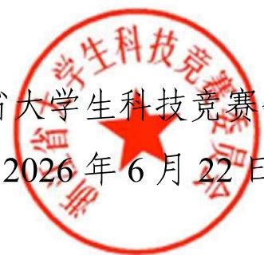

浙科竞〔2026〕25号

## 关于举办中国移动杯·第二届浙江省大学生人工智能竞赛的预通知

各高等院校:

为强化大学生在人工智能领域的前沿技术探索与应用创新能力，推动理论知识向实际应用的深度转化，实现智能产业应用落地，同时发现和培养一批具备潜力和才华的人工智能未来之星，为浙江省乃至全国人工智能产业发展提供人才支持，经研究，决定举办中国移动杯·第二届浙江省大学生人工智能竞赛。现将有关事项通知如下：

## 一、竞赛组织

主办单位：浙江省大学生科技竞赛委员会

承办单位：杭州电子科技大学、湖州师范大学、宁波大学、宁波职业技术大学

独家冠名协办单位：中国移动通信集团浙江有限公司

协办单位：浙江省高等学校图书情报工作指导委员会、宁波方太厨具有限公司、杭州市人工智能学会、中国（浙江）机器人及智能装备创新中心、杭州网易智企科技有限公司、杭州海康机器人股份有限公司、锐捷网络股份有限公司、杭州金扬智能科技有限公司、江苏润和软件股份有限公司、东阳市人民医院、嘉兴南洋职业技术学院、宁波大学科学技术学院、浙江迈沐智能科技有限公司、湖州市水务集团有限公司、北京智信数图科技有限公司、杭州沃聚网络科技有限公司

## （一）竞赛组委会

竞赛组委会负责制定竞赛方案, 确定竞赛题目、形式和流程, 聘请专家开展竞赛评审, 认定评审结果, 仲裁争议事项, 对竞赛组织工作进行监督和指导等。

## （二）竞赛秘书处

竞赛秘书处设在杭州电子科技大学，具体承担竞赛的组织工作，并处理日常事务。

## 二、竞赛内容

本次竞赛设算法挑战赛、“揭榜挂帅”赛和专项赛3条赛道。具体赛题及相关要求见附件1和2。

## （一）算法挑战赛

本赛道设置 3 个赛题供参赛学生选择，分别面向智慧消防、信息安全和医疗健康等前沿领域，聚焦企业实际需求，旨在通过竞赛加速 AI 技术的落地应用与成果转化。

## （二）“揭榜挂帅”赛

本赛道聚焦 AIGC、教育智能体、四足机器人、国产边缘智能、校园智慧赋能、文旅智能服务、零售服务机器人、工业质检、智慧农业、纺织智能制造、智慧水务等前沿应用领域，联合中国移动、网易智企、海康机器人、锐捷网络、润和软件、金扬智能、迈沐智能和湖州水务等大型国企、行业龙头企业及地方国企、科技企业共同发布赛题11项。参赛团队应立足各行业真实产业痛点与落地需求，自主研发创新方案、搭建智能应用系统、打造实景应用成果，输出完整的项目解决方案、实景应用案例与可落地产业化成果，助力人工智能技术与文旅、教育、工业、农业、水务、零售等多行业深度融合，赋能产业数字化、智能化转型升级。

## (三) 专项赛

本赛道设“AI+信息素养”专项赛（即浙江省大学生“AI+信息素养”大赛）、机器博弈专项赛和“方太”人工智能专项赛等3个赛项，其中“AI+信息素养”专项赛依托浙江省高等学校图书情报工作指导委员会行业资源，由北京智信数图科技有限公司提供赛事平台及培训体系；机器博弈专项赛由中国（浙江）机器人及智能装备创新中心提供软硬件技术保障；“方太”人工智能专项赛依托方太集团专属产业数据、机械臂仿真资源及A100高性能算力评测环境开展赛事。各参赛队可围绕AI信息素养应用、机器博弈算法研发、厨电AI场景落地三大方向自主探索创新场景。

## 三、参赛对象和要求

浙江省及长三角地区其他省市普通全日制高校在校研究生、本科生和高职高专学生均可参赛，参赛学生不允许跨校组队，且只能代表学籍所在学校参赛。

算法挑战赛、“揭榜挂帅”赛和“方太”人工智能专项赛均设置本研组和高职高专组，参赛队伍组别按队伍中最高学历参赛者来认定。学生以团队形式参赛，设队长1名，算法挑战赛团队人数（含队长）不超过3人，“揭榜挂帅”赛和“方太”人工智能专项赛团队人数（含队长）不超过8人；算法挑战赛和“揭榜挂帅”赛队长限报1支队伍，未担任队长的团队成员同一赛道限报1支队伍，“方太”人工智能专项赛一名学生限报1支队伍。“AI+信息素养”专项赛和机器博弈专项赛的组别设置、参赛形式和参赛队伍数限制均按照各专项赛规则执行。

算法挑战赛和“揭榜挂帅”赛每个学校合计限报50队，专项赛每个赛项每个学校均限报20队。

每支参赛队可设 1—2 名指导教师，鼓励企业导师参与指导，但至少需有一名为参赛队所在高校的在职教师，指导教师不允许跨校指导。

## 四、竞赛安排

## （一）赛题和规则发布

赛题和规则将于 2026 年 6 月中下旬发布，请各高校在赛题发布后通知学生尽快选题；参加 “揭榜挂帅” 赛和 “方太” 人工智能专项赛的学生应尽快与合作企业建立联系。

（二）竞赛报名

算法挑战赛、“揭榜挂帅”赛、机器博弈专项赛和“方太”人工智能专项赛报名时间为2026年6月20日至9月18日。各参赛高校请登录报名网站（https://zjrgzncontestc.woczx.com）进行报名，同时将加盖学校竞赛主管部门公章的报名表(见附件3)扫描件发送至竞赛秘书处邮箱 rgznjs@hdu.edu.cn。

“AI+信息素养”专项选拔赛本科和研究生组学校报名时间为2026年6月4日至6月30日，学生报名时间为7月3日至9月17日，报名网站为https://csc.xxsuyang.com；高职高专组学校报名时间为2026年6月9日至7月7日，学生报名时间为7月9日至9月24日，报名网站为https://cscgz.zhixinst.com。

## （三）竞赛缴费

本竞赛算法挑战赛、“揭榜挂帅”赛、“AI+信息素养”专项赛和“方太”人工智能专项赛参赛费为800元/队，机器博弈专项赛参赛费为300元/队。参赛费由参赛高校统一缴纳，不得以任何形式向学生收费。转账时务必附言：“人工智能竞赛+参赛学校名称”。

除 “AI+信息素养” 专项赛外的其他各赛道（赛项）参赛费，请各参赛学校于 2026 年 9 月 18 日前转账至杭州电子科技大学账户，账户名称：杭州电子科技大学，开户银行：工行杭州高新支行，账号：1202026209008806216。

“AI+信息素养”专项赛参赛费请各参赛学校于2026年10月12日前转账至宁波大学账户，账户名称：宁波大学，开户银行：工行宁波江北支行，账号：3901130009000002464。

## （四）赛程安排和形式

## 1.算法挑战赛

本赛道要求提交代码, 相关提交要求和截止时间等详见算法平台: https://aihuanxin.cn。排名前 30% 的参赛队获得决赛资格, 决赛将于 2026 年 11 月在湖州师范大学举行, 原则上采用现场答辩形式, 具体安排详见决赛通知。

## 2. “揭榜挂帅”赛和“方太”人工智能专项赛

要求各参赛队在 2026 年 9 月 24 日前登录系统上传作品，上传成功后由各参赛学校竞赛管理员审核后正式提交至系统。预赛将于 2026 年 10 月中旬开展，竞赛形式为线上评审，成绩排名前 30% 的参赛队获得决赛资格。决赛将于 2026 年 11 月在湖州师范大学举行，原则上采用路演和成果展示（演示）等形式，具体安排详见决赛通知。

## 3. “AI+信息素养”专项赛

本赛项的赛程安排、竞赛形式、决赛晋级比例、决赛时间和地点等信息详见专项赛通知。

## 4.机器博弈专项赛

本赛项决赛将于 2026 年 11 月在湖州师范大学举行, 赛程安排、竞赛形式、决赛晋级比例等信息另行通知。

## 五、竞赛规则

1. 竞赛正式报名结束后，参赛队不得变更赛道或选题，也不

得增减参赛队员，参赛队员不得变更所属队伍。

2. 参赛者需对竞赛数据严格保密，不得将数据用于竞赛以外的任何目的，竞赛结束后需按照组委会要求删除或归还数据。

3. 参赛队需独立完成竞赛，比赛过程中不得有违规行为。提交的所有作品资料应遵守匿名规则，不允许出现参赛队所在学校、团队或队员身份等相关信息，否则取消该队参赛资格。如发现有抄袭其他参赛者、使用未经授权的代码，或有擅自修改竞赛数据、比赛环境等行为，将取消参赛队的参赛资格。

4. 为保证竞赛的公正性，竞赛组织方将对评奖结果进行公示，公示期为竞赛结果公示之日起一周，逾期不再受理。

5. 参赛作品的知识产权归参赛者所有，但竞赛组织方有权在竞赛宣传、成果展示等相关活动中使用参赛作品的部分或全部内容，无需另行征得参赛队同意。

## 六、奖项设置

1. 根据浙江省大学生科技竞赛章程，本届竞赛设一等奖、二等奖、三等奖，获奖比例上限分别为参赛学生的 10%、15%、25%。算法挑战赛、“揭榜挂帅”赛和“方太”人工智能专项赛本研组和高职高专组学生分别独立评奖，其他专项赛按各自竞赛规则执行。

2. 竞赛设立 “优秀组织奖”，对竞赛组织工作中表现出色的学校给予表彰奖励；同时评选 “优秀指导教师”，对竞赛指导工作中表现突出的教师个人给予表彰奖励。

## 七、联系方式

本届竞赛办公室设在杭州电子科技大学。

联系人：张老师，电话：13956467045；颜老师，电话：0571-86919137。

竞赛邮箱：rgznjs@hdu.edu.cn。

通信地址：杭州市钱塘区二号大街1158号杭州电子科技大学自动化学院，邮编310018。

竞赛系统网站：https://zjrgzncontestc.woczx.com；https://zjcsc.nczxst.com（“AI+信息素养”专项赛）。

浙江省大学生科技竞赛监督邮箱：zj\_gjc@126.com。

附件：1. 第二届浙江省大学生人工智能竞赛赛题

2. 第二届浙江省大学生人工智能竞赛赛题详解

3.第二届浙江省大学生人工智能竞赛报名表

浙江省大学生科技竞赛委员会

2026年6月22日

