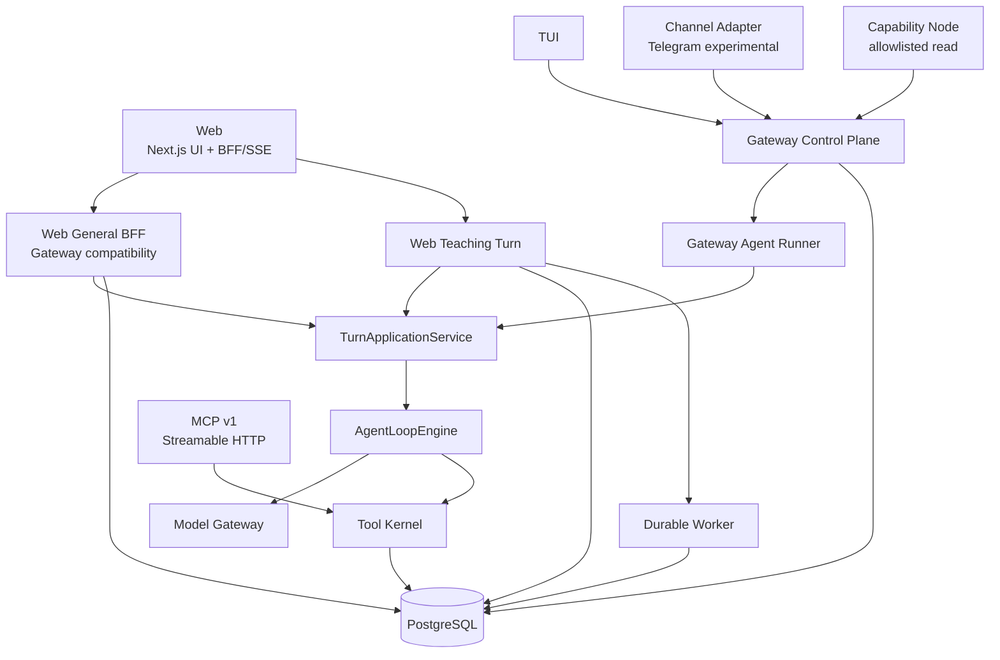

# 系统架构现状

- 状态：`accepted`
- 负责人：项目负责人
- 最后验证时间：2026-07-23
- 内容边界：只记录已落地并由代码或测试支持的事实；稳定形态见[第二代架构](03-第二代架构.md)
- 关键决策：[ADR-0015](../09-decisions/0015-education-centered-personal-agent-platform.md)、[ADR-0016](../09-decisions/0016-gateway-clients-channels-and-nodes.md)、[ADR-0017](../09-decisions/0017-unified-runtime-and-notebook-context.md)、[ADR-0019](../09-decisions/0019-modular-monolith-artifacts-and-durable-jobs.md)

## 一、已成立的产品与数据边界

- 一个自然人拥有一个长期 Personal Agent；Web、TUI 和外部渠道是不同入口，不是不同 Agent；
- Notebook 是 Source、Conversation、Artifact 和共享 Membership 的聚合根；
- Gateway 是身份、路由、Operation、审批、事件恢复和渠道投递的控制平面；Model Gateway 只适配模型供应商；
- PostgreSQL 是身份、Notebook、消息、Operation、Artifact、学习事实和持久任务的事实源；
- 教育判分、掌握度和结构化课程状态由确定性代码维护，不能由模型或浏览器直接写成事实；
- 当前保持模块化单体：可运行组合根位于 `apps/`，可复用协议、运行时和领域能力位于 `packages/`。

## 二、当前进程与入口

Web 浏览器传输仍使用 `/api/v1/chat/*` 与 `/api/v1/learn/*` 的 BFF/SSE 兼容层；TUI、Channel 和 Node 通过独立 Gateway 进程。两条浏览器协议没有被强制改成 Gateway 的持久 NDJSON 协议，这是 ADR-0016 的兼容选择。Gateway、Web General 与 Web Teaching 的服务端执行语义已经收敛到同一个 Turn Application；Node 的 L0/L1 只读 Adapter与MCP v1无鉴权L0/L1 Adapter已在Gateway和Web General接入。Gateway Asset、高风险MCP续跑和真实Credential Broker仍在后续阶段。

## 三、当前模块职责

| 模块                                          | 当前职责                                                                                     | 当前限制                                     |
| --------------------------------------------- | -------------------------------------------------------------------------------------------- | -------------------------------------------- |
| `packages/gateway-core`                       | `gateway.v1` 的角色、Envelope、事件、能力、审批、渠道、Node、投递和引用 Schema               | 不依赖 Next.js、Drizzle、K12 或 Provider SDK |
| `packages/gateway-runtime`                    | 路由、指纹、幂等、Operation 事件流、恢复、审批续跑和单终态                                   | 不承担Profile、Tool或领域逻辑                |
| `apps/gateway`                                | HTTP组合根、Client/Node session、目录、审批、NDJSON、Node/MCP Tool与内部指标                 | Asset与K12 Profile尚未接入                   |
| `packages/agent-runtime`                      | 唯一目标`TurnApplicationService`、`AgentLoopEngine`、Context Engine、Tool Kernel和模型流验证 | 通过Port接收可信归属，不拥有K12事实          |
| `apps/web`                                    | 学生 Web、BFF/SSE、通用与教学 Profile 组合、兼容事件投影                                     | 浏览器仍使用兼容 SSE，不承担 Operation 终态  |
| `apps/tui`                                    | Gateway bootstrap、会话、流式聊天、恢复、审批、渠道与 Web handoff                            | 不直接访问数据库或模型 Runtime               |
| `packages/channel-telegram` / `apps/telegram` | 私聊文本归一化、绑定、幂等、Gateway 调用和投递账本                                           | 实验性、非默认启动，无 live 凭据证据         |
| `packages/node-runtime`                       | 把私人 Node 的新鲜能力、调用等待与结果限制适配到统一 Tool Kernel                             | 只提供既有 L0/L1 只读能力                    |
| `packages/mcp-runtime`                        | MCP v1可信注册、SDK生命周期、Schema防漂移、Credential Port、输入输出限额与脱敏健康状态       | 只开放L0/L1；Bearer缺Broker时禁用            |
| `packages/node-host` / `apps/node`            | 出站配对、心跳、撤销、状态与白名单只读文件                                                   | 不开放 Shell、写文件、任意根目录或入站端口   |
| `packages/teaching-core`                      | 教育状态、guard、判分、掌握度和可信学习事件纯逻辑                                            | 不负责模型循环                               |
| `packages/teaching-runtime`                   | K12 Prompt、安全、课程 Workflow、领域回调与 Teaching Tool Adapter                            | 不拥有独立Agent Loop或Tool生命周期           |
| `apps/worker`                                 | Artifact、资料摄取和匿名主体维护的持久任务                                                   | 不承担交互连接和身份路由                     |

`apps/ + packages/` 顶层结构没有过时。当前问题发生在内部应用服务和运行时职责重复，不需要用全仓目录重排掩盖。

## 四、一次 Turn 的真实路径

当前三条生产 Turn 调用路径都进入 `TurnApplicationService`；旧教学 Orchestrator 和 Tool Executor 已删除。生产应用路径现为：

1. `apps/gateway/src/agent-runner.ts`：把可信路由投影到`TurnApplicationService`并投影事件；独立Gateway Profile已接入私人Node只读工具与MCP v1无鉴权L0/L1工具，Asset仍未接通；
2. `apps/web/server/gateway/web-turn.ts`：Web BFF先建立Gateway Operation，再把通用请求投影到同一`TurnApplicationService`；Web Profile已接入结构化Asset Context、网页Tool Kernel、引用、取消和统一账本；
3. `apps/web/server/teaching/learning-turn.ts`：Web教学 Profile 把 K12 Prompt、输入/输出安全门、课程状态能力白名单和教材引用接入同一服务；教学可见消息与租约仍写 K12 表，Context/Model/Tool/Effect 审计写统一 Operation 账本。

Gateway、Web General与Web Teaching已共享应用服务、Context/Model账本和消息/Operation单写纪律；Gateway与Web General还共享同一`node-runtime`工具定义和等待语义，但网页与Asset Adapter仍是Web专用。`turn-engine.ts`负责单次模型运行事件校验，不是另一套Agent Loop。

现有跨入口 fixture 已证明同一用户可从 Web 与 TUI 到达同一 Notebook/Conversation；这只证明路由一致，不证明两条入口已经拥有完全相同的 Context、Tool 与审计能力。

## 五、当前工具与审计双轨

- Web General网页工具、Web Teaching教学工具以及Gateway/Web General的Node和MCP工具都通过生产`ToolKernel`执行；三条组合路径通过共享Resolver解析服务端五维Tool Policy，Teaching state只收窄Profile维，transport/render manifest不授予工具；旧通用注册表与教学执行器已删除，本地/教学模块只保留定义和Adapter；
- MCP工具的模型名、描述、capability、risk、effect和输入Schema来自服务端静态注册；远端`annotations`不授予权限。SDK结果先经过Schema防漂移和有界净化，远端正文、URL、Token和原始异常不进入状态、账本或模型；
- `ToolKernel` 与 PostgreSQL `tool_effects` 已实现五维授权交集、L2/L3审批门、超时/取消、幂等和结果未知语义；网页读取的Adapter函数名与公共能力名分离，Provider使用`fetchWebPage/webSearch`，权限和公共事件使用`web.fetch/web.search`；
- Gateway Operation Event 是跨入口控制面事实；Gateway迁移后由事件循环独占Operation终态，Turn Application只结算消息；
- `model_runs`、`tool_calls`和`turn_context_snapshots`已additive支持通用Operation；三条生产路径均写统一Context与Model Run，Web General写网页Tool/Effect，Web Teaching写教学Tool并继续保留独立的K12安全与引用证据；
- Artifact/资料摄取等分钟级工作由 PostgreSQL 背书的 Worker 处理，不在 HTTP Turn 内等待。

剩余差异是 Profile 和入口能力差异，不再是第二套 Tool Runtime。有限收口项见[第二代架构](03-第二代架构.md)与 active plan。

## 六、身份与 Notebook 边界

- `platform_users` 与 `personal_agents` 表达一人一 Agent；
- `notebook_memberships` 的 `owner/editor/contributor/viewer` 控制 Notebook 行为，viewer 不能回复；
- Operation 保存真实 `actor_user_id`、`agent_id`、`notebook_id` 和 `conversation_id`；
- `delegated_grants` 表达显式、到期、可撤销的教师/家长/管理员授权，禁止冒充；
- Web 匿名 Cookie 只映射到 `anonymous_compat` 主体，不能成为 TUI/渠道的正式认证机制；
- 私人 Memory、Credential、Node Pairing 与默认 Tool Grant 不随 Notebook Membership 传播是设计不变量。Node的Operation级能力解析与入队已有跨Actor集成fixture；Memory、Credential与default grant仍待完整端到端fixture。

## 七、当前部署与已知缺口

本地 `make dev` 启动 Web、Gateway、Worker 和 PostgreSQL；公共 Client/Node transport 只有配置足够长度的 bootstrap token 与 session secret 才开放，内部 transport 也默认关闭。

当前不具备 production 声明条件：正式 IdP、自助账号生命周期、外部 Trace/SLO、对象删除闭环、原生多模态、长期学习者记忆、高风险MCP/Node审批续跑、真实Credential Broker、Telegram live凭据验证和微信/QQ Adapter仍未完成。Gateway bootstrap token是管理员或本地建联凭据，不是最终用户登录方案。

详细协议与入口见 [Gateway 与多入口](02-Gateway与多入口.md)；稳定编排术语与边界见 [Agent 编排边界](../03-ai/01-Agent编排边界.md)。
