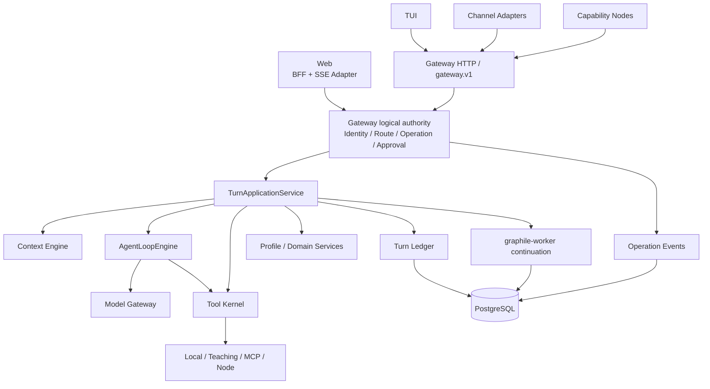

# 第二代架构

- 状态：`accepted`
- 负责人：项目负责人
- 最后验证时间：2026-07-23
- 稳定决策：[ADR-0020](../09-decisions/0020-第二代HybridPorts架构.md)
- 当前事实：[系统架构现状](01-系统架构现状.md)
- 剩余收口：[第二代架构收口计划](../plan/active/2026-07-第二代架构升级.md)

## 一、解决什么问题

第二代架构不是框架重写，也不是目录重排。它把曾经分散在 Gateway、Web General、Web Teaching 的 Turn、Context、Tool、Ledger 与恢复语义收敛成一套产品内核，同时保留教育判分、掌握度和未成年人安全的确定性边界。

截至 2026-07-23，统一内核已经落地。当前阶段只剩入口一致性、最小人工对账、清理和最终证据，不再把所有未来生产能力捆绑成“架构升级”。

## 二、产品形态

- 默认是具备教育核心能力的通用个人 Agent，不假定用户始终处于课程；
- Web 是 K12 用户的主要产品入口，TUI 是高级第一方入口，Channel/Node 是远程 Adapter；
- Notebook 管理 Sources、Conversations、Artifacts、Notebook Memory 和运行记录；
- Personal Memory、Credential、Node 与默认授权属于个人 Agent，不随共享 Notebook 传播；
- 诊断、练习、测评、掌握度和可信学习证据通过按需 K12 Profile/Workflow 提供。

## 三、逻辑架构

Gateway 是逻辑控制面权威，不等于 Web 必须发生一次独立网络跳转。Web 的共进程 BFF 与远程 Gateway Client 必须共享服务端身份、路由、Operation、审批和 Tool Policy；展示协议可以分别使用 SSE 与 `gateway.v1`。

## 四、唯一职责

| 边界              | 负责                                                  | 不负责                        |
| ----------------- | ----------------------------------------------------- | ----------------------------- |
| Gateway authority | 身份、Notebook 路由、Operation、审批、控制事件、投递  | Prompt、判分、Provider 细节   |
| Turn Application  | Context、Loop、Tool、Ledger、Profile hooks 的阶段编排 | 自创身份、第二 Operation 终态 |
| Context Engine    | 有界 Segment 选择与可解释 Snapshot                    | 长期 Memory 事实、权限授予    |
| AgentLoopEngine   | 模型/工具循环、预算、取消、synthesis                  | Notebook 归属、领域状态机     |
| Tool Kernel       | 能力交集、审批、执行、effect、timeout、结果未知       | 接受模型或客户端自报权限      |
| Domain Services   | 教育安全、状态机、判分、掌握度和可信事件              | 第二模型循环或通用运行账本    |
| Model Gateway     | Provider 流式协议与错误归一化                         | 业务 Context 与 Notebook      |
| Worker            | 分钟级任务和明确等待点续跑                            | 每个普通 Turn                 |

## 五、事实与恢复

- Gateway Operation Event 是跨入口控制事实；
- Turn Ledger 是消息、Model、Tool 与 Context 执行事实；
- Learning Event 是可信教育事实；
- Tool Effect 记录外部副作用当时的提交状态；
- Checkpoint、Job 与 Trace 都不能替代上述事实。

`outcome_unknown` 不自动重试。人工 operator/service 可以追加对账决议，但不能改写历史终态；自动核验只有真实 Adapter 提供可信查询或服务端幂等契约后才能启用。

## 六、从成熟项目学习什么

| 来源              | 学习                                                                          | 不复制                                                  |
| ----------------- | ----------------------------------------------------------------------------- | ------------------------------------------------------- |
| OpenClaw          | 单一控制面权威、多入口、服务端路由、send/abort、渠道生命周期、compaction 配对 | 单操作者信任、宿主机默认高权限、用 session key 代替授权 |
| Claude Code/Codex | 单循环、Context、权限过滤、审批、取消与会话恢复                               | 开发目录等同 Notebook、学生默认 Shell                   |
| AI SDK            | Provider Adapter 与流式互操作                                                 | 把终态、业务错误和账本交给 SDK                          |
| MCP               | Tool Kernel 后的外部工具协议                                                  | 内部总线、annotations 作为授权                          |
| OpenTelemetry     | 脱敏因果链                                                                    | 业务事实源或学生正文仓库                                |
| LangGraph         | 未来有界复杂 Workflow 的候选 Adapter                                          | framework-first、每 Turn 图化                           |

## 七、完成与后续

第二代架构完成条件只包括统一内核、入口一致性、最小安全边界、重复实现清理和全量证据。Notebook Memory、原生多模态、教学质量、正式 IdP、渠道生产化、自动对账与完整 SLO 是后续独立计划。
