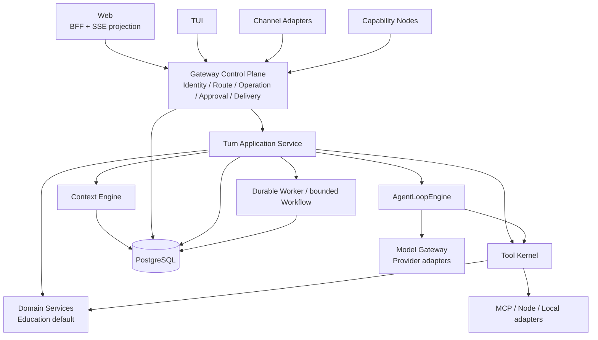

# 第二代架构提案

- 状态：`accepted target`
- 负责人：项目负责人
- 最后验证时间：2026-07-21
- 决策状态：ADR-0020 已接受；目标已确定，但生产迁移仍按 active plan 逐条实施
- 决策收口：[ADR-0020：第二代 Hybrid Ports Agent 架构](../09-decisions/0020-第二代HybridPorts架构.md)
- 当前事实：[系统架构现状](01-系统架构现状.md)
- 前置研究：[第二代架构研究](../plan/completed/2026-07-第二代架构研究.md)
- 实施计划：[第二代架构升级](../plan/active/2026-07-第二代架构升级.md)

## 一、目标

第二代架构不是重写产品，也不是把 EduCanvas 迁入某个 Agent 框架。目标是保留已经成立的 Gateway、Notebook、身份、教育可信事实和 PostgreSQL 边界，收敛当前重复的 Turn、Context、Tool、Operation 与 Trace 语义，使 Web、TUI 和渠道真正成为同一个个人 Agent 的不同窗口。

目标形态是：一个控制平面、一个 Turn Application、一个 Agent Loop、一个 Tool Kernel；教育作为默认 Profile 与确定性 Domain Services 进入，而不是形成第二套 Agent Runtime。

## 二、目标逻辑架构

Web 可以继续输出兼容 SSE，但服务端必须调用同一个 Turn Application Service；这不是要求浏览器直接使用 Gateway NDJSON。传输可以不同，身份、路由、Operation、工具策略和终态语义不能分叉。

## 三、唯一职责

| 组件                     | 唯一职责                                                           | 禁止承担                         |
| ------------------------ | ------------------------------------------------------------------ | -------------------------------- |
| Gateway Control Plane    | 认证主体、解析 Notebook 路由、创建 Operation、审批、事件恢复、投递 | Prompt、教学判分、Provider 细节  |
| Turn Application Service | 编排一次 Turn 的 Context、Loop、Tool、Domain hook、账本和终态      | 自创身份、绕过 Operation         |
| Context Engine           | 预算化选择 Segment 并固化 Context Snapshot                         | 授权来源、成为长期 Memory 事实源 |
| AgentLoopEngine          | 有界模型/工具循环、取消、强制 synthesis、单终态                    | Notebook 归属、领域状态机        |
| Tool Kernel              | 注册、能力交集、审批、执行、effect ledger、timeout 与结果未知      | 接受模型自报权限                 |
| Domain Services          | 判分、掌握度、课程 guard、未成年人安全等可信事实                   | 拥有第二模型循环                 |
| Model Gateway            | Provider 请求/事件规范化与可替换适配                               | 业务 Context、Notebook Session   |
| Worker / Workflow        | 分钟级任务和明确等待点的有界续跑                                   | 承载每个普通 Turn                |

## 四、为何必须收敛现有重复

### 三套 Turn Application

Gateway runner、Web General 和 Web Teaching 当前都能调用同一 `AgentLoopEngine`，但各自装配 Context、Prompt、工具、消息账本和回调。入口能力会因此漂移：TUI 能到达同一 Conversation，却未必拥有 Web 相同的工具和审计。第二代应收敛应用服务，不复制 Loop。

### 两套 Tool Runtime

`AgentToolRegistry` 与 `TeachingToolExecutor` 分别解决了部分 Schema 和执行问题，但没有一个统一位置计算主体、Notebook、Profile、入口、环境与安全策略交集。Tool Kernel 的目的不是“抽象漂亮”，而是让本地 Tool、Teaching Tool、MCP Tool 与 Node Tool 遵守相同授权、副作用与恢复语义。

### 教学专用审计

教学审计保留了模型 Run 和 Tool Call 证据。`model_runs`、Context Snapshot 与 `tool_calls` 均已以 additive 方式支持通用 `agent_turn`，并保留旧教学记录读取。通用 Context Snapshot 绑定已鉴权Operation，并把实际消息与AssetVersion选择固化为不含正文的可重放证据；Tool Call 通过双唯一键固化调用身份，但副作用提交仍由后续独立effect ledger证明。目标不是删除教育证据，而是把通用运行事实提升为通用账本，再由学习事件引用这些证据；教育领域继续拥有判分和掌握度事实，不再拥有模型运行记录的专用副本。

### Operation continuation

当前可按 sequence 重放已写入事件，但事件重放不能继续未完成的计算。审批通过、外部等待或进程崩溃后，系统需要从明确业务游标恢复，并确保副作用不会重复。Continuation 因此是高风险工具与耐久 Workflow 的前置能力，不是所有 Turn 的默认框架。

## 五、从成熟项目学习什么

| 来源          | 采用或适配                                                                                        | 明确不复制                                                           |
| ------------- | ------------------------------------------------------------------------------------------------- | -------------------------------------------------------------------- |
| OpenClaw      | 单一 Gateway truth、服务端路由、`send/steer/abort`、渠道生命周期、工具策略、compaction 配对完整性 | 单操作者信任、把 session key 当授权、workspace/主机执行语义          |
| Claude Code   | 单一 query loop、权限过滤、abort、远程审批桥、压缩与会话切换模式                                  | 非官方泄漏源码作为决策依据、开发目录即 Notebook、默认 Shell 能力     |
| LangGraph     | 只评估审批/等待/跨进程副作用等有界 Workflow 的 checkpoint 与 interrupt                            | framework-first、每 Turn 图化、checkpoint 替代 Operation/权限/事实源 |
| AI SDK        | `TurnModelGateway` 后的 Provider 流式适配                                                         | 原始错误、终态和业务账本外包给 SDK                                   |
| MCP           | Tool Kernel 后的外部工具 Adapter                                                                  | 内部总线、annotations 直接充当授权                                   |
| OpenTelemetry | 脱敏的跨进程因果 Trace                                                                            | 替代 Operation Event 或记录学生正文/Secret                           |

详细证据见 [`docs/research/`](../research/00-研究说明.md)。

## 六、迁移顺序与决策门

1. **先证明隐私边界**：共享 Notebook 可见，但个人 Memory、Credential、Node 与默认 grant 对其他 Actor 必须 fail closed；
2. **定义统一 Tool Kernel fixture**：覆盖能力交集、审批、effect ledger、timeout、取消和 `outcome_unknown`；
3. **统一 Turn Application Service**：先以现有 Engine 和账本为依赖，逐条迁移 Gateway、Web General、Web Teaching，不做一次性重写；
4. **泛化运行审计与 Context Snapshot**：保持旧 ID 可追溯，教育学习事件只引用可信运行证据；
5. **对照 continuation**：比较原生 PostgreSQL/graphile-worker 与 LangGraph Saver 在五个 kill point 下的数据正确性、回滚和运维成本；
6. **补真实跨入口与 Trace 证据**：同一 Notebook、同一工具策略、同一终态，Trace 默认脱敏；
7. **形成 proposed ADR**：只有 fixtures、strongest counterargument、迁移/回滚和数据兼容通过后，才请求接受并进入生产实施。

若候选引入第二身份源、第二 Notebook/Session 事实源、第二 Operation 终态源或第二学习事实源，应直接淘汰。若单一成熟方案在相同硬约束下可验证地降低至少 30% 的实现、测试和运维总成本，应重新比较当前 Hybrid Ports 假设。

## 七、研究收口后的答案

- Turn Application 使用 transport-neutral input/event Port；Web SSE 与 Gateway NDJSON 只做 projection；
- effect ledger 属于 Tool Kernel 业务证据，Operation 引用其结果，checkpoint/job 不得提交 effect 或 Operation 终态；
- 通用 Ledger 采用 additive、逐入口、单写路径迁移，保留旧 ID 和学习证据引用；
- approval continuation 先用 PostgreSQL 业务状态 + graphile-worker；LangGraph 只在有界复杂 Workflow 达到 30% 门槛后采用；
- Context Snapshot 默认按最小化和可删除设计，具体保留期在生产 Schema 前单独完成隐私设计；
- send/abort 是二代必需控制语义；steer 在同一 Operation 单写者与取消闭环后按真实产品需求增加，不为追平方法名预建。

完整决定、迁移/回滚和产品形态已进入 accepted ADR-0020。实施状态只以[第二代架构升级计划](../plan/active/2026-07-第二代架构升级.md)、生产源码和测试为准；不能把已接受目标误写为已经完成的生产事实。
