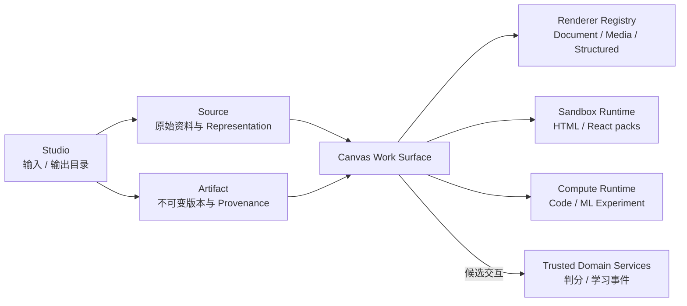

# 统一 Canvas 工作面

- 状态：`accepted`
- 负责人：项目负责人
- 最后验证时间：2026-08-07（W 线收口）
- 关键决策：[ADR-0004](../09-decisions/0004-能力信任与学习证据.md)、[ADR-0005](../09-decisions/0005-模块化单体产物与持久任务.md)、[ADR-0009](../09-decisions/0009-统一画布工作面与运行时分层.md)
- 当前事实：[系统架构现状](01-系统架构现状.md)
- 已完成计划：[画布运行时与实时语音主线](../plan/completed/UV-画布语音.md)
- 已完成界面优化：[画布界面与可访问性优化](../plan/completed/F-画布界面.md)

## 一、定位

Canvas 是同一 Notebook 内阅读、创作、运行和继续编辑内容的统一工作面。它可以展示来源，也可以承载 Agent 或用户生成的产物，但它不是数据库聚合根、Artifact 仓库或执行服务。

四个概念必须保持分离：

| 概念     | 负责                                                                       | 不负责                               |
| -------- | -------------------------------------------------------------------------- | ------------------------------------ |
| Notebook | Source、Conversation、Artifact、Membership、Notebook Memory 与运行记录归属 | 具体渲染和代码执行                   |
| Studio   | 同一 Notebook 中“输入”和“输出”的发现、创建、筛选与管理入口                 | 单独保存一份来源或产物事实           |
| Canvas   | 打开内容、交互、编辑、对比版本、呈现运行状态                               | 自己成为新的持久化容器或越权执行环境 |
| Runtime  | 在明确能力、资源、审批和沙箱边界内完成生成、播放、代码或实验执行           | 把运行结果直接宣布为可信学习事实     |

因此“所有模态都能进入 Canvas”表示它们共享一个工作表面和交互协议，不表示所有内容使用同一种 Schema、Renderer 或安全等级。

## 二、目标结构

Canvas 接收的是带归属和能力描述的 `CanvasResource`，而不是根据扩展名随意执行内容。目标最小描述包含：

- `resourceId`、`notebookId`、`resourceKind` 与不可伪造的归属；
- `representation`、`mimeType`、版本和内容校验和；
- `rendererId`、`rendererVersion` 与客户端支持能力；
- `trustTier`、允许的动作和是否可产生候选学习事件；
- `provenance`、生成模型或来源、引用与派生关系；
- `runtimeKind`、资源预算和运行状态；没有 Runtime 的内容必须保持只读预览。

协议应由稳定 Core package 定义，Renderer 与 Runtime 通过 Registry/Port 扩展。不能在一个巨型 Canvas 组件中用不断增长的条件分支承载所有类型。

## 三、能力分层

### 3.1 来源预览

PDF、图片、网页、文本、音频和视频仍是 Source 事实。Canvas 通过 Representation 打开它们，支持页码或时间轴定位、引用高亮、转写文本和可访问替代内容。标注或摘录形成单独的用户事实或派生 Artifact，不能改写原始来源。

### 3.2 结构化 Artifact

Slides、思维导图、闪卡、笔记、练习和参数化动画使用有界 Schema 与预注册 React Renderer。内容版本不可变，修改产生新版本；Renderer 只解释协议，不拥有 Notebook 权限或生成任务。

### 3.3 媒体 Artifact

图片、音频和视频产物由对象存储保存二进制，PostgreSQL 保存版本、校验和、来源和任务状态。Canvas 提供播放、字幕、章节、替代文本和派生操作；真实生图、语音或视频 Provider 未接入时必须明确 unavailable。

### 3.4 探索型交互应用

HTML/JavaScript、未来审计过的 React/GSAP/Motion/Three.js 依赖包在隔离沙箱运行。模型不能注入主页面，也不能动态从任意 CDN 或 npm 下载依赖。允许的依赖必须固定版本、经过审计并由平台提供；沙箱默认禁同源、禁网络、禁 Credential，桥接消息使用版本化白名单协议。

### 3.5 编程与机器学习环境

代码执行和机器学习实验不是浏览器 Canvas 的隐藏能力。Canvas 只提供编辑器、输出、图表、文件和运行控制；真实执行由独立 `ExperimentRuntimePort` 后的受控环境完成，并具备：

- CPU、内存、GPU、磁盘、网络和时长配额；
- 明确的依赖镜像与数据集挂载；
- 启动、取消、超时、日志、结果未知和审计；
- 运行快照、输入数据版本、代码版本、随机种子和输出 Artifact；
- 未成年人默认禁网络、Secret、宿主文件系统和高风险工具。

## 四、信任与运行时

| 层级              | 内容                                 | 运行位置                          | 能否直接形成学习事实 |
| ----------------- | ------------------------------------ | --------------------------------- | -------------------- |
| Tier 1 可信结构化 | 练习、判分交互、参数化动画、受控文档 | 预注册 Renderer + 服务端验证      | 仅经领域服务验证后   |
| Tier 2 隔离探索   | HTML/JS、依赖包受限的交互应用        | sandboxed iframe/隔离 Web Runtime | 否                   |
| Tier 3 受控计算   | 代码、Notebook、数据与机器学习实验   | 独立 Compute Runtime              | 否，结果需另行验证   |

模型、浏览器和 Runtime 输出都只产生候选事件。判分、掌握度、课程状态和报告必须由可信领域服务依据保存的题目、答案、版本和策略生成。

高风险动作沿用统一 Tool Kernel 与 Operation：先做服务端授权交集，再审批、执行、审计和收敛终态。Canvas 不能创建旁路权限，也不能因为内容“看起来像教学”而降低沙箱等级。

## 五、当前实现状态

截至 2026-08-04，已经落地：

- `canvas-protocol` 已定义浏览器安全的 `CanvasResource`、Renderer Manifest、
  Runtime要求与标准错误。该协议只描述服务端授权后的资源投影，不携带内容本体、
  对象存储键、动态组件或权限；
- Web服务端Source Adapter已在现有Asset Preview组合层附加`canvasResource`，
  按服务端MIME映射PDF、PNG/JPEG/WebP、Markdown、TXT和DOCX；Source只有不可变
  versionId，没有数字序号时`sequence=null`。Artifact Adapter已在现有Artifact
  Detail组合层附加同一投影，覆盖思维导图、Slides、闪卡、笔记与`audio_overview`，
  并依据真实版本和生成任务收敛processing/ready/failed/unavailable状态；
- 两个Adapter都只在Repository按有效`notebook_memberships`完成主体、过期/撤销状态和
  角色权限校验后运行；不存在、跨用户、跨Notebook和权限不足不暴露差异。Source与
  Artifact的`allowedActions`由当前有效成员角色决定，viewer只读。动作、信任层、
  Renderer和Runtime来自服务端白名单策略；客户端同名字段、对象存储键、私有判分信息、
  原始Prompt、Provider响应与堆栈不参与投影；有界只读接口
  `GET /api/v1/canvas/resources/{resourceKind}/{resourceId}`只接受资源种类与ID，
  身份和当前Notebook由服务端会话解析，不存在与越权统一返回
  `resource_not_found/404`；
- `classification_game`、`quiz` 的严格 Schema、公开题面/私有判分键拆分、静态 Renderer 和服务端判分；
- `pipeline_flow` 参数化 GSAP 模板与 `AnimationShell` 控制；
- `mind_map`、`slides`、`flashcards`、`audio_overview`、`note` 的持久 Artifact、不可变版本、Studio 恢复和 Worker 生成；
- General Agent 在用户明确要求时可通过受控 `artifact.create` Tool 发起部分 Artifact；
- Agent 创建的 Artifact 通过生成任务 `operation_id` 回挂到对应助手消息末尾，
  同一引用可反复打开最新 Canvas；Studio 继续按 Notebook 聚合更久远的输入与输出，
  两个入口不复制 Artifact 内容或状态；
- 助手消息中的显式 `html/htm` 代码块可由用户点击后在 `sandbox="allow-scripts"`、文档级禁网络 CSP、256KB 上限的 iframe 中运行；当前无 `postMessage` 桥，也不是一等持久 Artifact；
- 当前 Notebook 的 PDF、PNG/JPEG/WebP、Markdown、TXT与DOCX已可从 Studio
  进入统一 Canvas 工作面；二进制只经同源、逐次所有权校验的私有端点以内联
  `nosniff` 响应读取，Markdown不执行原始HTML，DOCX沿用服务端有界转换，
  对象存储键不进入公共契约；
- Source上传会为不可变版本登记`original/text`表现能力和有界处理任务事实；DOCX先校验
  OOXML容器再提取正文。representation与job不复制原文件，也不成为第三个内容事实源；
- Source删除在tombstone事务内写对象删除Outbox，由Worker以行锁、退避和稳定错误码
  幂等清理本地私有对象；安全审计账本已覆盖Notebook重命名/Conversation归档。Artifact
  创建支持可选幂等键和请求指纹，Notebook/Source/Artifact列表提供兼容的Cursor分页；
- Web Canvas 已有桌面 `region` 和移动端/全屏 `dialog` 语义。
- TUI 已通过 bearer 鉴权的 Gateway CanvasResource 目录复用同一服务端 Source/Artifact
  投影；切换 Notebook 会清空缓存，文本可经受控读取边界展示，其余资源使用既有两分钟
  一次性 Conversation 交接回到 Web，TUI 不复制 Renderer 或 Runtime；
- Telegram 的真实投递链会从 Gateway Artifact 事件提取有界 ID，再以可信绑定的用户与
  Notebook 重新加载 CanvasResource。渠道只发送不超过 600 字符的状态摘要，不发送正文、
  provenance、Prompt、对象键或 bearer 深链；Web/Experiment Runtime 明确降级为“需在
  Web 打开”，不会伪装成已执行。

- W 工作面收敛线已完成（W00-W06，2026-08-07）：`WorkspaceSurface` 判别联合成为
  资源打开的唯一状态权威，手工互斥链收敛到 reducer，`GeneralChatWorkspace` 从 599 行
  God Component 拆为 149 行组合层（controller/layout/slot/pane）；资源打开失败/权限/
  能力不可用统一为 `CanvasShellStatus` 7 态诚实语义，不再吞错转空；Artifact 内容经
  Web Renderer Registry 分发——mind_map/slides/flashcards/note/dom 5 类内容驱动产物
  经 `canvas-resource-registry` 注册的预注册 Renderer 渲染真实内容，交互式 kind 选择
  unavailable；默认 E2E lane 覆盖 chromium 桌面 + 移动 viewport + firefox，含
  键盘-only 打开/切换/关闭资源、reduced-motion、状态矩阵与无重复请求性能证据。

尚未落地：

- Source 打开仍走既有 Source Renderer 分发，尚未迁移到统一 Renderer Registry；
- Artifact 打开当前依赖浏览器端 kind→rendererId 映射补足服务端 detail 接口缺失的
  `rendererId` 字段（Issue #306，R 线接口补全）；补全后可删除
  `artifact-canvas-resource.ts`，直接改由 `canvasResource.renderer` 驱动；
- Source 与 Artifact 共用的时间轴和引用定位；
- 全量认证、成员变更、连接撤销和管理操作的安全审计覆盖，以及对象删除残留巡检/S3适配；
- 持久的沙箱应用 Artifact、审计依赖包和版本化桥接；
- 生产 Experiment Artifact 数据源及其完整跨入口恢复；当前 U16 仍是固定测试 fixture，
  不伪装为生产数据源；
- 客户端动画观察提升为可信学习事件的服务端确认链路。

规划清单不等于已实现能力。每个新增 Renderer 或 Runtime 必须以真实消费者、失败状态、权限测试和资源上限作为完成证据。

## 六、动画工程约束

GSAP、Motion 和 Three.js 是 Renderer 的实现工具，不是 Artifact 协议本身。当前 GSAP 代码继续遵守：

- React 中优先使用 `@gsap/react` 与独立 `scope`，卸载时回收 Timeline；
- 优先动画 `transform` 和 `opacity`，页面隐藏时暂停；
- `prefers-reduced-motion` 下提供等价静态终态，不创建无意义的无限动画；
- 不在服务端渲染阶段访问浏览器 API；
- 模型只能提供模板允许的语义参数，不能提供 CSS 选择器、任意属性或 GSAP 指令；
- 低端设备、键盘、触摸和屏幕阅读器均需有验证证据。

## 七、交付不变量

1. Source、Artifact 和 Runtime Record 各自只有一个事实源；
2. Canvas 只通过服务端确认的 Notebook 归属读取资源；
3. 每个 Renderer 和 Runtime 有独立类型、错误、上限、测试和降级策略；
4. 所有生成结果保存 Provenance；所有可编辑内容使用不可变版本；
5. 不支持、生成失败、超时或结果未知时诚实呈现，不以占位内容伪装成功；
6. 渠道无法呈现 Canvas 时返回摘要、媒体或带一次性交接能力的 Web 深链接；
7. 任何互动都不能绕过服务端判分与学习事件验证。
