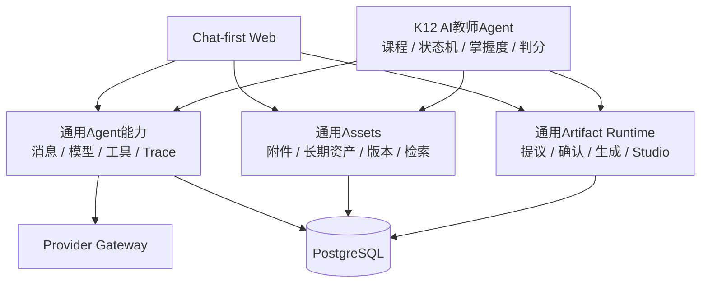
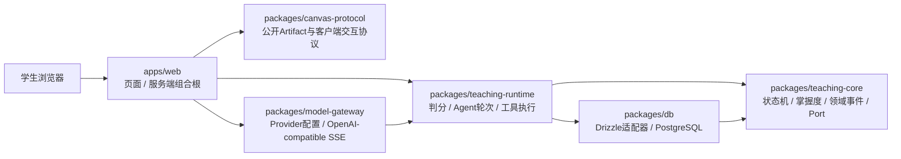

# 系统架构

- 状态：`draft`

## 设计原则

- EduCanvas平台本体是通用全模态Chat、Assets、Agent Runtime、Artifact Runtime和Studio；K12教学是首个垂直Agent；
- 通用模型、消息、工具、资产、Artifact和运行Trace协议不得依赖教学状态、掌握度或课程概念；
- 阶段一采用模块化单体，Next.js同时承载Web与BFF；领域逻辑必须留在独立workspace包中；
- 阶段二以后Next.js回归Web与BFF，不承载全部后端；
- 核心API无状态化，可水平扩展；
- 模型调用、检索、实时连接和长任务相互隔离；
- PostgreSQL是业务事实源；
- Redis只保存短期状态；
- 长任务必须可重试、可恢复；
- 所有模型调用和教学决策可追踪。

## 能力分层

平台层只提供通用执行与数据能力；垂直Agent选择工具、领域策略和专用Artifact。K12的可信学习事件可以驱动掌握度，但不能成为通用消息或Artifact协议的前置条件。

## 当前阶段一：模块化单体

当前代码已经拆出Canvas协议、教学核心、应用运行时、模型网关与数据库适配器。`teaching-core`保持纯逻辑并只声明Port；`teaching-runtime`包含可信判分、两阶段Turn Orchestrator、状态感知Tool Executor、可信状态推进与事件回放；`model-gateway`封装OpenAI-compatible SSE，不把供应商类型泄露给业务层。Next.js组合根已接通匿名身份、EduCanvas SSE、消息/模型/工具/安全账本、取消和刷新恢复。知识资料的不可变版本、FTS、Turn快照、候选和引用仓储已经落地，但尚未组合进Turn工具与引用UI；可信状态推进也尚未接入Web判分后的应用流程。

当前包边界仍带有“以K12纵切承载通用Agent基础设施”的历史形态：`model-gateway`依赖`teaching-core`中的通用模型契约，Web Turn编排位于`teaching-runtime`。下一阶段按[ADR-0009](../09-decisions/0009-general-multimodal-platform-and-k12-vertical.md)增量抽取通用`agent-core`/`agent-runtime`边界，并通过兼容导出迁移；不以一次性重命名或微服务拆分制造高风险重写。

## 目标服务形态

| 服务                | 职责                                 |
| ------------------- | ------------------------------------ |
| `web`               | Next.js页面、SSR、BFF和流式UI        |
| `core-api`          | 用户、Workspace、会话、权限和业务API |
| `realtime-gateway`  | SSE、WebSocket和语音信令             |
| `agent-runtime`     | 通用模型、工具、上下文和运行Trace    |
| `artifact-runtime`  | 通用Artifact提议、生成、校验和版本   |
| `teaching-runtime`  | K12教学状态机、判分和学生状态        |
| `retrieval-service` | 多模态资产检索、重排和证据组装       |
| `ai-worker`         | OCR、切块、Embedding和批处理         |
| `workflow-worker`   | 教材处理、报告和再索引等长任务       |

## 基础设施

- PostgreSQL + pgvector；
- PgBouncer；
- Redis；
- OSS/S3兼容对象存储；
- Temporal；
- Kafka/Redpanda在学习事件量增长后接入；
- OpenTelemetry统一观测。

这些是目标形态的基础设施，不是阶段一启动依赖。Redis、Temporal、Kafka/Redpanda和独立Worker按实际负载与可靠性需求逐步引入。

## 开放问题

- 首次上线采用自建Kubernetes还是托管容器平台；
- 实时语音是否直连模型供应商WebRTC；
- 事件总线在第几个阶段引入；
- 向量服务与业务PostgreSQL是否从第一天物理隔离。
