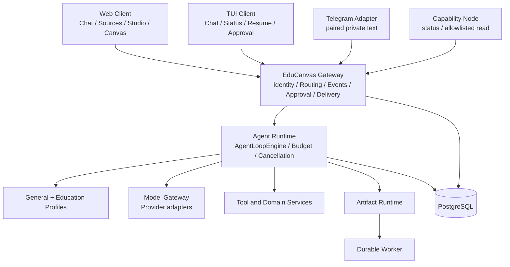
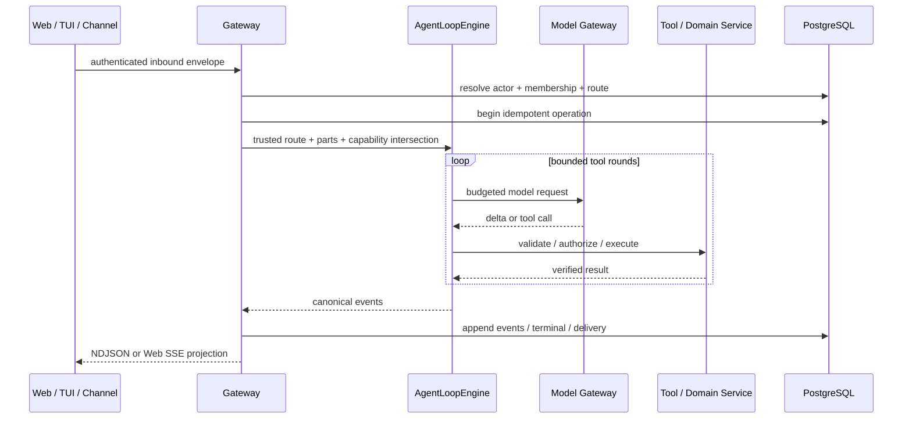

# 系统架构

- 状态：`accepted`
- 负责人：项目负责人
- 最后验证时间：2026-07-19
- 关键决策：[ADR-0015](../09-decisions/0015-education-centered-personal-agent-platform.md)、[ADR-0016](../09-decisions/0016-gateway-clients-channels-and-nodes.md)、[ADR-0017](../09-decisions/0017-unified-runtime-and-notebook-context.md)、[ADR-0019](../09-decisions/0019-modular-monolith-artifacts-and-durable-jobs.md)

## 架构原则

- 一个自然人拥有一个长期个人 Agent，Web、TUI 和渠道只是入口；
- 一个逻辑 Gateway 控制平面，一个生产 `AgentLoopEngine`；
- Notebook 是来源、会话、产物和共享授权的上下文根；
- 教育是默认且最深的能力域，但不进入通用 Gateway/模型循环契约；
- 权限、审批、判分和可信状态由模型之外的确定性代码裁决；
- 长任务与连接生命周期解耦；当前保持模块化单体，不提前拆微服务。

## 当前逻辑架构

`EduCanvas Gateway` 管连接、身份、路由、审批、事件和投递；`Model Gateway` 只适配模型供应商。两者不能互相替代。

## 已落地的物理边界

| 模块                                          | 当前职责                                                                     | 明确不负责                          |
| --------------------------------------------- | ---------------------------------------------------------------------------- | ----------------------------------- |
| `packages/gateway-core`                       | `gateway.v1` 角色、Envelope、事件、能力、审批、渠道、Node、投递和引用 Schema | Next.js、Drizzle、K12、Provider SDK |
| `packages/gateway-runtime`                    | 路由、指纹、幂等、Operation 事件流、恢复和单终态                             | Prompt、渠道原生协议、数据库实现    |
| `apps/gateway`                                | HTTP 组合根、Client/Node session、目录、审批、NDJSON、内部指标               | Web UI、教学判分、任意主机执行      |
| `packages/agent-runtime`                      | 唯一 `AgentLoopEngine`、模型流验证、Context/工具基础                         | Notebook 归属、K12 事实、具体渠道   |
| `apps/web`                                    | Web Client 与兼容 BFF，把 Chat/Learn 请求包装为可信 Gateway Envelope         | 接受客户端自报主体、第二套模型循环  |
| `apps/tui`                                    | 认证 bootstrap、会话列表、流式 Chat、状态/恢复/审批                          | 数据库和 Runtime 实现               |
| `packages/channel-telegram` / `apps/telegram` | 私聊 Update 归一化、绑定、幂等、Gateway 调用和投递账本                       | 群聊、媒体、高风险审批              |
| `packages/node-host` / `apps/node`            | 出站配对、心跳、撤销、状态与白名单只读文件                                   | Shell、写文件、任意根目录和入站端口 |
| `packages/teaching-core` / `teaching-runtime` | 教育策略、可信事实、可选课程 Workflow 和 Profile 适配                        | 另一套 Agent Loop                   |
| `apps/worker`                                 | Artifact、资料摄取和匿名主体维护的持久任务                                   | 交互连接和身份路由                  |

`apps/ + packages/` 顶层结构仍正确：可运行组合根放在 `apps`，可复用协议、应用服务和领域能力放在 `packages`。这次演进修正了内部职责，不需要更换顶层目录或全仓重命名。

## 一次 Agent Turn

Gateway Event 以 `operationId + sequence` 持久化并可用 `after` cursor 恢复。Web 与 TUI 自动化 Fixture 已证明同一用户可从两个 transport 到达同一 Notebook/Conversation；共享 Notebook 集成测试同时保留 Actor 的个人 Agent，不把 Notebook 当成主体。

## Notebook 与身份边界

- `platform_users` 与 `personal_agents` 建立一人一 Agent 的当前模型；
- `notebook_memberships` 的 `owner/editor/contributor/viewer` 决定 Notebook 行为，viewer 不能回复；
- 共享操作保存 `actor_user_id`、`agent_id`、`notebook_id` 和 `conversation_id`；
- 私人 Memory、Credential、Node Pairing 和默认 Tool Grant 不随 Membership 传播；
- `delegated_grants` 为教师/家长/管理员提供显式、到期、可撤销的授权，禁止冒充；
- Web 匿名 Cookie 只映射到 `anonymous_compat` 主体，不能成为 TUI/渠道的正式认证机制。

## 当前部署和限制

本地 `make dev` 启动 Web、Gateway、Worker 和 PostgreSQL。它们共享代码仓和数据库，但 Gateway 已是独立进程组合根。公共 Client/Node transport 只有同时配置至少 32 字节的 bootstrap token 和 session secret 才开启；内部 transport 也默认关闭。

当前不是 production：正式 IdP、自助账号生命周期、外部指标/Trace 后端、SLO、对象删除闭环、原生多模态和 Telegram live 凭据验证仍未完成。Gateway 的 bootstrap token 是管理员/本地建联凭据，掌握它可以为指定 user 建立 session，不能作为面向最终用户的登录方案。

详细协议和入口见 [Gateway 与多入口架构](gateway-and-channels.md)。
