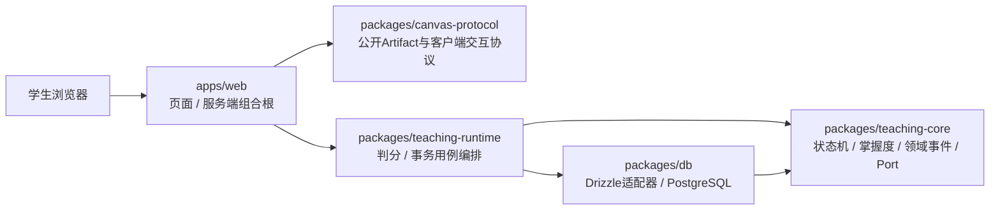

# 系统架构

- 状态：`draft`

## 设计原则

- 阶段一采用模块化单体，Next.js同时承载Web与BFF；领域逻辑必须留在独立workspace包中；
- 阶段二以后Next.js回归Web与BFF，不承载全部后端；
- 核心API无状态化，可水平扩展；
- 模型调用、检索、实时连接和长任务相互隔离；
- PostgreSQL是业务事实源；
- Redis只保存短期状态；
- 长任务必须可重试、可恢复；
- 所有模型调用和教学决策可追踪。

## 当前阶段一：模块化单体

当前代码已经拆出Canvas协议、教学核心、应用运行时与数据库适配器。`teaching-core`保持纯逻辑并只声明Port；`teaching-runtime`目前只实现`GradeCanvasSubmissionService`，用于编排服务端判分、可信测评事件和掌握度事务，不代表完整Agent教学运行时已经完成；Next.js组合根只注入具体实现。认证和session归属校验落地前，不开放浏览器可直接调用的判分Route Handler。

## 目标服务形态

| 服务                | 职责                            |
| ------------------- | ------------------------------- |
| `web`               | Next.js页面、SSR、BFF和流式UI   |
| `core-api`          | 用户、课程、会话、权限和业务API |
| `realtime-gateway`  | SSE、WebSocket和语音信令        |
| `teaching-runtime`  | 教学状态机、工具调用和学生状态  |
| `retrieval-service` | 混合检索、重排和证据组装        |
| `ai-worker`         | OCR、切块、Embedding和批处理    |
| `workflow-worker`   | 教材处理、报告和再索引等长任务  |

## 基础设施

- PostgreSQL + pgvector；
- PgBouncer；
- Redis；
- OSS/S3兼容对象存储；
- Temporal；
- Kafka/Redpanda在学习事件量增长后接入；
- OpenTelemetry统一观测。

这些是目标形态的基础设施，不是阶段一启动依赖。Redis、Temporal、Kafka/Redpanda和独立Worker按实际负载与可靠性需求逐步引入。

## 开放问题

- 首次上线采用自建Kubernetes还是托管容器平台；
- 实时语音是否直连模型供应商WebRTC；
- 事件总线在第几个阶段引入；
- 向量服务与业务PostgreSQL是否从第一天物理隔离。
