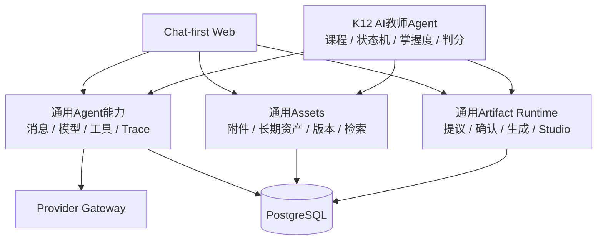
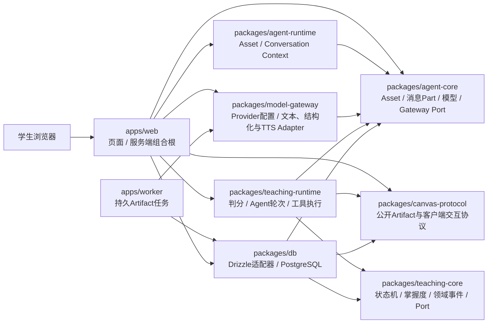
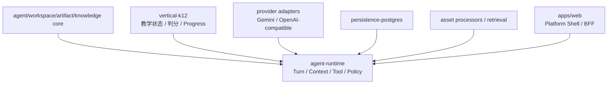

# 系统架构

- 状态：`draft`

## 设计原则

- EduCanvas平台本体是通用全模态Chat、Assets、Agent Runtime、Artifact Runtime和Studio；K12教学是首个垂直Agent；
- 通用模型、消息、工具、资产、Artifact和运行Trace协议不得依赖教学状态、掌握度或课程概念；
- 阶段一采用模块化单体，Next.js同时承载Web与BFF；领域逻辑必须留在独立workspace包中；
- 阶段二以后Next.js回归Web与BFF，不承载全部后端；
- 核心API无状态化，可水平扩展；
- 模型调用、检索、实时连接和长任务相互隔离；
- PostgreSQL是业务事实源；
- Redis只保存短期状态；
- 长任务必须可重试、可恢复；
- 所有模型调用和教学决策可追踪。

## 能力分层

平台层只提供通用执行与数据能力；垂直Agent选择工具、领域策略和专用Artifact。K12的可信学习事件可以驱动掌握度，但不能成为通用消息或Artifact协议的前置条件。

## 当前阶段一：模块化单体

当前代码已经拆出通用`agent-core`契约、`agent-runtime`上下文装配、Canvas协议、教学核心、教学应用运行时、模型网关与数据库适配器。`agent-runtime`现已同时负责Asset文本物化与有界Conversation历史选择；实际消息/Asset版本选择写入`turn_context_snapshots`。`agent-core`定义供应商无关的Asset、不可变版本引用、多Part消息、流式事件、运行元数据和Gateway Port；`model-gateway`已只依赖通用契约。`teaching-core`保持K12纯领域逻辑；`teaching-runtime`包含可信判分、两阶段Turn Orchestrator、状态感知Tool Executor、可信状态推进与事件回放。Next.js组合根已接通匿名身份、Asset上传、EduCanvas SSE、消息/模型/工具/安全账本、取消和刷新恢复；K1的FTS检索、候选白名单、引用持久化/SSE/UI已经进入Turn纵切；Canvas判分后只在可信`ASSESS`状态触发受控状态推进。

### 已确认的迁移缺口

- `agent-runtime`已负责Asset与Conversation Context装配，但通用Turn/Tool编排仍位于`teaching-runtime`；
- 模型输入契约仍是纯文本`ModelMessage.content`，原生图片、音频和视频引用尚不能进入Provider；
- 一等Space/Conversation与通用Message骨架已落地并回填K12 Session，但生产Turn/Model Run仍走`lesson_sessions + chat_messages`兼容链路；
- 用户上传Asset与可检索Source/Chunk仍是两条链路；
- Artifact已具备提议、确认、异步生成、不可变版本、Studio恢复和音频私有读取；
  尚缺跨轮迭代同一Artifact与插件化Renderer Registry；
- `learning-turn.ts`仍是Next.js中的K12大型组合根，传输、应用服务和基础设施装配尚待拆分。

迁移按[ADR-0009](../09-decisions/0009-general-multimodal-platform-and-k12-vertical.md)与[Gemini + NotebookLM 产品复刻计划](../plan/active/2026-07-gemini-notebooklm-replica.md)小步进行：先建立通用数据骨架和Runtime Port，再接原生全模态、Artifact Runtime与Platform Shell；不以一次性重命名或提前拆微服务制造高风险重写。

## 目标模块依赖

K12贡献Agent Profile、Policy、Tools、Progress和专用Artifact；Space、Conversation、Message、Asset、Artifact与Model Run属于平台层。

通用学生端将`Space + 主Conversation`投影为一个Notebook：Space是Sources与Studio Artifact的聚合根，Conversation是Notebook内的消息账本。当前保持一对一关系以降低迁移风险；Web不得把Space级来源降级为Composer附件，也不得按Conversation过滤掉仍属于该Space的Studio产物。

## 目标服务形态

| 服务                | 职责                                 |
| ------------------- | ------------------------------------ |
| `web`               | Next.js页面、SSR、BFF和流式UI        |
| `core-api`          | 用户、Workspace、会话、权限和业务API |
| `realtime-gateway`  | SSE、WebSocket和语音信令             |
| `agent-runtime`     | 通用模型、工具、上下文和运行Trace    |
| `artifact-runtime`  | 通用Artifact提议、生成、校验和版本   |
| `teaching-runtime`  | K12教学状态机、判分和学生状态        |
| `retrieval-service` | 多模态资产检索、重排和证据组装       |
| `ai-worker`         | OCR、切块、Embedding和批处理         |
| `workflow-worker`   | 教材处理、报告和再索引等长任务       |

## 基础设施

- PostgreSQL + pgvector；
- PgBouncer；
- Redis；
- OSS/S3兼容对象存储；
- Temporal；
- Kafka/Redpanda在学习事件量增长后接入；
- OpenTelemetry统一观测。

这些是目标形态的基础设施，不是阶段一启动依赖。Redis、Temporal、Kafka/Redpanda和独立Worker按实际负载与可靠性需求逐步引入。

## 开放问题

- 首次上线采用自建Kubernetes还是托管容器平台；
- 实时语音是否直连模型供应商WebRTC；
- 事件总线在第几个阶段引入；
- 向量服务与业务PostgreSQL是否从第一天物理隔离。
