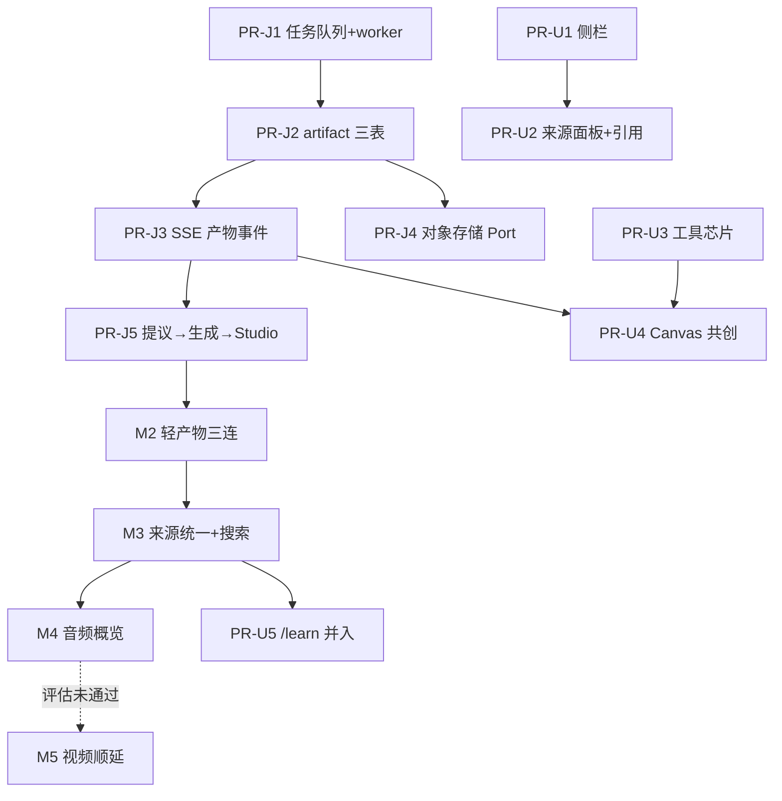

# Gemini + NotebookLM 产品复刻计划

- 状态：`active`
- 负责人：项目负责人
- 最后验证时间：2026-07-18
- 取代：[`2026-07-platform-decoupling-runtime-hardening.md`](../completed/2026-07-platform-decoupling-runtime-hardening.md) 与 [`2026-07-real-agent-learning-vertical-slice.md`](../completed/2026-07-real-agent-learning-vertical-slice.md) 的未完成部分
- 关键决策：[ADR-0009](../../09-decisions/0009-general-multimodal-platform-and-k12-vertical.md)、[ADR-0010](../../09-decisions/0010-canvas-trust-tiers.md)、[ADR-0011](../../09-decisions/0011-answer-phase-tool-preamble.md)、[ADR-0012](../../09-decisions/0012-artifact-runtime-durable-jobs.md)

## 目标

阶段目标是复刻 Gemini + NotebookLM 的产品体验：产品第一身份是多模态输入输出的 AI Agent（AI 老师是按需激活的第二身份），一个界面承载 Gemini 式对话与 Canvas 共创、NotebookLM 式来源管理与 Studio 产物输出。Agent 编排优化与各类创新属于下一阶段，不进入本计划。

体验基准（2026-07 拆解结论，写入 [student-ui-spec](../../01-product/student-ui-spec.md)）：

- Gemini：侧栏历史对话；落地渐变问候；输入框工具芯片（Canvas 可被用户显式选择，也可被模型建议）；Canvas 是持久、可跨轮迭代、有版本的共创分栏；
- NotebookLM：来源常驻面板（文档/网页/搜索结果，逐条勾选）；回答带行内数字引用可跳转原文；Studio 面板一键生成导图/Slides/测验/闪卡/音频概览/视频等产物。

## 完成画像（计划关闭时用户可以做什么）

以下每条都是可人工验收的用户行为，任何一条做不到就不满足完成条件：

1. 打开站点即 Gemini 式统一界面：侧栏可回到任一历史对话；输入框下有工具芯片，选中 Canvas 后本轮产物在右侧分栏展开；
2. 左侧常驻来源面板中添加 PDF、图片、网页链接或发起网页搜索，搜索结果成为可勾选来源；回答附行内数字引用，点击跳转来源原文；
3. 说一句"帮我把这些资料做成思维导图/Slides/测验"，产物由后台任务生成——**关闭浏览器再回来，任务仍在跑或已完成**；产物有版本、沉淀在 Studio 列表、可让 AI 继续修改（Canvas 共创）；
4. 生成一份基于所选来源的音频概览并在产物卡内播放；
5. 问到课程内容时，判分、掌握度与教学推进照常工作，但界面上不存在任何"K12 模式"入口。

明确不交付：正式账号体系与生产 hardening、自主多步规划的 Agent、视频概览（M5 有独立闸门，允许顺延为新计划）。

## Agent 循环模型与本计划的边界

Agent = goal → action → observation 的受控循环。三条不变量贯穿本计划所有实现：

1. **循环控制权在 runtime，不在模型**：工具可见性（状态白名单 × 注册表 × exposure）、参数校验、超时、预算、状态转移全部由确定性代码裁决；模型只负责表达与提议；
2. **每一圈都记账**：模型运行、工具调用、生成任务全部进 PostgreSQL 账本，可回放、可审计；
3. **本计划只扩展循环的两个维度**——action 空间从秒级工具扩展到分钟级持久产物任务（M1），圈数从硬编码一圈放开为 Agent Profile 的 `maxToolRounds` 策略配额（M3）。目标自主拆解、多步规划、后台长时程 Agent 属于下一阶段，本计划不做。

## 当前事实（2026-07-17）

- 已具备：真实 Provider SSE Turn（含工具前导文本容忍）、Space/Conversation/Operation 数据骨架、PDF/图片 Asset、FTS 检索与引用、统一分栏 CanvasHost（Tier 1 判分 + Tier 2 沙箱预览共用）、Markdown 渲染、深色 Gemini 式视觉；
- 结构性缺口：无持久异步任务与 worker、Artifact 非一等公民、SSE 无产物事件、无对象存储 Port、Turn 硬限两跑、Asset 与 Source/Chunk 双链路、无网页搜索来源、来源藏在抽屉、无侧栏历史、引用是尾部胶囊。

## 里程碑与实施顺序

### M1 产物主干（关键路径第一站，依 ADR-0012）

- [x] **PR-J1** 任务队列选型（graphile-worker vs pg-boss，对比记录回写 ADR-0012）+ worker 进程接入 `make dev` 与 CI 冒烟；
- [x] **PR-J2** `artifacts` / `artifact_versions` / `artifact_generation_jobs` 表与仓储（additive migration，trust tier 落列）；
- [x] **PR-J3** SSE 协议新增 `artifact.*` 事件族（additive `schemaVersion=1`，整体升版会迫使旧客户端拒收全部事件，故不升）；断连后经 `GET /api/v1/chat/artifacts` 恢复产物状态；
- [x] **PR-J4** `ObjectStoragePort`（本地实现起步，校验和入库）；
- [x] **PR-J5** 产物提议 → 用户确认 → 生成任务 → Studio 真实列表（吸收原纵切 PR-C1）——拆两刀执行：
  - [x] J5a 后端链路（PR #52）：原子入队、worker `artifact:generate`（v1 规则大纲）、mind_map Schema、创建/详情端点；
  - [x] J5b UI 链路（PR #54）：菜单入口 + 确认卡 + 轮询产物卡 + MindMap 渲染 + Studio 列表 + worker 进 E2E 编排 + 全链路 E2E。

**M1 验收状态**：全链路 E2E ✅（真实 worker 进程,含刷新恢复）；worker 重启任务恢复 ✅（任务即数据库行,J1/J5a 集成测试）；Tier 边界 ✅（生成任务静态边界检查 + 平台产物无学习事件写入路径）。备注:K12 侧提议入口与 Studio 沿用 CanvasPanel 现状,统一入口随 UI 线 U5(/learn 并入)收敛。

**验收**：一个"生成思维导图"全链路（对话 → 确认卡 → 任务 → 产物卡 → Canvas 打开 → 版本可查）E2E 可复现；worker 杀进程重启后任务恢复；Tier 2 产物持久化后仍无法写入学习事件（边界测试）。

### M2 轻产物三连（零重基建，紧随 M1 数据模型）

- [x] 思维导图 Artifact（结构化 JSON Schema + 客户端渲染，J5 落地；模型驱动生成随 PR #60 接通,含 generated_by 溯源与诚实三分支策略）；
- [x] Slides Schema Artifact（大纲 → 分页渲染，导出后置；PR #64）；
- [x] 闪卡泛化为通用自评式 Artifact（PR #65:自评仅存浏览器内存,不产生可信事件,UI 明示;K12 判分路径不变）；
- [ ] 通用**服务端判分测验**:需要平台产物的私有判分载荷分离设计(公开 content 经详情端点入浏览器,判分键不能同仓)——移入 M3 与来源统一一并设计,不赶工。

**验收**：三类产物均可从对话生成、进 Studio、在 CanvasHost 打开；测验在通用与 K12 两种上下文分别验证事件边界；每类 Schema 附单元测试。

### M3 来源统一与网页搜索

- [ ] Asset 与通用Representation/Chunk的完整单链路仍待后续摄取迁移（承接旧平台计划缺口 5），包括上传PDF自动可检索化、统一上下文预算和claim/span Anchor；
- [x] M3c网页来源纵切：`fetchWebPage`完整正文落Link AssetVersion → `operation_sources`跨工具圈稳定编号 → 最终正文合法`[n]`实际子集与消息终态原子写入`conversation_message_citations` → SSE/刷新/历史切换恢复 → 徽章打开服务端验证的原网址。`webSearch`摘要不能直接成为来源；general-only匿名主体同步纳入完整保留期删除闭包；
- [x] 最小 Agent Runtime:圈数策略化(PR #69)+ 引擎抽取至 agent-runtime(PR #71)+ AgentToolRegistry 与通用 turn 受验证循环(PR #72,圈配额 3)；
- [x] 搜索 Provider Adapter 与 URL 抓取器:webSearch(PR #72,实机冒烟✅)+ fetchWebPage 读页工具与链接导入为来源(PR #75:SSRF 纵深防护、kind=link/url_import 资产链路、实机从 2026-07 新闻页抽取事实✅)。"结果自动入统一 Source 管道"的深度统一并入 M3c 单链路工作。

**验收**：一次"围绕问题搜索网页 → 摘取多页 → 带行内引用作答"的多圈工具回路 E2E 可复现（Scripted 回放）；圈数超配额被 runtime 截停并诚实失败。

### M4 音频概览

- [x] `speech.generate` Provider Adapter（独立Port与`speech` alias；1次/任务、
  3500字符、20 MiB上限，无内部重试；模型/voice/字符数/耗时随版本审计）；
- [x] 冻结1–8项勾选AssetVersion → 来源脚本 → TTS → 对象存储 → 私有Range
  读取 → 音频产物卡/播放器/文字稿；checkpoint重投不重复调用TTS。

**验收**：从勾选来源生成音频概览，任务中断恢复后产物完整；音频二进制只在对象存储，数据库仅存引用与校验和。

### M5 视频概览（闸门里程碑）

- [x] Provider 选型与成本评估完成：外部生成式视频闸门**未通过**，按
  [ADR-0013](../../09-decisions/0013-video-overview-cost-gate.md)顺延为独立计划，不新增
  Provider/入口、不阻塞本计划关闭。最低候选的60秒名义成本仍为$1.80，且存在
  Preview、固定配额、英语Prompt、多片段拼接和来源失真风险；后续优先评估
  “来源脚本/Slides + M4配音 + 确定性MP4渲染”。

### UI 蓝图线（与 M1 起并行推进）

- [x] **PR-U1** 侧栏历史对话（Conversation 列表接口 + 左侧栏；PR #62）；
- [x] **PR-U2** 来源常驻面板替代 Sheet 抽屉；共享Chat渲染器支持K12来源徽章与通用网页引用，行内`[n]`跳到来源徽章，网页徽章安全打开原网址；工具新增Link Asset在Turn结束后刷新进来源面板；
- [x] **PR-U3** 输入框工具芯片（Canvas / 来源）：Canvas 意图可从空白入口带入会话，确认生成后按本轮一次性消费并自动打开分栏；来源芯片复用真实 Asset 选择状态并显示数量；
- [ ] **PR-U4** Canvas 共创化：产物持久挂接 Conversation，模型跨轮迭代同一产物（依赖 M1 PR-J2/J3）；
- [ ] **PR-U5** `/learn` 并入 `/` 统一界面（教学 Turn 接入 + learning-flow E2E 重写，与最小 Agent Runtime 协同排期）。

**验收**：完成画像 1/2 两条全部人工验收通过；视觉基线（darwin+linux）更新；reduced-motion 与键盘可达性维持现有 E2E 标准。

## 依赖与并行边界

- 同时最多两条开发线：**产物主干线**（J/M 系列）与 **UI 蓝图线**（U 系列）；
- 公共契约（SSE 协议、`schema.ts`、agent-core 契约）只允许在 PR-J2/J3 与 M3 的最小 Runtime PR 中修改，UI 线基于已合并契约开发；
- K12 收尾三项（非 `ASSESS` 事件、整节课 E2E、live smoke）不占开发线，竞赛节点前独立小批插入。

## 承接债务清单（旧计划未完成项，不丢）

| 来源        | 事项                                                                            | 归属                             |
| ----------- | ------------------------------------------------------------------------------- | -------------------------------- |
| 平台计划 P0 | 摘要/Sources/Artifact/Vertical Context 统一预算策略；synthesis 返回实际引用子集 | M3                               |
| 平台计划 P1 | 生产 Turn/Message Parts/Model Run 迁移通用 Operation；Asset 归属 Space          | M1 前置或并行                    |
| 纵切计划    | 非 `ASSESS` 状态事件接线、整节课 E2E、受控 live Provider smoke                  | K12 收尾，竞赛节点前独立小批执行 |
| 纵切计划    | 沙箱预览 E2E 覆盖                                                               | ✅ PR #63 清偿                   |

## 风险与闸门

- **worker 部署形态**：本地与 CI 从单进程变双进程，`make dev`/`make e2e` 必须在 PR-J1 内完成改造并保持一条命令启动，否则后续所有开发者路径断裂；
- **外部 Provider 成本**（搜索 API、TTS）：实现 PR 内必须带用量上限与失败降级（诚实失败，不静默重试烧钱）；选型对比记录回写对应 ADR；
- **视频（M5）**：2026-07-18成本闸门未通过，已按ADR-0013顺延；当前计划不新增
  视频Provider或入口，开发主线转入U3；
- **K12 回归**：每次合并前现有 E2E 全绿是底线；泛化测验（M2）时判分与掌握度的事件边界必须有双向测试（通用不产生可信事件、K12 照常产生）。

## 非目标

- production hardening（正式认证、多租户、法务/DPA、备份、分布式限流、SLO 与灰度）；
- 自主目标拆解、多步规划、后台长时程 Agent、多 Agent 协作、记忆系统（下一阶段"Agent 编排优化"的正题）；
- 微服务拆分：worker 进程是单体内的第二进程，不是服务边界。

## 质量门禁

- 每个里程碑内的核心纯逻辑（任务状态机、产物 Schema、来源合并、圈数配额）在实现 PR 附单元测试；
- 迁移全部 additive + 回填 + 兼容读取，K12 纵切回归（现有 E2E）在每次合并前保持通过；
- 行为/协议/数据变化在同 PR 更新 canonical 文档；重大取舍先 ADR。

## 证据状态

| 日期       | 事项                                                       | 证据                                                                                                                                                                |
| ---------- | ---------------------------------------------------------- | ------------------------------------------------------------------------------------------------------------------------------------------------------------------- |
| 2026-07-17 | 计划建立时基线                                             | 全部单元/集成/E2E、typecheck、production build 通过（随 PR #35–#40 合并验证）                                                                                       |
| 2026-07-17 | PR-J1 完成（PR #42）                                       | graphile-worker 选定并回写 ADR-0012；`make check`/`make integration` 全绿（含事务入队守护测试）；实机冒烟 SQL 入队 1.21ms 消费                                      |
| 2026-07-17 | PR-J2 完成（PR #44）                                       | artifact 三表迁移 0015 + 平台仓储;6 项集成测试(越权/版本单调/双形状约束/任务状态机/失败码)                                                                          |
| 2026-07-17 | PR-J3 完成（PR #46）                                       | 5 个 artifact 事件契约 + 严格解析正反向单测;恢复端点 GET /api/v1/chat/artifacts;api-conventions 同步                                                                |
| 2026-07-17 | 结构清理（PR #48/#49）                                     | workspace/server 按域重组、净删约 500 行仓储重复;worker 新增知识摄取与匿名清理任务;三套测试全绿                                                                     |
| 2026-07-17 | PR-J4 完成（PR #50）                                       | ObjectStoragePort 契约 + LocalObjectStorage(原子写/sha-256/readVerified);6 项单测                                                                                   |
| 2026-07-17 | PR-J5a 完成（PR #52）                                      | 三行同事务原子入队 + worker 生成回路集成测试;mind_map Schema;创建/详情端点;信任边界静态检查                                                                         |
| 2026-07-17 | PR-J5b 完成（PR #54）,**M1 收官**                          | 确认卡→状态卡→ArtifactCanvas→Studio 列表;E2E 编排拉起真实 worker;全套 25/25;entry 残留 K12 链接清除                                                                 |
| 2026-07-17 | 开发体验修复(#56/#58/#59)                                  | worker 自加载 env;Turbo passThroughEnv 根因修复;GSAP scale 重置警告消除                                                                                             |
| 2026-07-17 | M2-PR1 完成（PR #60）                                      | StructuredModelGateway 适配器(6 单测)+worker 模型路径(3 单测)+generated_by 溯源;真实 DeepSeek 冒烟产出合规导图                                                      |
| 2026-07-17 | U1 完成（PR #62）+ 沙箱 E2E 债清偿（PR #63）               | 侧栏历史/切换/E2E Provider 隔离;沙箱预览全回路 E2E                                                                                                                  |
| 2026-07-17 | M2 Slides/闪卡完成（PR #64/#65）                           | 双产物 Schema+渲染器+双策略生成;E2E 28/28;判分测验拆分决策记录                                                                                                      |
| 2026-07-17 | U2 前半完成（PR #67）                                      | 侧栏来源常驻区(勾选/直传),共享 assets 状态零新数据路径;E2E 28/28                                                                                                    |
| 2026-07-18 | M3a 完成（PR #69）                                         | 圈数策略化+契约语义迁移;编排器 21 测试(两圈累积/提前完成);check/integration/e2e 全绿                                                                                |
| 2026-07-18 | 引擎抽取+通用工具循环（PR #71/#72）                        | validateModelRun 迁 agent-runtime(零行为);通用 turn 受验证循环+webSearch(未配置降级);6 组新单测,e2e 28/28                                                           |
| 2026-07-18 | webSearch 实机联网冒烟 ✅                                  | 真浏览器零 mock:前导说明→真实 Tavily 检索→当日时效新闻(WAIC 2026 开幕)带来源链接作答                                                                                |
| 2026-07-18 | M3b-C 完成(PR #75)                                         | fetchWebPage 工具+链接导入为来源;SSRF 单测 4 组;实机:AI 读 2026-07 新闻页精确抽数、链接导入即现侧栏                                                                 |
| 2026-07-18 | M3c K12引用子集第一刀(`feat/20260718-citation-subset`)     | 最终安全回答marker→candidate子集/稀疏ordinal→SSE/刷新恢复→行内链接；`make check`、56项integration、production build、28项Chromium E2E通过；通用网页来源引用未标完成 |
| 2026-07-18 | M3c通用网页来源闭环(`feat/20260718-general-web-citations`) | Link AssetVersion快照+operation来源白名单+跨圈稳定编号+消息实际引用子集原子提交；网页SSE/历史恢复/原网址链接；general-only匿名清理集成覆盖；Scripted多页E2E         |
| 2026-07-18 | M4音频概览(`feat/20260718-audio-overview`)              | `speech.generate`+迁移0018；来源冻结→脚本→TTS→对象/checkpoint→版本；中断恢复0次重复TTS；私有Range播放器；集成6/6、Artifact E2E 4/4 |
| 2026-07-18 | M5视频概览成本闸门                                    | ADR-0013；官方价/能力对比后闸门未通过：最低60秒$1.80且为Preview固定配额；无Provider代码变更，顺延独立计划，主线转U3                      |

## 完成条件

- M1–M4 验收全部有可复现证据（M5 允许按闸门顺延为独立计划）；
- 完成画像五条全部人工验收通过；UI 蓝图线五项落地且视觉基线更新；
- 承接债务清单清零或显式移交下一计划；
- 稳定事实回写 canonical 文档，本计划压缩移入 `completed/`。
