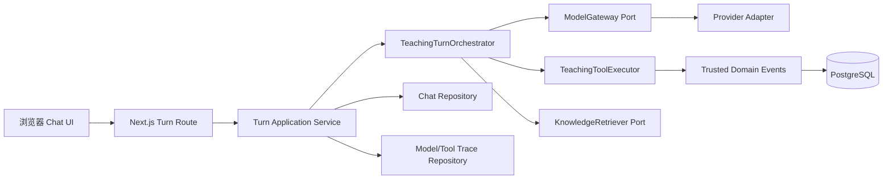
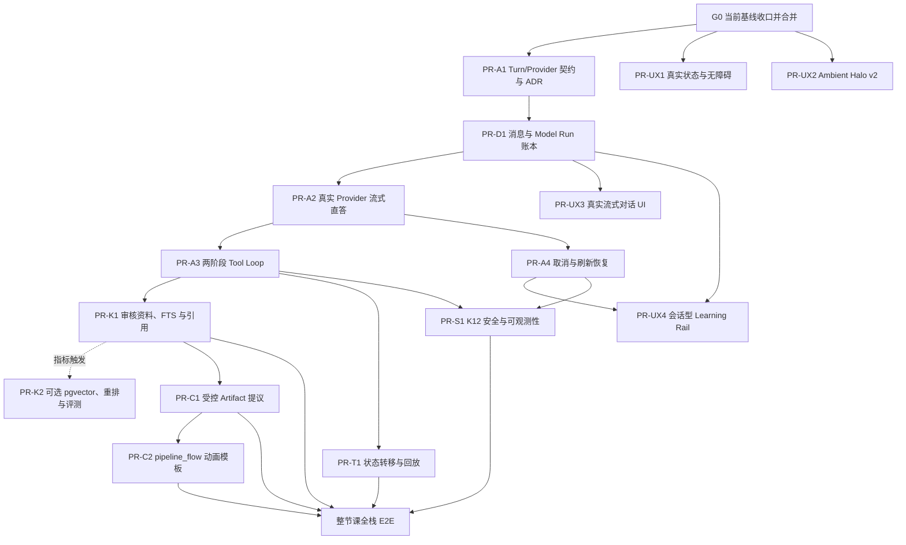

# 真实 Agent 学习纵切与体验优化计划

- 状态：`active`
- 负责人：项目负责人
- 最后验证时间：2026-07-16
- 对应路线图阶段：[阶段一：产品纵切](../../10-planning/roadmap.md#阶段一产品纵切)
- 研究输入：`EduCanvas Evidence-Driven Implementation Research`（2026-07-15 会话附件）

> 范围声明：本文是 K12 AI 教师这一首个垂直 Agent 的交付计划，不是 EduCanvas 平台总产品定义。通用 Chat、Assets、Agent Runtime、Artifact Runtime 与 Studio 的边界由[产品定义](../../01-product/product-definition.md)和[ADR-0009](../../09-decisions/0009-general-multimodal-platform-and-k12-vertical.md)约束；教学状态机、掌握度和可信判分不得反向成为通用平台依赖。

> 治理说明：平台解耦、连续对话、Space/Conversation、原生全模态和Artifact Runtime的后续实施以[通用平台解耦计划](./2026-07-platform-decoupling-runtime-hardening.md)为准。本文“研究边界与初始仓库基线”保留的是计划启动时的历史差距，不是当前代码事实；开发不得从该历史表复制已过期路径或结论。

## 目标

在不削弱现有状态机、受控 Canvas、可信学习事件和服务端判分边界的前提下，完成“AI 如何识别猫和狗”的真实 Agent 教学纵切：学生提出一个未预设的问题，服务端调用真实模型并流式回答；消息和模型运行可审计、刷新后可恢复；模型只能调用当前状态允许的工具；课程资料回答具有服务端可验证引用；学生确认后才能创建受控 Artifact；练习结果继续由服务端判分并驱动掌握度、教学状态和下一步推荐。

本计划同时收口两条体验支线：一是以近黑背景、多层低对比光场改进 Chat-empty 质感；二是在真实会话、资料和产物数据存在后，再逐步加入可折叠 Learning Rail。两条支线都不得使用硬编码数据伪装已存在的 Agent 能力。

本 active plan 的完成终点是“受控 shared dev 中可审计的匿名完整教学纵切”，不是生产发布。staging 与 production 门槛在本文中用于约束设计方向，正式认证、法务审批、数据生命周期、备份恢复和生产 SLO 必须在后续 production-hardening active plan 中实现并验收。

## 当前实施快照（2026-07-16）

当前处于“本地真实 Agent 纵切收口”阶段，不再是 G0/UI 骨架阶段，也尚未达到 shared dev 完整纵切：

| 状态     | 能力                                                                                                    | 当前证据                                                                                                                                                                                                                  |
| -------- | ------------------------------------------------------------------------------------------------------- | ------------------------------------------------------------------------------------------------------------------------------------------------------------------------------------------------------------------------- |
| 已实现   | G0、UX1/UX2、A1、D1、A2/A3/A4、UX3/UX4、S1 基线；通用Asset纵切；K1 Web接线；T1 `ASSESS`接线；C2受控模板 | 真实Turn/Cancel Route、Provider与两阶段工具循环、可审计账本与安全Gate；PDF/图片上传、不可变Asset版本和消息Part；FTS检索、候选白名单、引用SSE/UI；可信ASSESS推进；严格`pipeline_flow` Schema、静态Renderer与AnimationShell |
| 已验证   | 单元、生产构建、PostgreSQL集成、无Provider诚实失败、浏览器交互与视觉基线                                | 289项单元测试、46项PostgreSQL integration、23项Chromium E2E；Asset所有权/恢复、K1迁移与引用防伪、桌面/移动深色基线、reduced-motion与菜单键盘焦点通过；正式live smoke仍未执行                                              |
| 待完成   | C1、完整状态事件、整节课E2E与受控live smoke                                                             | 完成Artifact提议/确认/生成/Studio真实列表；补齐非`ASSESS`状态事件接线；随后验证整节课Trace与轮换后Provider Key的合成数据真实调用                                                                                          |
| 后续计划 | production hardening                                                                                    | 正式认证、多租户、法务/DPA、备份恢复、分布式限流、生产 SLO 与灰度                                                                                                                                                         |

从工程协作上可以立即开启独立 Backend 工作流：`teaching-core`、`teaching-runtime`、`model-gateway`、`db` 与 Web BFF 已有稳定边界，前后端通过 EduCanvas SSE v1、Artifact Schema 和 Server Action DTO 对齐。但当前继续保持模块化单体部署；只有出现独立扩缩容、长任务、故障隔离或多客户端复用的真实需求后，才评估拆出独立 API/Worker 服务。

## 研究边界与初始仓库基线

输入报告没有访问本地仓库，因此其中的 Google 产品观察和供应商资料可作为研究输入，仓库现状判断不能直接视为事实。2026-07-15 已逐项核对当前代码，得到以下基线：

> 这里保留的是计划启动时的差距分析，不代表 2026-07-16 的当前实现状态；当前事实以本文顶部的“当前实施快照”和“验证证据”为准。

| 领域              | 已核验事实                                                                                                                                                                                                                                       | 计划含义                                                       |
| ----------------- | ------------------------------------------------------------------------------------------------------------------------------------------------------------------------------------------------------------------------------------------------ | -------------------------------------------------------------- |
| 学生对话          | 消息只存在 React 内存；发送后显示“模型未接入”，没有服务端 Turn API、SSE 或消息恢复（[`learn-workspace.tsx`](../../../apps/web/features/workspace/learn-workspace.tsx):90-150）                                                                   | 真实消息账本和服务端流式纵切是主阻塞项                         |
| 防伪回复          | 当前工作树已将正常页面与 Demo Script 解耦，并新增生产依赖边界测试（[`production-boundary.test.ts`](../../../apps/web/features/chat/production-boundary.test.ts):22-37）                                                                          | 先合并这条安全基线，后续 PR 不再混入 Demo 行为                 |
| 模型端口          | `ModelGateway` 供应商无关，但只有 `generateStructured()`，元数据也不足以完整审计真实流式调用（[`ports.ts`](../../../packages/teaching-core/src/ports.ts):91-121）                                                                                | 保留结构化生成，并增加供应商无关的流式事件契约                 |
| Turn Orchestrator | 已有状态感知 Prompt、结构化回答/工具计划和工具授权；当前不持久化、不转移状态、工具后不做二次合成（[`turn-orchestrator.ts`](../../../packages/teaching-runtime/src/turn-orchestrator.ts):192-226、332-345）                                       | 在现有 Orchestrator 上补齐两阶段循环，不替换领域运行时         |
| 工具执行          | “状态白名单 × 注册 Handler × exposure”以及 Schema、超时、整批预检和进程内去重已经存在（[`tools.ts`](../../../packages/teaching-core/src/tools.ts):28-78；[`tool-executor.ts`](../../../packages/teaching-runtime/src/tool-executor.ts):228-277） | 首批只接只读生产 Handler，再按业务需要增加持久审计和写工具幂等 |
| 数据              | 只有 lesson session、公开/私有 Artifact、可信学习事件和掌握度表（[`schema.ts`](../../../packages/db/src/schema.ts):13-147）                                                                                                                      | 不照搬报告一次性建十余张表；按功能到来增量迁移                 |
| 可信教学事实      | 状态机转移权属于 runtime，影响掌握度的事实只能由服务端可信事件产生（[`ADR-0004`](../../09-decisions/0004-state-machine-runtime.md):20-27；[`ADR-0006`](../../09-decisions/0006-trusted-learning-events.md):15-22）                               | 模型文字、工具原始输出和浏览器状态都不能直接改 mastery/state   |
| Canvas            | Artifact 严格 Schema、公开/私有分离和静态 Renderer 注册表已经存在（[`artifact.ts`](../../../packages/canvas-protocol/src/artifact.ts):5-44；[`canvas-registry.tsx`](../../../apps/web/features/canvas/canvas-registry.tsx):234-241）             | 继续输出 JSON + 白名单 Renderer；不执行模型生成的 HTML/JS/GSAP |
| RAG               | 只有 `KnowledgeRetriever` Port；摄取、表结构、pgvector、Reranker 和评测集均不存在（[`ports.ts`](../../../packages/teaching-core/src/ports.ts):123-148；[`rag-embedding.md`](../../03-ai/rag-embedding.md):3-5）                                  | 先做审核资料与可验证引用，再加向量和学生上传                   |
| 视觉              | 空态只有单个高饱和径向渐变节点，GSAP 只动画 transform/opacity（[`empty-chat-hero.tsx`](../../../apps/web/features/workspace/empty-chat-hero.tsx):12-73；[`globals.css`](../../../apps/web/app/globals.css):37-68）                               | 多层 Halo 可以独立并行，但参数必须经过真实截图与性能验收       |
| 测试              | CI 已有 checks、PostgreSQL integration 和生产构建 E2E（[`.github/workflows/ci.yml`](../../../.github/workflows/ci.yml):8-114）                                                                                                                   | 新能力在各自 PR 内补测试，不把全栈验证留到最后                 |

## 需求摘要

1. Chat 是唯一常驻主交互；Canvas、资料、Studio 和进度继续按需出现。
2. 正常学生问题必须产生真实 Provider 调用，或返回明确失败；成功老师回答不能存在零 Provider 调用。
3. 浏览器只提交问题、附件引用和幂等键；可信学生身份与当前 lesson session 继续由服务端 Cookie 和课程范围恢复，不能接受客户端声明的 `studentId` 或 `sessionId`（[`learning-session.ts`](../../../apps/web/server/learning-session.ts):90-116）。
4. 用户可见消息与运行 Trace 分层持久化；刷新至少恢复 `completed / failed / cancelled / interrupted`，首版不冒充“逐 token 无缝续传”。
5. 模型只能看到 runtime 选择的工具；工具调用必须经过 Schema、状态、权限、配额和幂等校验，工具结果必须进入第二次模型合成。
6. 知识资料是显式、可选择、可版本化的资产；每个引用必须映射到本轮实际检索到的不可变 chunk。
7. Artifact 必须先提议、再由学生确认、再经服务端 Schema 校验和静态注册表渲染。
8. DeepSeek 可作为隔离开发环境的可选适配器，但在未成年人法务、隐私、数据驻留和供应商审批完成前，生产 alias 必须禁止解析到 DeepSeek。
9. 已经暴露在对话中的旧 API Key 视为泄露，必须先在供应商控制台吊销；新 Key 只进入服务端 secret，禁止 `NEXT_PUBLIC_*`，禁止写入仓库、日志、截图或测试 Fixture。

## 架构决定（本计划提案，实施前写入 ADR）

### 1. 保留模块化单体和现有领域边界

阶段一仍由 Next.js 承担 Web/BFF，领域协议留在 workspace 包中（[`system-architecture.md`](../../02-architecture/system-architecture.md):5-28）。不引入 LangChain/LangGraph 作为状态事实源，不因接入模型而推倒 `teaching-core → ports ← adapters` 结构。

### 2. EduCanvas 自己拥有流式协议

- `teaching-core` 定义归一化 `TurnModelEvent`、`ProviderCallMetadata`、`NormalizedModelError` 和模型别名；供应商 SDK 类型不得越过适配器包。
- 正常教学 Turn 必须进入 `TeachingTurnOrchestrator.streamTurn()`：直接回答只有一次 `phase=answer` 模型运行；工具路径先由一次 `phase=answer` 运行产出 tool calls，执行后再由一次 `phase=synthesis` 运行流式生成最终回答。单轮模型运行硬上限为两次。
- 首次 `answer` 运行若产生 tool calls，不得同时把未经过工具结果验证的文本作为最终老师回答；工具执行后必须进入 `synthesis`，失败则诚实收敛为失败状态。
- `ModelGateway.generateStructured()` 不参与正常对话 Turn，只保留给 Artifact 和离线结构化任务；现有基于 `TeachingTurnPlan` 的正常生产路径在 PR-A3 结束前移除或降为测试迁移代码，并由依赖边界测试禁止生产导入。
- “单轮最多两次”只约束 `operationKind=teaching_turn`。学生确认提案后触发的 Artifact 生成是新的 `operationKind=artifact_generation`，以 proposal ID 作为 operation ID 单独审计，不能复用原 Turn ID 或 assistant message，也不能把第三次模型运行塞回原 Turn Trace。
- Web Route 把内部 Turn 事件转换为 EduCanvas SSE 事件，不能把 DeepSeek 或 AI SDK 原始事件直接透传给浏览器。
- Vercel AI SDK 只允许作为适配器内部实现细节。PR-A1 先用契约 Fixture 验证它能否完整保留 response ID、tool call ID、usage、finish reason、fingerprint 和 Abort；若不能，首个 OpenAI-compatible Adapter 直接解析供应商 SSE。

### 3. 阶段一复用 `lesson_sessions` 作为对话容器

当前产品是一节 lesson session 对应一条主要教学对话，因此首批只增加 `chat_messages` 与 `model_runs`。暂不增加 `conversations`、通用 `message_parts`、一对一 `token_usage`、数据库 `prompt_versions` 或 `stream_sessions`：

- `lesson_sessions` 增加 `status: active | archived`、`last_activity_at`、`archived_at` 和可空 `title`；同一可信身份/课程范围内显式恢复某个 session 时，在同一事务中将它设为 active，并归档原 active session；
- “新建学习”创建新 session 并保留旧记录；“恢复学习”只切换 active 状态，不复制或覆盖消息；首版标题来自课程名与第一条学生消息的确定性截断；
- 多分支对话出现后再增加 `conversations` 并回填默认会话；
- 文本先放 `chat_messages.content`，资料、引用和工具各自使用严格关联表；
- Token 直接作为 `model_runs` 显式列；
- Prompt 先保存代码版本与 hash，出现后台 Prompt 灰度后再建 registry；
- 真正逐 delta 续传需要可重放事件，不用一个只有 resume token 的空壳表伪装完成。
- `clientMessageId` 是发送 Turn 的唯一幂等键，不再同时引入含义重叠的 `idempotencyKey`：同 ID + 同标准化内容返回原 turn，同 ID + 不同内容返回稳定 conflict；取消、完成、失败和 lease 收敛使用条件更新，遵守 first-terminal-write-wins。

### 4. Provider 与 K12 治理解耦

- `taskAlias` 表示业务任务，例如 `teaching.turn`、`artifact.generate`、`retrieval.query_rewrite`；`modelAlias` 表示路由档位，例如 `primary`、`fast`、`structured`。两者不得混为一个字段，也不得把供应商模型 ID 写入业务代码。
- 第一个 Provider Adapter 可以使用 DeepSeek 做本地合成问题的技术验证，但默认 production 配置必须拒绝该映射，直到治理清单被签字接受。
- 不保存、展示或分析供应商原始推理内容；不把内部 student/session ID 自动发送给供应商。

### 5. 数据和引用采用现有 knowledge taxonomy

数据库沿用文档中的 `knowledge_sources / knowledge_documents / knowledge_chunks / embedding_spaces`，产品 UI 继续称“知识资产”，避免同时维护报告中的 `assets/*` 与仓库中的 `knowledge/*` 两套概念（[`data-design.md`](../../04-data/data-design.md):26-30）。对象存储只保存 `object_key`，不保存可能过期或泄露权限的公开 URL。

## 范围

- 合并当前“无 Provider 诚实失败 + Demo Script 生产隔离 + Chat-first 视觉基线”工作；
- 修复当前 S0 和资料/Studio 文案中仍存在的伪能力暗示；
- 定义真实 Turn、Provider、SSE、消息和 Trace 契约；
- 建立最小消息/模型运行账本；
- 接通真实直接回答、取消和刷新恢复；
- 完成受控两阶段工具循环和首批只读生产工具；
- 建立教师/课程预置资料的检索与服务端引用闭环；
- 接通受控 Artifact 提议和现有 Canvas 判分闭环；
- 补齐教学状态转移应用服务、事件回放和下一步推荐；
- 优化 Ambient Halo，并在真实数据存在后加入 Learning Rail；
- 完成 shared dev 的匿名纵切证据，并把 staging/production 的未满足条件显式移交给后续 production-hardening 计划。

## 非目标

- 不在本阶段执行模型生成的任意 HTML、JavaScript 或 GSAP；
- 不一次性支持 PDF、图片、链接、DOCX、PPTX、音视频等所有上传类型；
- 不在没有长任务业务前提前引入 Temporal、Redis、独立 Worker 或 `studio_jobs`；
- 不做无缝逐 token 断点续传，除非后续 ADR 选择 durable event ledger 或外部 stream broker；
- 不在匿名纵切内冒充已经完成正式账号、班级、学校和多租户能力；
- 不把报告中的 Gemini 色值、纵向位置或动画参数当作已验证品牌规范；
- 不把 DeepSeek 直接设为未成年人生产主模型。

## 依赖顺序与并行路线

同一时间最多保持三条开发线：Runtime/Provider、Data/RAG、UX/Motion。跨线公共契约只由 PR-A1 和 PR-D1 修改；其余分支基于已合并契约开发，避免多个 Agent 同时改 `ports.ts`、`schema.ts` 和 `LearnWorkspace`。

## 实施步骤

### G0：收口并合并当前安全基线

**依赖：** 无。后续工作不得继续混入当前大范围 UI/文档工作树。

**文件：**

- `apps/web/features/workspace/learn-workspace.tsx`
- `apps/web/features/workspace/top-bar.tsx`
- `apps/web/features/assets/assets-drawer.tsx`
- `apps/web/features/studio/studio-drawer.tsx`
- `apps/web/features/composer/plus-menu.tsx`
- `apps/web/features/chat/production-boundary.test.ts`
- `tests/e2e/learning-flow.spec.ts`
- `tests/e2e/learning-visual.spec.ts`

**工作：**

1. 保留 Demo Script 仅测试可用和正常页面无伪回复边界。
2. 修复 `quiet` 只隐藏课程/阶段、却仍显示 Progress/Studio 的偏差（[`top-bar.tsx`](../../../apps/web/features/workspace/top-bar.tsx):34-74）。
3. 在真实状态投影接入前隐藏硬编码“练习”；在 RAG 接入前禁用或改写“勾选资料会成为回答依据”；将预置 Artifact 描述为“本课预置互动”而非“老师生成”（[`learn-workspace.tsx`](../../../apps/web/features/workspace/learn-workspace.tsx):96-109、251-255、352-367）。
4. 将学生界面的技术错误改成“AI 老师暂时无法连接，请稍后重试”；消息持久化落地前不得声称问题已保存，技术原因只进入服务端稳定错误码和日志。
5. 将“创建互动演示”改为“打开本课互动演示”，直到真实 Artifact 生成链路存在。
6. 关闭当前范围后完成 commit/PR，后续从最新 main 新开分支。

**验收：**

- 在 Learning Rail 实现前，新访客和已有匿名会话刷新后的 S0 都只显示品牌、问候和 Composer；
- 生产 Web 源码扫描不到 Demo Script 或 `ScriptedModelGateway` 依赖；
- UI 不声称资料已被模型使用、预置 Artifact 已由 AI 生成或阶段来自 runtime；
- lint、typecheck、unit、build、PostgreSQL integration、Playwright、视觉快照和 `git diff --check` 全部通过；
- 旧 DeepSeek Key 已在供应商控制台吊销，且 Git 跟踪文件中无 secret。

**回退：** 只回退本 PR 的 UI/文档变更；保留 Demo 生产隔离测试。

### PR-UX1：真实状态、移动 Canvas 与无障碍收口

**依赖：** G0。可与 PR-A1、PR-UX2 并行。

**工作：**

- 移动/全屏 Canvas 使用真正的 `dialog`、`aria-modal`、焦点约束、背景 inert 和焦点归还；桌面侧栏保持 `region`（当前仅为覆盖式 section，见 [`canvas-panel.tsx`](../../../apps/web/features/canvas/canvas-panel.tsx):80-124）。
- 为可拖拽分隔条增加 `aria-valuemin / aria-valuemax / aria-valuenow / aria-valuetext`。
- 字符图标替换为现有 Phosphor 图标；未接通菜单项隐藏或明确 disabled，并从 roving focus 中跳过。
- 增加 320px 宽、200% 缩放、键盘与读屏状态测试。

**验收：**

- Canvas 打开后 Tab 不进入底层 Chat，Escape/关闭按钮归还触发点；
- 320px 与 200% 缩放无横向溢出；正文对比度不低于 4.5:1，焦点与组件边界不低于 3:1；
- E2E 覆盖刷新 S0、移动 Canvas 焦点循环、分隔条键盘值变化。

### PR-UX2：Ambient Halo v2

**依赖：** G0。无 AI/数据库依赖。

**文件：**

- `apps/web/features/workspace/empty-chat-hero.tsx`
- 新建 `apps/web/features/workspace/ambient-halo.tsx`
- `apps/web/app/globals.css`
- `tests/e2e/learning-visual.spec.ts`
- `docs/06-quality/visual-regression.md`

**工作：**

- 保留近黑 `--color-canvas`，使用最多三层错位的低透明度蓝/紫/青静态 gradient + blur；增加暗部 vignette。
- 模糊子层保持静态，GSAP 只动画 wrapper 的 transform/opacity；不使用 WebGL、鼠标跟随或逐帧 blur/background-position。
- 页面 hidden 时暂停 Timeline，visible 时恢复；reduced-motion 不创建无限 Timeline并移除不必要 `will-change`。
- 移动端降为一层动画 core + 静态 ambient haze。

**验收：**

- Composer 视觉亮度高于光场，光场没有硬边贴住输入框，不再呈现整块高饱和蓝色椭圆；
- 使用同视口参考图与实现图人工并排验收，不以报告参数代替判断；
- 5 秒 Performance trace 中，首次栅格化后光场不持续触发 Layout/连续 Paint，也不产生由光场导致的 >50ms 长任务；
- reduced-motion 下相隔 5 秒截图像素稳定；桌面和移动 S0 均有快照；
- 若三层未保持 compositor-only，回退为一层动画 + 两层静态。

### PR-A1：真实 Turn、Provider Alias 与 SSE 契约

**依赖：** G0。

**文件：**

- `packages/teaching-core/src/ports.ts`
- `packages/teaching-core/src/index.ts`
- `packages/teaching-runtime/src/turn-orchestrator.ts`
- 新建 `packages/model-gateway/`
- `docs/03-ai/model-routing.md`
- `docs/05-engineering/api-conventions.md`
- 新增 ADR-0007“真实 Turn 与 Provider 治理”
- 新增 ADR-0008“消息、Trace 与刷新恢复”

**契约：**

- `TaskAlias`（`teaching.turn / artifact.generate / retrieval.query_rewrite`）与 `ModelAlias`（`primary / fast / structured`）；
- `StreamTurnTextRequest`；
- `TurnModelEvent`：`text_delta / tool_call / usage / completed / failed`；
- `ProviderCallMetadata`：provider response ID、provider、model alias、resolved model ID/revision、fingerprint、finish reason、usage、latency、trace ID；
- `NormalizedModelError`：timeout、rate limit、content filtered、invalid response、aborted、unavailable、unknown；
- 当前 EduCanvas Web 事件：`turn.accepted / message.delta / message.citation / tool.* / turn.completed / turn.failed / turn.cancelled`；Artifact 生命周期事件在 C1 实现时 additive 增加。

**验收：**

- `teaching-core`、`teaching-runtime` 和 Web 组件不导入供应商 SDK/类型；
- 契约明确：正常 Turn 只调用 `streamTurnText()`；`generateStructured()` 只能用于 Artifact/离线结构任务；Scripted Gateway 继续只用于测试；
- 直接回答 Trace 严格为一个 `phase=answer` model run；工具回答严格为 `answer → tool calls → synthesis`，单轮不允许第三次模型运行；
- 契约测试覆盖正常 delta、分块 tool call、usage、完成、Abort、畸形事件和稳定错误映射；
- 供应商模型 ID 只出现在配置、适配器和审计结果中；
- ADR 明确 AI SDK 与原生 SSE 的自动选择标准，以及 DeepSeek 的 dev-only 默认策略。

### PR-D1：最小对话与模型运行账本

**依赖：** PR-A1。可与 Provider Adapter 实现并行，但先于 Web 流式接线合并。

**数据：**

1. `lesson_sessions` 增量字段
   - `status: active | archived / title / last_activity_at / archived_at`；
   - 同一可信身份与课程范围只允许一个 active session；新建/恢复由应用服务在事务中切换状态。
2. `chat_messages`
   - `id / session_id / turn_id / client_message_id / request_hash`；`request_hash` 使用服务端约定的 NFC、换行和首尾空白规范化后计算，不进入日志；
   - `role: student | assistant`；
   - `status: pending | streaming | completed | cancelled | interrupted | failed`；
   - `content / failure_code / created_at / completed_at / cancel_requested_at / cancelled_at`；
   - 唯一约束 `(session_id, client_message_id)`；稳定 cursor `(session_id, created_at, id)`。
3. `model_runs`
   - `session_id / operation_id / operation_kind / assistant_message_id? / turn_id? / phase / attempt / trace_id`；
   - D1 首版只写 `operation_kind=teaching_turn`，要求 `assistant_message_id` 与 `turn_id` 非空且 `operation_id=turn_id`；C1 再以 additive migration 增加 `artifact_proposal_id` 外键，并扩展约束支持 `artifact_generation`；
   - `task_alias / model_alias / prompt_version / prompt_hash`；
   - `provider / provider_model_id / model_revision / provider_response_id / system_fingerprint / finish_reason`；
   - `status: pending | running | succeeded | failed | cancelled | interrupted`，以及 `error_code / input_tokens / output_tokens / cache_hit_tokens / reasoning_tokens / latency_ms`；
   - `started_at / completed_at`。

**文件：**

- `packages/db/src/schema.ts`
- 新建 `packages/db/src/chat-repository.ts`
- 新建 `packages/db/src/model-run-repository.ts`
- `packages/db/src/index.ts`
- 新增 Drizzle migration/snapshot 和独立 integration suite
- `apps/web/server/learning-session.ts`
- `apps/web/features/learning/learning-contracts.ts`

**验收：**

- `clientMessageId` 是唯一发送幂等键：同 ID + 同标准化内容并发提交只产生一条学生消息、一个 turn 并返回原结果；同 ID + 不同内容返回 `409 message_id_conflict`，且不调用 Provider；
- 消息状态只允许 `pending → streaming → completed|failed|cancelled|interrupted`；终态通过条件更新写入，cancel/complete、lease/complete 竞争都保持 first-terminal-write-wins；
- 数据库以部分唯一索引保证每个可信身份/课程范围最多一个 active session，并以约束/仓储测试保证每个 `operation_kind + operation_id + phase + attempt` 唯一；
- Provider `aborted` 只有在服务端已经记录显式取消请求时映射为 `cancelled`；浏览器断连、进程退出或意外上游中断映射为 `interrupted` 或 `failed`，不能伪装成用户取消；
- 新建、归档、恢复和最近会话列表遵守 session 所有权与单 active 约束，`last_activity_at` 只由服务端消息事实推进；
- 错误身份不能读取或写入其他学生消息；
- 成功 assistant message 至少关联一个成功 `model_run`，指标 `completed_assistant_messages_without_model_run = 0`；
- Provider 失败后 assistant message 收敛到 `failed`，不能永久停留 pending/streaming；
- 页面刷新按稳定 cursor 恢复完整历史；
- 全新安装与从 migration `0003` 升级都通过真实 PostgreSQL 测试；
- 迁移使用 expand/contract：回滚应用和 feature flag，不立即 drop 已写入的新表。

### PR-A2：真实 Provider 流式直接回答

**依赖：** PR-A1、PR-D1。

**文件：**

- `packages/model-gateway/src/*`
- `apps/web/server/model-runtime.ts`
- `apps/web/server/learning-turn.ts`
- 新建 `apps/web/app/api/v1/learn/turn/route.ts`
- `apps/web/server/teaching-runtime.ts`
- `apps/web/features/workspace/learn-workspace.tsx`
- `apps/web/features/chat/messages.ts`
- `.env.example`

**工作：**

1. Route兼容纯文本请求，并支持严格的`{ clientMessageId, parts }`多Part请求；服务端恢复身份和lesson session，逐个验证Asset归属与版本，不能接受客户端声明的`sessionId`或私有存储键。
2. Route 必须调用 `TeachingTurnOrchestrator.streamTurn()`，不能从 Web 层绕过 Orchestrator 直接调用 Provider；直接回答只产生一次 `taskAlias=teaching.turn, modelAlias=primary, phase=answer` 模型运行。
3. 短事务先写学生消息、pending assistant message 与 pending model run，再调用供应商；不得在流式期间持有数据库事务。
4. Provider delta 映射为 EduCanvas 事件；完成、失败、取消均通过条件更新收敛消息和 model run 状态。
5. 重复 `clientMessageId` 请求先比较标准化正文：相同则返回既有 turn/状态，不重复调用 Provider；不同则稳定返回 conflict。
6. 前端只渲染真实 delta；不存在 Provider call 时不得显示 typing。
7. Provider alias 默认未配置即诚实失败；DeepSeek alias 只允许 local/dev + 合成问题，production 默认拒绝。
8. 同一 lesson session 首版只允许一个 active turn；第二轮并发请求稳定返回 `409 turn_in_progress`，本阶段不实现隐式队列。请求体大小、单轮 Token 上限和最近窗口调用次数在进入 Provider 前校验；阶段一可使用 PostgreSQL 状态/查询实现，不能用仅进程内计数冒充分布式限流。

**验收：**

- 一个未见过的问题产生真实 Provider response ID、resolved model、usage、latency 和至少一个 `message.delta`；
- `provider_calls_per_completed_turn >= 1`，首个 delta 必须先于 `turn.completed`；
- 不允许先生成完整文本再用定时器切块伪装 streaming；
- 429、timeout、内容过滤、畸形 SSE、连接中断和 Provider 未配置均返回稳定错误码与学生可理解文案；
- 同一 session 的并发第二轮稳定返回 `turn_in_progress`，不产生第二个 Provider 调用；
- API Key、原始 system Prompt、学生正文和供应商推理不进入普通日志；
- Contract 测试使用官方格式 Fixture；真实 live smoke 只在手动/nightly 隔离环境使用合成问题和独立 secret。

### PR-UX3：真实流式对话体验

**依赖：** PR-A1 契约、PR-D1 DTO。可先用契约 Fixture 开发，最终与 PR-A2 联调。

**工作：**

- 支持 pending、streaming、completed、failed、cancelled、interrupted；并发轮次明确提示当前回答尚未结束，失败原位重试，流式时显示真实停止按钮。
- 长对话仅在用户接近底部或刚发送自己的消息时自动贴底，不能打断向上阅读；当前无条件贴底逻辑位于 [`learn-workspace.tsx`](../../../apps/web/features/workspace/learn-workspace.tsx):117-121。
- 读屏器只播报“开始回答 / 回答完成 / 回答失败”，不逐 token 播报。
- 刷新后恢复历史和 turn 状态，不退回 S0。

**验收：**

- 首问流式、失败、重试、停止和刷新恢复均有 Playwright；
- 无 Provider call 时 typing 数量为零；
- 长线程滚动、键盘焦点和屏幕阅读器播报不会因 delta 频率失控。

### PR-A3：两阶段 Tool Loop 与持久审计

**依赖：** PR-A2。

**文件：**

- `packages/teaching-runtime/src/turn-orchestrator.ts`
- `packages/teaching-runtime/src/tool-executor.ts`
- `apps/web/server/teaching-tools.ts`
- `packages/db/src/schema.ts`
- 新建 `packages/db/src/tool-call-repository.ts`

**工作：**

- 生产组合已接`getStudentState`与`retrieveKnowledge`只读Handler；后续工具仍必须按真实纵切逐项注册。
- 第一次 `phase=answer` Provider 运行提出 tool call 后，不输出最终老师文本；runtime 预检和授权 → 执行 → 持久化脱敏审计 → tool result 回注 Provider → 唯一一次 `phase=synthesis` 运行流式生成最终老师回答。
- 到功能出现时才新增 `tool_calls`；一对一结果先保存在同一记录的严格、脱敏结果摘要，不提前建空 `tool_results` 表。
- 持久唯一键覆盖 runtime execution ID 与 `(model_run_id, provider_tool_call_id)`；写工具将来必须先取得数据库幂等记录。
- PR 合并时移除正常生产路径对 `TeachingTurnPlan`/`generateStructured()` 的依赖；若为旧测试保留兼容层，必须位于测试专用入口并有生产依赖边界测试。

**验收：**

- `TOOLS_EXECUTED` 不再是学生可见终态；工具路径最终得到二次合成文本或明确失败；
- 每轮最多两次模型阶段、最多四个 tool call，禁止无限循环；
- 越权、未知工具、非法参数、重复 call ID、超时和二次合成失败均有单元/集成测试；
- Trace 可关联 answer model run → tool call → 结果摘要 → synthesis model run；直接回答 Trace 不得出现 synthesis run；
- 工具原始异常、堆栈、敏感参数和未过滤输出不进入 UI/普通日志；
- 工具结果不能直接修改 mastery/state，可信事实继续走现有 Unit of Work。

### PR-A4：取消、租约与刷新恢复

**依赖：** PR-A2。可与 PR-A3 并行。

**工作：**

- `POST /api/v1/learn/turn/{turnId}/cancel` 只从服务端 session 所有权解析目标 Turn，幂等记录 `cancel_requested_at`，再把 AbortSignal 传到 Provider；迟到 delta 不能覆盖已写终态。
- 浏览器网络断开不等于显式 Stop：若服务端仍可完成则继续持久化；进程/上游意外终止则由 lease 收敛为 interrupted/failed，不能写成 cancelled。
- streaming assistant message 使用 lease/heartbeat 或等价机制；过期后收敛为 `interrupted`，页面提供“重新发送”，不永久转圈。
- 首版刷新只恢复已持久状态和完成内容，不宣称从丢失 token 处续传。
- 如果产品仍把逐 delta 续传列为硬要求，另写 ADR，在 PostgreSQL `turn_stream_events` 与外部 durable broker 中二选一；必须存可重放事件并实现 Last-Event-ID，不能只保存 resume token。

**验收：**

- Stop 后 Provider 接收到 abort，消息/model run 进入 cancelled；
- 覆盖 cancel/complete 竞争、双击 Stop、双标签页、服务器重启和 lease 过期；
- 刷新准确显示 completed/failed/cancelled/interrupted，并且无永远 streaming 记录；
- 不支持无缝续传时，产品文案明确“回答已中断，可重新发送”。

### PR-S1：K12 安全、Provider 治理与可观测性基线

**依赖：** PR-A3、PR-A4。它是进入 shared dev 和完整纵切 E2E 的阻塞项，不代表生产治理已经完成。

**工作：**

- Provider 路由采用服务端环境 allowlist：`local/test/shared-dev/staging/production` 分别配置可用 provider；DeepSeek 在 staging/production 配置解析阶段硬拒绝，不能只靠 UI feature flag。
- 为匿名教学纵切固定并版本化 K12 system policy：年龄适配表达、事实不确定性、禁止诱导提供身份信息、危险操作边界，以及自伤、虐待、性内容、暴力等高风险类别的安全回应与升级提示。
- 输入在 Provider 前完成大小、注入模式、PII 与高风险分类；输出在发给浏览器前经过小缓冲分段安全检查。命中阻断策略时停止正常 delta，记录稳定 `policy_code`，返回不泄露内部规则的年龄适配文案。
- 增加不含原文的 `turn_safety_decisions`：`turn_id / phase / policy_version / category / action / detector_version / created_at`；普通 telemetry、错误日志和 Trace 禁止记录学生正文、资料正文、system Prompt、供应商原始推理、secret 或未经脱敏的工具参数。
- shared dev 仅允许合成数据和明确知情的内部测试者；匿名保留单位是整个 synthetic subject，而不是单条 session：当该 `student_id` 的所有 session 最后活动均超过 7 天时，事务性删除其全部会话数据。
- S1 建立中央 anonymous-data lifecycle registry 和幂等清理服务。最终删除闭包按外键顺序覆盖：`message_citations`；`tool_calls / model_runs / turn_safety_decisions`；`canvas_artifact_grading_keys / canvas_artifacts / artifact_proposals`；`retrieval_candidates / turn_source_versions / session_source_bindings`；`chat_messages / learning_events / lesson_sessions`；最后删除该 subject 的 `mastery_states`。共享课程的 `knowledge_sources/documents/chunks` 不属于学生数据，不随选择记录删除。
- S1 首次合并覆盖当时已存在的表；之后 PR-K1、PR-T1、PR-C1 只要增加 `student_id/session_id/turn_id/proposal_id` 关联表，就必须在同一 PR 扩展 lifecycle registry、清理 Fixture 和残留断言，否则不得合并。聚合指标只有在移除 student/session/trace 高基数标识并不可逆聚合后才能保留。
- 增加指标与告警：`provider_calls_per_completed_turn`、`completed_assistant_messages_without_model_run`、首 token/完整 turn p50/p95、过期 streaming、policy block、rate limit、tool reject、citation invalid、清理任务失败；所有维度使用低基数 alias/error code。
- CI 增加 secret scanning、依赖漏洞扫描、生产 Provider allowlist 测试、日志脱敏测试和 K12 对抗 Fixture；真实 Provider smoke 只在隔离手动/nightly 任务中使用合成输入。

**验收：**

- production 配置即使误填 DeepSeek Key 也无法解析出 DeepSeek adapter；local/shared-dev 可通过显式 allowlist 启用且默认关闭；
- 高风险、PII、prompt injection、越权工具和正常教学问题的冻结 Fixture 均得到预期 action，安全策略版本可从 Trace 关联但无原始敏感文本；
- 日志捕获测试扫描不到 API Key、学生原文、资料原文、system Prompt 和 reasoning；`completed_assistant_messages_without_model_run` 始终为 0；
- 7 天清理测试先为同一 synthetic subject 在上述每张当前表写入记录并保存所有 session/turn/proposal ID；执行后逐表断言残留为零、`mastery_states` 为零、共享课程资料仍存在。重复执行无错误，事务失败不留下半清理状态并触发告警；
- shared dev 明示“仅限合成/内部测试数据”，正式未成年人流量继续被后续 production-hardening 计划阻塞。

### PR-UX4：真实会话型 Learning Rail

**依赖：** PR-D1；完整“继续中断学习”依赖 PR-A4。资料和 Studio 区域分别等待 PR-K1/PR-C1，不得先放硬编码列表。

**工作：**

- 桌面默认窄 rail：新建学习、搜索会话、当前课程、最近 lesson sessions、继续中断的学习；S0 不自动展开。
- 移动端使用模态导航抽屉，不保留永久侧栏。
- UI 使用 EduCanvas 的课程/本课/学习记录语义，不复制 Gemini 的 Library、Gem、Upgrade 或模型档位。
- `aria-current` 标记当前会话；展开偏好可保存在本地，会话事实只能来自服务端。
- 增加 `listOwnedRecent()` 与显式“新建学习”应用服务；新建操作保留旧 session 并创建新 session，不能继续复用当前 `bootstrap()` 的单一活跃会话语义。首版列表标题使用课程名 + 第一条学生消息的确定性截断，不额外调用模型生成标题。
- 同步更新 `student-ui-spec.md`：S0 禁止“展开侧栏”，但允许一个不抢焦点的折叠图标 rail；如果视觉验收认为仍过重，则 S0 完全隐藏 rail。

**验收：**

- 所有列表来自真实查询，无硬编码 recent items；无权或已删除会话不能打开；
- 新建学习不会覆盖或串写旧 session；搜索、分页和恢复都只返回当前可信身份拥有的记录；
- collapsed/expanded/mobile drawer 均支持键盘和焦点恢复，并有视觉快照；
- 展开 rail 后 Chat 保持可读宽度；S0 的主要视觉焦点仍是 Composer。

### PR-K1：审核课程资料、FTS 与服务端引用

**依赖：** PR-A3。

**范围：** 只支持通过服务端 CLI/受控摄取任务导入的课程纯文本和可解析 PDF；阶段一尚无教师账号，暂不开放学生/教师页面上传、OCR、任意 URL 抓取或多模态 Embedding。

**数据与文件：**

- `knowledge_sources`
- `knowledge_documents`（不可变版本、hash、object key、解析状态）
- `knowledge_chunks`
- `session_source_bindings`（session 与允许使用的课程 source，记录启用/停用事实）
- `turn_source_versions`（Turn 开始时解析并冻结的不可变 document version 快照）
- `retrieval_candidates`（本轮实际返回的 chunk、retriever/version、rank、score 和 query hash）
- `message_citations`（只引用 `retrieval_candidate_id`，不能直接接受任意 chunk/document ID）
- 对象存储 Port/Adapter、摄取服务、PostgreSQL FTS Retriever
- 扩展 `KnowledgeEvidence`，加入 document/version、content hash、定位和 rank
- `apps/web` 中“本次使用的资料”引用 UI

**服务端流程：**

1. 受控摄取任务创建不可变 document version 和 chunks；同一 hash 重试返回原版本。
2. 资料选择接口只接受当前课程范围内的 `sourceId`，服务端校验身份/课程后写入 `session_source_bindings`；浏览器不能声明 document version、chunk 或 citation。
3. Turn 开始时，服务端从 active bindings 解析每个 source 的当前可用版本，写入 `turn_source_versions`；该快照在本轮内不可变，之后换版只影响新 Turn。
4. Retriever 只能在快照版本和课程范围内查询；返回候选先写入 `retrieval_candidates`，再交给 Orchestrator。
5. 模型引用标记由服务端映射到候选集合；`message_citations` 必须外键关联候选，未在本轮候选集中的引用一律拒绝。

**验收：**

- 同一 hash 摄取幂等；跨课程/学生隔离；解析失败显式可见；
- Citation 只能引用本轮 `retrieval_candidates`，服务器逐条验证 message、turn snapshot、document version 与 chunk 关联；伪造 source/version/chunk/candidate ID 均返回稳定错误且不写引用；
- 并发换版期间，同一 Turn 的检索和引用始终使用同一 `turn_source_versions` 快照；后续 Turn 才能看到新版本；
- 删除/换版后旧 chunk 不进入新检索，历史引用显示 tombstone 而非错误正文；
- 上传材料中的 prompt injection 不能覆盖 system/runtime policy；
- 有资料时显示“依据课程资料”，无资料时明确“依据通用知识”；
- RAG 未接通前删除当前本地勾选即生效的假交互。

### PR-K2：可选 pgvector、Embedding、重排与评测

**依赖：** PR-K1 已建立 FTS、引用基线和冻结评测集。它不阻塞 shared-dev 完整纵切或整节课 E2E。

**启动条件：** 在至少 100 条、覆盖事实定位/概念解释/跨段综合/易混概念的冻结中文教材查询上，满足任一条件才启动：FTS `Recall@10 < 0.90`、可验证引用覆盖率 `< 0.95`、或人工裁决的 top-3 错 source 比例 `> 5%`。均未触发则记录基线并推迟本 PR，不为“架构完整”引入向量复杂度。

**工作：**

- 增加 `embedding_spaces` 和需要的 chunk embedding 关联；不同模型/版本/维度/指令 hash 不混用空间。
- 实现 FTS + pgvector + RRF + Reranker；模型变更走双写、回填、Shadow、灰度和回滚窗口。
- 建立固定 K12 中文教材检索集，记录 Recall@10、MRR@10、nDCG@10、错学段召回、引用覆盖率和 p50/p95。

**验收：**

- hybrid 结果至少不低于 PR-K1 冻结的 FTS 基线；任何下降必须有书面接受记录；
- superseded/deleted chunk 不被召回；跨课程隔离为零泄漏；
- 每次检索 Trace 可定位 embedding space、chunk version、rank 和 rerank 结果。

### PR-T1：可信状态转移、回放与下一步推荐

**依赖：** PR-A3；可与 PR-K1 并行。

**文件：**

- `packages/teaching-core/src/state-machine.ts`
- 新建 `packages/teaching-runtime/src/state-transition.ts`
- `packages/db/src/teaching-adapters.ts`
- Replayer/Projector 与集成测试

**工作：**

- Orchestrator 只能提出候选信号；状态应用服务使用 guard、乐观锁、Unit of Work 和 `state_transition` 可信事件提交。
- 从 `learning_events` 重建教学状态、掌握度、提示和误区投影；增量结果必须与全量回放一致。
- `recommendNextNode` 只消费可信掌握度与课程配置。

**验收：**

- 对抗 Prompt 无法跳过 PRACTICE/ASSESS；非法转移不写状态或事件；
- 同一 causation/idempotency key 并发执行只产生一个状态事实；
- 全量回放与线上投影一致；工具原始文本不能成为转移依据。

### PR-C1：受控 Artifact 提议与真实 Studio 列表

**依赖：** PR-A3、PR-K1；沿用 ADR-0002，不开放任意代码。

**工作：**

- `proposeArtifact` 是注册到 `TeachingToolExecutor` 的 state-allowed runtime tool，输入使用严格 Schema，并沿用 `TurnModelEvent.tool_call`、tool audit 和 A3 的幂等/调用上限；它唯一允许的副作用是持久化 proposal，不生成 Artifact、不挂载 Canvas。不得从老师自由文本、Markdown、正则或前端关键词推断“需要创建 Artifact”。
- 新增 `artifact_proposals`：`proposal_id / session_id / turn_id / provider_tool_call_id / kind / objective / status(pending|generating|ready|rejected|expired|failed) / expires_at / source_snapshot_hash / confirmation_id / generation_attempt / lease_expires_at / created_at / resolved_at`；`(turn_id, provider_tool_call_id)` 唯一，提案默认 30 分钟过期。
- `canvas_artifacts` 增加可空且唯一的 `proposal_id` 外键；Artifact 通过它反查 proposal，不在两张表之间建立双向外键。
- Web 只展示服务端持久化的 `artifact.proposed` 卡片。确认接口 `POST /api/v1/learn/artifact-proposals/{proposalId}/accept` 只接受路径中的 `proposalId` 与 body 中的 `confirmationId`（该操作的幂等键），并重新校验 session 所有权、有效期、kind 白名单、source snapshot，以及当前状态是否允许首次确认、幂等读取或 lease 恢复。
- 首次合法确认通过行锁/条件更新把提案原子改为 `generating` 并取得 lease，再启动独立 `operationKind=artifact_generation, operationId=proposalId`；该 operation 调用一次 `generateStructured(taskAlias=artifact.generate, modelAlias=structured)` 生成已有 `quiz`/`classification_game` Artifact，不计入原 teaching Turn 的两次模型上限。
- C1 以 additive migration 给 `model_runs` 增加 `artifact_proposal_id` 外键并扩展 check：`artifact_generation` 必须 `artifact_proposal_id` 非空、`assistant_message_id/turn_id` 为空、`operation_id=proposal_id`、`phase=artifact`；原始教学 Turn 通过 proposal 的 `turn_id` 间接追溯。Artifact 持久化与 proposal `ready` 在同一事务提交，并以 `canvas_artifacts.proposal_id UNIQUE` 保证至多一份产物。
- 同一 `confirmationId` 重试在 pending/generating/ready/failed 各状态返回或恢复同一 proposal；不同确认键在首次确认后返回 conflict。lease 过期才允许同 confirmation 重试生成，且受最大 attempt 限制。
- 服务端严格校验、拆分公开题面/私有判分键、持久化，再发 `artifact.ready`；模型文本不能直接打开 Canvas。
- Studio 从 `canvas_artifacts` 真实查询，不再从 `LearnWorkspace` 拼硬编码输出。
- Artifact generation operation 也写入 `model_runs`，记录 alias、Prompt/schema 版本、usage、attempt 与稳定失败状态；每次 attempt 最多一次模型调用，最多两次 attempt。

**验收：**

- 任意模型文本、过期/跨会话 proposal 或篡改 payload 都不能直接挂载 Canvas；只有注册类型和服务端验证成功的版本可渲染；
- Trace 明确区分 `teaching_turn` 与 `artifact_generation`；原 Turn 始终最多两个 model run，Artifact run 没有伪造的 assistant message/turn 关联；
- 确认操作覆盖重复请求、并发双击、不同 confirmation ID、过期、拒绝、进程崩溃、lease 过期、生成失败和同 confirmation 重试；任一分支最多生成一个 Artifact；
- Artifact revision 仍使用现有 snapshot + schemaVersion；没有编辑/version 业务前不额外建 `artifact_versions`；
- Studio 列表可刷新恢复，预置和 AI 生成来源描述准确；
- Canvas 提交继续走服务端判分和可信 `assessment_graded`，不改变现有安全回归。

### PR-C2：`pipeline_flow` 与 AnimationShell

**依赖：** PR-C1。沿用 [`canvas-and-gsap.md`](../../02-architecture/canvas-and-gsap.md):32-55 的模板族方案。

**工作：**

- 为 `pipeline_flow` 增加严格教学语义 Schema、公开投影、静态 Renderer 注册和协议测试；
- 实现共享 `AnimationShell`：播放、暂停、跳转、上一步、下一步、重置、速度和 reduced-motion；
- 模型只能填写步骤文案、已注册语义槽位、高亮顺序和暂停点，不能输出选择器、任意属性、时长或 GSAP 指令；
- 动画交互先作为不可信 Canvas event，只有 runtime 确认的完成事实才能进入 `learning_events`。

**验收：**

- 未注册槽位、未知字段和任意动画指令被 Schema 拒绝；
- Timeline 卸载/隐藏时停止并清理，键盘控制和 reduced-motion 可用；
- 动画普通播放事件不改变 mastery；服务端确认的完成事件幂等且可回放；
- 桌面、移动、暂停点与 reduced-motion 均有 E2E/视觉证据。

## 整节课验收场景

阶段完成需要两类互补证据：普通 CI 使用可控 Provider Fixture 验证确定性协议与失败分支；隔离环境再用合成问题跑一次真实 Provider smoke，证明生产 Route 没有退化成脚本。二者共同覆盖以下完整故事，而不是用不稳定的真实 Provider 取代日常 E2E：

1. 学生进入安静 S0，提出一个测试集中未硬编码的问题；
2. 服务端创建消息和 model run，真实 Provider 流式回答；
3. 刷新后问题、回答和状态仍存在；
4. 学生启用一份审核课程资料，服务端冻结本轮 source version/candidate 集合，回答展示可定位且可验证的引用；
5. Provider 请求 `getStudentState` 或 `retrieveKnowledge`，runtime 授权、执行并做第二次合成；
6. AI 通过结构化 side-channel 持久化 Artifact proposal，学生以幂等确认操作接受后，受控 Canvas 才打开；
7. 学生提交答案，服务端判分、追加可信事件、更新 mastery 和教学状态；
8. Progress、Studio、Learning Rail 与下一步建议均从持久事实读取；
9. 全链路可以通过同一 trace ID 查询消息、model run、tool call、source snapshot、retrieval candidate、citation、safety decision、artifact proposal/artifact 与 learning event；
10. 任一 Provider/RAG/工具失败都进入可重试的诚实状态，不生成伪回复或伪产物。

## 验证策略

全栈验证从 PR-D1 开始逐 PR 执行，不等功能全部完成后再补。

| 层级                   | 每个相关 PR 的证据                                                                                 |
| ---------------------- | -------------------------------------------------------------------------------------------------- |
| Unit                   | Alias 路由、错误归一、SSE parser、tool loop stop、citation mapper、Artifact validator、state guard |
| Contract               | 使用供应商官方格式但不含 secret 的 SSE/tool/usage Fixture；EduCanvas Turn Event Schema             |
| PostgreSQL integration | 消息/模型运行幂等、所有权、失败收敛、tool audit、citation、迁移 fresh install + 0003 upgrade       |
| E2E                    | 真实 Fixture 流式顺序、停止、失败、刷新恢复、Rail、引用、Artifact 确认、判分和状态推进             |
| Controlled live smoke  | 隔离环境、合成问题、手动/nightly 触发；验证 response ID、usage、delta 和 Provider 真实性           |
| Security               | Prompt injection、未知工具、跨会话访问、引用伪造、Artifact 篡改、PII/secret/reasoning 泄漏         |
| Visual/a11y            | S0、长对话、Halo、Rail、Canvas、引用、Studio；reduced-motion、键盘、320px、200% 缩放               |
| Observability          | Provider 调用/成功率、首 token/完整 turn p50/p95、过期 streaming、工具结果、引用覆盖和无效引用     |

基础命令沿用 [`testing-and-evaluation.md`](../../06-quality/testing-and-evaluation.md):39-49；新增表后为 `packages/db` 增加独立 lint，并拆分共享 truncate Fixture，避免集成测试初始化列表无限增长。CI 同时增加 secret scanning、dependency scanning 和不含真实学生文本的手动/nightly live smoke；普通 PR 不读取供应商 secret。

## 环境推进门槛

### 可进入本地真实联调

- G0、PR-A1、PR-D1、PR-A2 合并；
- 新 Provider Key 已轮换并只在本地 server env；
- 合成问题 live smoke 产生真实 response ID、usage 和 delta；
- Provider 未配置/失败时没有伪回复。

### 可进入共享 dev

- PR-A3、PR-A4、PR-UX3、PR-S1 完成；
- 消息/模型/工具 Trace 可查询；停止、失败、刷新恢复通过 E2E；
- Alias 能一键禁用或切换 Provider；基础限流和配额已启用；
- 共享环境不允许使用已经泄露的 Key，也不允许真实学生数据进入未审批 Provider；仅允许合成数据和知情内部测试者。

### 本 active plan 完成：shared dev 匿名纵切

- PR-UX1/UX2/UX4、PR-K1、PR-T1、PR-C1/C2 和整节课 E2E 完成；PR-K2 仅在冻结指标触发时执行；
- 同一匿名 lesson session 可完成真实问答、一次受控 tool loop、审核资料引用、Artifact 提案/确认、服务端判分、状态推进和刷新恢复；
- PR-S1 的环境 allowlist、K12 policy、日志脱敏、匿名 7 天清理、关键指标和告警均有可复现证据；
- 最终 Schema 的 synthetic subject 清理 Fixture 覆盖消息、Trace、RAG 快照/候选、Artifact/判分键、学习事件、session 和 mastery，逐表残留为零；
- 该环境仍不是未成年人生产环境；不得引入真实学生、班级或学校数据。

### 可进入 staging（后续 production-hardening plan）

- 本 active plan 已完成并压缩归档；另一个 production-hardening active plan 已建立并通过独立安全审阅；
- 正式认证、授权、会话吊销、CSRF、聊天/工具/Artifact 分层限流已实现；
- 供应商法务/隐私/数据驻留/DPA 审批完成；未获批 Provider 的 production alias 仍硬禁用；
- Prompt/RAG/安全评测集通过，关键指标与告警可见；
- additive migration、应用回滚、备份/PITR 恢复完成演练；所有上述证据不得由本计划中的 shared-dev smoke 代替。

### 可进入 production（后续 production-hardening plan）

- staging 使用合成和受控试点数据完成灰度，无高危安全问题；
- 未成年人隐私告知、同意、保留、导出、删除和高风险内容升级流程完成；
- 容量、429/timeout、数据库故障和 Provider 切换演练通过；如果届时启用了 Worker/长任务，再增加对应故障演练；
- 关键 SLO、成本预算、告警负责人和回滚手册已签字；
- 完整课程 E2E、模型回归、检索基线和可访问性验收全部有可复现证据。

生产推进由证据门槛决定，不由日期决定。当前已完成通用Asset首条纵切、K1 Web检索引用、T1 `ASSESS`推进与C2受控模板，但C1、完整状态事件、live smoke与整节课证据仍未完成；本active plan不授予进入staging或production的结论。

## 生产强化的后续计划边界

以下内容在真实纵切验收后另建 active plan，不继续扩张本文件：

- 对象存储、链接/音频/视频导入、OCR、恶意文件检测和完整文件删除链路（本地PDF/图片Asset首条纵切已实现）；
- 正式用户、教师、班级、学校与多租户，以及认证、授权、会话吊销和 CSRF；
- 未成年人法务/DPA、隐私告知/同意、导出/删除、危机升级流程和正式 Provider 审批；
- 分布式分层限流、正式账号/上传资产的法务保留/导出/删除编排、备份/PITR、灾难恢复、生产 SLO/告警责任和灰度回滚；
- Slide、音频、视频等长任务及 `studio_jobs`、Outbox、Worker/Temporal 选型；
- 无缝流重放（若仍有业务价值）；
- 多 Provider Fallback、熔断、成本和容量治理；
- 生产灰度和竞赛交付包装。

## 风险与回退

| 风险                          | 触发信号                              | 缓解                                       | 回退                                               |
| ----------------------------- | ------------------------------------- | ------------------------------------------ | -------------------------------------------------- |
| Provider 对未成年人治理不合格 | 法务/隐私未批准，或数据驻留不符合要求 | production alias 硬禁用；本地只用合成数据  | 切换/关闭 alias，不改业务代码                      |
| 供应商/AI SDK 类型泄漏领域层  | core/runtime 出现供应商 import        | PR-A1 契约测试和依赖边界测试               | 回退适配器，保留 EduCanvas 协议                    |
| 一次性 Schema 过度设计        | 新表没有对应用户行为或读写链路        | 按 PR 到来新增；首批仅 messages/model_runs | 关闭 feature flag，保留 additive 表，不破坏性 drop |
| 流中断后永久 pending          | lease 过期记录持续增长                | PR-A4 heartbeat/收敛任务与告警             | 标记 interrupted，允许重试                         |
| 引用幻觉                      | citation 指向未检索或错误版本 chunk   | 服务器白名单映射和数据库外键               | 禁用 retrieval，不删除资产                         |
| Tool Loop 退化成无限 Agent    | model/tool 阶段数持续增长             | 两阶段、四调用硬上限和 stable error        | 关闭工具暴露，退回真实直接回答                     |
| 模型文本污染 mastery/state    | 状态变化缺少可信事件                  | ADR-0004/0006、guard、UoW、回放测试        | 拒绝变更并保留原投影                               |
| Artifact 成为任意代码入口     | payload 含脚本/选择器/GSAP 指令       | strict Schema + 静态 Registry              | 隐藏 Artifact 入口，保留 Chat                      |
| UI 暗示不存在能力             | 本地假数据被描述为“已使用/已生成”     | PR-UX1 truth pass，数据为空即隐藏          | 回退到诚实不可用状态                               |
| Halo 在低端设备持续重绘       | trace 出现连续 Paint 或 >50ms 长任务  | 静态 blur + wrapper transform，移动降级    | 一层动画或完全静态                                 |
| 当前大工作树继续膨胀          | Provider/DB 变更混入同一 PR           | G0 后从最新 main 开新分支                  | 停止新改动，先拆 PR                                |

## 预期事实回写

| 稳定事实类型                              | 目标文档                                                               |
| ----------------------------------------- | ---------------------------------------------------------------------- |
| Chat-first、Rail、资料、Artifact 用户行为 | `docs/01-product/student-ui-spec.md`、`user-flows.md`                  |
| Turn、Tool Loop、状态转移                 | `docs/03-ai/agent-orchestration.md`                                    |
| Provider Alias、Fallback 与治理           | `docs/03-ai/model-routing.md`、ADR-0007                                |
| 消息/Trace/恢复与数据保留                 | `docs/04-data/data-design.md`、ADR-0008                                |
| RAG、Embedding、引用                      | `docs/03-ai/rag-embedding.md`                                          |
| SSE 与错误契约                            | `docs/05-engineering/api-conventions.md`                               |
| Halo、Canvas、AnimationShell              | `docs/02-architecture/canvas-and-gsap.md`                              |
| 测试、评测与安全                          | `docs/06-quality/testing-and-evaluation.md`、`security-and-privacy.md` |
| 指标、环境与回滚                          | `docs/07-operations/deployment-and-observability.md`                   |
| 阶段完成情况                              | `docs/10-planning/roadmap.md`                                          |

## 验证证据

2026-07-16 在当前分支复跑的自动化基线为：289项单元测试、46项PostgreSQL integration、23项Chromium E2E全部通过，TypeScript typecheck与Next.js production build通过。该基线证明当前Asset/K1/T1、首个跨轮Context Snapshot、通用Space/Conversation骨架和UI改造没有回归，但不能替代真实Provider、C1、完整状态事件或整节课闭环证据。

| 验收项             | 已取得证据                                                                 | 尚缺证据或工作                                                   | 结果       |
| ------------------ | -------------------------------------------------------------------------- | ---------------------------------------------------------------- | ---------- |
| 当前自动化基线     | 289 unit、46 PostgreSQL integration、23 Chromium E2E；typecheck/build通过  | 无                                                               | `verified` |
| G0 基线收口        | 诚实失败、Demo 生产隔离、桌面/移动与视觉回归已纳入上述测试                 | 无                                                               | `verified` |
| 真实 Provider 直答 | Provider Adapter、SSE Contract、失败归一与 Web Turn 纵切已有自动化覆盖     | 使用轮换后 Key 的 controlled live smoke                          | `partial`  |
| 两阶段工具         | Orchestrator/Tool Executor、工具审计和 Trace 路径已有单元与集成覆盖        | 与 K1/C1 新工具接线后的回归证据                                  | `verified` |
| 刷新/取消          | 消息恢复、停止、lease 与终态收敛已有 PostgreSQL integration 和 E2E 覆盖    | 无                                                               | `verified` |
| RAG 与引用         | K1数据层、FTS、Turn快照、候选白名单、引用持久化/SSE/UI已接通并通过集成测试 | 冻结中文检索评测集与真实Provider引用smoke                        | `partial`  |
| 受控 Artifact      | 现有 Artifact Schema、服务端判分、`pipeline_flow` 与 AnimationShell 已覆盖 | C1 提议/确认/生成、Studio 真实列表及其 E2E                       | `partial`  |
| 状态与回放         | T1 Core/Runtime及Canvas判分后的可信`ASSESS`推进已有自动化覆盖              | 非`ASSESS`节点事件接线与整课回放证据                             | `partial`  |
| Halo/无障碍        | 桌面/移动、Canvas 交互、reduced-motion 与视觉基线已有 Chromium E2E         | 最终 Performance trace 与人工键盘/缩放验收记录                   | `partial`  |
| 整节课闭环         | 分段能力由当前自动化基线保护                                               | 问答→引用→Artifact→判分→状态推进→刷新恢复的统一 Trace 与完整 E2E | `pending`  |

计划继续保持`active`：controlled live Provider smoke、C1、完整状态事件和整节课E2E均完成并满足shared dev门槛后，才允许执行收尾检查和归档。

不得在此表或任何仓库文档记录 API Key、学生真实数据、供应商原始推理或无法复现的口头结论。

## 执行编组建议

- **Runtime/Provider 线**：负责 PR-A1/A2/A3/A4；要求熟悉流式协议、Abort、工具调用和供应商错误归一。
- **Data/RAG 线**：负责 PR-D1/K1/K2/T1；数据库迁移和引用安全由同一负责人守边界。
- **UX/Motion 线**：负责 PR-UX1/UX2/UX3/UX4/C1 的客户端部分；不改 Provider/DB 公共契约。
- **独立验证线**：每个高风险 PR 合并前检查生产依赖图、迁移、K12 隐私、E2E、视觉性能和事实文档回写，不由原实现 Agent 自批。

## 收尾检查表

- [ ] 整节课验收场景 10 项均有可复现证据；
- [ ] 所有成功老师回答都有真实 model run，所有引用都映射到真实 chunk；
- [ ] 工具、状态、掌握度和 Artifact 仍遵守 accepted ADR；
- [ ] 稳定事实已经回写到 canonical 文档；
- [ ] ADR-0007、ADR-0008 及后续必要 ADR 已 accepted；
- [ ] 临时 Provider、Fixture、Feature Flag 和过期候选方案已清理或明确归属；
- [ ] 未完成的上传、Studio 长任务和生产强化已拆为新的 active plan；
- [ ] 本计划压缩后移入 `completed/`，并更新 `docs/plan/README.md`。
