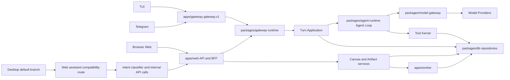
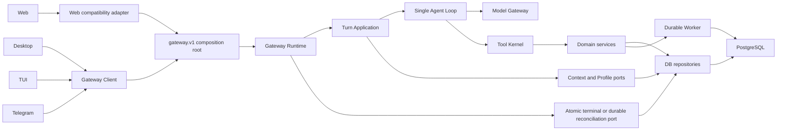
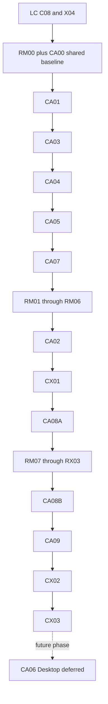

# 代码与架构可信化

- 任务分配名：`CA 代码与架构可信化`
- 状态：`completed`（唯一 reviewer 已验收并完成本地 RM/CA 集成；CA06 保持 `DEFERRED`）
- 负责人：@Timcai06
- 代码审核与最终验收：Codex
- 最后验证时间：2026-08-13
- 默认分支审计基线：`origin/main@b0d0ddb21430b28d37dd663eb7fcb6963315b7e8`
- 计划编写工作区：`fix/live-voice-orb@a33c225398bd4dda069e79ed84d5fc02a3efff96`
- 关联计划：[LC Live 与 Canvas 输出](LC-Live与Canvas输出产品化.md)、
  [RM 统一资源工作台](RM-统一资源工作台.md)、[KM 知识记忆](../active/KM-知识记忆.md)、
  [O 删除队列](../active/O-删除队列.md)、[G 产品发布闭环](../active/G-产品发布闭环.md)
- 联合执行模式：同一分支、同一工作树、单一代码任务队列
- 远端 PR 策略：本轮不审计、不合并、不依赖远端 PR；Desktop 主链任务延后

> 本计划记录的是上述 `origin/main` 快照的审计结论。工作区未提交文件、当前分支新增能力和
> 未合并 PR 不得写成默认分支既有事实。计划激活前必须重新核对 `origin/main` SHA、当前分支、
> 工作树、CI 和 RM/CA 文件所有权；本文件已在 reviewer 授权后进入 active 分配索引。本轮只以
> 同一分支实际代码为输入，任何远端 PR 都不构成任务前置或完成证据。

## 本地候选收口（2026-08-13）

- 阶段一候选 `3395c272fb80172a687a4b0d45c0f670d40ca205` 已获 reviewer 阶段接受；
- CA08B `f40568aa67cbd76a635ac0b96d4339e18da46bcc` 完成 K12 provenance、全量
  parity/orphan、受控 platform 读与显式 legacy 回退，未删除 legacy；
- CA09 `8fa9d6b143e33a75038de608cbc730966c9ea3d4` 仅拆实际触达热点，保持公开 API、
  事务与锁顺序；
- CX02 `673087a9ab96316d0edac3d521a861b66d97dddf` 只读核对
  `EduCanvas-rm@ae7c82276c4d44fa2d7821947513eb5e3a4db4b5`，没有复制或合并 RM 代码；
- CX03 回写当前实现事实与本地证据。计划在 reviewer 最终接受前保留于 `active/`；最终候选
  SHA、同 SHA 门禁与残余冲突以 `CA_STATUS.md` 为准；最终 CA 候选 `e3bf580` 已由唯一
  reviewer 接受并集成。CA06 继续 `DEFERRED`，不冒充本轮已交付能力。

## 最终 Reviewer 结档（2026-08-13）

- CA 候选 `e3bf580a3610ca64b6b2deaf560eeaaf2ed67659` 与 RM 候选
  `ae7c82276c4d44fa2d7821947513eb5e3a4db4b5` 已合入本地集成分支；代码与 E2E 接缝候选为
  `908489bc186d4f28e3cffe37c6167e436aca5881`。
- Reviewer 解决了 `general-workspace-layout.tsx`、ADR-0028、typed Turn outcome 与陈旧
  PlusMenu E2E 接缝；失败、取消、拒绝或中断的 Turn 不再错误消费一次性上下文。
- 联合门禁通过：Turbo unit 25/25（Web 213 files / 1596 tests）、typecheck 25/25 加 E2E、
  PostgreSQL DB 366 与 Worker 54、Migration 17/17、Desktop Chromium 50/50、build 8/8、
  file governance 2002 files 与 `git diff --check`。
- 根 `pnpm lint` 的 workspace lint 4/4 通过；wrapper 仅因扫描三个被 Git 忽略的
  `apps/desktop/out/**` 生成 bundle 返回 1，未修改生成物，不能写成全绿。
- 按项目负责人指示，集成候选没有重跑移动 Chromium 或 Firefox；Safari、真实麦克风、真实
  Provider/MinerU、远端 nightly 与发布环境继续标记为未验证，不阻塞本地竞赛范围结档。
- 完整联合证据见[RM/CA 最终集成交付与结档证据](../../06-quality/evidence/22-RM-CA最终集成交付与结档证据.md)。

## 一、执行结论

EduCanvas 已经超出“页面加一个模型接口”的 Demo 阶段。默认分支存在真实的模块化单体、唯一
Agent Loop、Gateway 事件协议、工具执行账本、PostgreSQL 持久化、Worker、Canvas Resource、
Artifact 版本链和较密集的自动化测试。以竞赛展示和本地验证标准，它是一个**基本可用、核心
架构可持续演进的产品原型**；以长期产品标准，它还不是一个可以用 CI 绿灯直接证明可靠性的
完整产品。

本轮加权结论：

| 总体维度 |   分数 | 核心判断                                                                      |
| -------- | -----: | ----------------------------------------------------------------------------- |
| 代码质量 | 76/100 | 类型、数据层和 Agent Runtime 较强；错误终态、部分超大文件与跨端旁路拉低可信度 |
| 架构质量 | 79/100 | 模块化单体与 Provider 边界真实成立；桌面端复用和终态持久化边界尚未完全收口    |

- 最大优势：`packages/agent-runtime` 中只有一套真实 Agent Loop，模型供应商原始类型与秘密被
  截止在 `packages/model-gateway`，核心不是靠目录名伪装出的分层。
- 最大结构性问题：General Turn 的 assistant 消息终态和 Gateway operation 终态由两次独立
  写入完成；中间失败时缺少已证实的通用 Turn reconciliation 闭环。
- 当前最值得做：先让终态一致性、完整 E2E、干净环境启动三类证据恢复可信，再继续扩大功能面。
- 当前最不值得做：微服务化、第二套 Agent Runtime、多 Agent 炫技、事件溯源重写或全仓推倒重写。
- 重写结论：**不需要重写**。现有 Agent、Gateway、Model Gateway、DB、Canvas 和 Worker 都是
  有价值资产，应沿现有模块化单体做渐进式收口。

## 二、审计边界与证据等级

### 2.1 事实边界

- 默认分支事实只取自 `origin/main@b0d0ddb` 的源码、配置、GitHub Actions 和该快照的本地验证；
- 当前工作区基线 `a33c225` 及未提交改动只用于编写本计划，不参与默认分支评分；
- PR #369 在审计时是未合并的大型桌面端演进 PR，只保留为历史审计事实；本轮不重新检查其
  SHA、状态或代码，Desktop 后续立项时再以当时真实基线重新审计；
- Provider canary、真实麦克风、Safari 和真实外部服务没有本轮验收证据，统一标记 `[待验证]`；
- 未安装 `knip`、`madge` 或 `dependency-cruiser`，因此没有把人工可疑项写成“已证实死代码”。

### 2.2 标签

- `[事实]`：源码、配置、测试或 CI 结果直接证明；
- `[判断]`：由已列事实得出的工程判断；
- `[风险]`：尚未观察到事故，但现有边界允许事故发生；
- `[待验证]`：受 Provider、浏览器、密钥或外部服务限制，当前证据不足。

## 三、当前事实地图

### 3.1 仓库结构与真实职责

```text
EduCanvas/
├── apps/
│   ├── web/          Next.js 浏览器应用、兼容 BFF、General/Teaching Web 组合根
│   ├── gateway/      gateway.v1 HTTP 组合根与本地/渠道身份路由
│   ├── worker/       Graphile Worker 持久任务、Artifact/媒体/删除等后台执行
│   ├── desktop/      Electron 桌宠；默认分支仍调用 Web assistant 兼容端点
│   ├── tui/          终端客户端，消费 Gateway 契约
│   ├── telegram/     Telegram 渠道适配器
│   ├── node/         Node 运行入口
│   └── web-runtime/  隔离的 Canvas Web Runtime
├── packages/
│   ├── agent-runtime/    唯一 Agent Loop、Turn Application、Tool Kernel
│   ├── model-gateway/    唯一 Provider Adapter 边界
│   ├── gateway-runtime/  operation、事件流、取消、审批的应用编排
│   ├── gateway-client/   多客户端 gateway.v1 客户端契约
│   ├── db/               Drizzle Schema、Migration、Repository、PostgreSQL 适配器
│   ├── canvas-protocol/  CanvasResource、Renderer、动作与运行时协议
│   ├── teaching-runtime/ 教学会话、判分、学习状态与教学工具应用服务
│   └── ...               Agent Core、MCP、Telemetry、共享 UI/协议等边界包
├── tests/e2e/        Playwright 主流程、浏览器、无障碍与跨端契约测试
├── tooling/          本地编排、评测、质量门禁、Migration 与 CI 辅助脚本
├── .github/workflows GitHub Actions 质量、夜间、Provider canary 等工作流
├── docs/             产品、架构、工程、质量、ADR 与阶段计划
└── docker-compose.yml / Makefile / turbo.json  本地与工作区入口
```

### 3.2 技术栈

| 层级   | 已证实使用                                                                |
| ------ | ------------------------------------------------------------------------- |
| 工作区 | pnpm 10.33、Turborepo 2.10、Node `>=24.18 <25`                            |
| Web    | Next.js 16、React 19、App Router、Route Handler、SSE/事件流               |
| 服务端 | Node.js 应用、Gateway Runtime、Graphile Worker                            |
| 数据   | PostgreSQL、Drizzle ORM、pgvector、FTS、显式 Migration                    |
| AI     | 自有 Agent Runtime、Model Gateway、多 Provider Adapter、严格流事件校验    |
| 桌面   | Electron 43、Main/Preload/Renderer 边界                                   |
| 测试   | Vitest、Node test、Playwright、真实 PostgreSQL Integration、评测 harness  |
| CI     | GitHub Actions、changed-files 路由、PR smoke、nightly/full、受保护 canary |

### 3.3 当前真实架构



图中 Desktop 的旁路是默认分支事实，不是目标设计。审计时 PR #369 曾尝试把 Desktop 改为
`GatewayClient → gateway.v1 → 既有 Turn Application/Agent Loop`；未合并代码不计入上图，
也不是本轮执行输入。

## 四、已验证的架构资产

### 4.1 唯一 Agent Loop 与真实工具闭环

- `[事实]` `packages/agent-runtime/src/agent-loop.ts:245-471` 明确声明并实现唯一模型循环：最多
  4 轮工具调用，工具结果按 call ID/名称校验后重新送回模型，最后进入 synthesis；这不是单次
  `fetch` 包装。
- `[事实]` `packages/agent-runtime/src/turn-application/service.ts:62-289` 统一编排 begin、replay、
  cancellation、preflight、context prepare、loop、output guard 与 settle。
- `[事实]` `packages/agent-runtime/src/tool-kernel/service.ts:84-145` 及相邻 adapter 对工具参数、
  effect ledger 和幂等性做集中约束。
- `[判断]` 新 Agent、入口或客户端应复用这一 runtime；为桌面端或功能包创建第二套循环会破坏
  当前最有价值的单一事实来源。

### 4.2 Provider 与不可信响应边界

- `[事实]` `packages/model-gateway` 是 Provider SDK、原始响应和密钥的截止边界；公开入口没有
  导出 Provider 原始类型，响应在产生领域事件前经过运行时校验和错误归一化。
- `[事实]` Web/Gateway 只显式传递允许的模型配置，浏览器错误不会携带 Prompt、Provider body、
  stack 或 key。
- `[判断]` 更换模型供应商的主要影响被限制在 Adapter 和能力配置，而不是散落到 UI/DB。

### 4.3 数据、Artifact 与 Canvas 不是占位能力

- `[事实]` `packages/db/src/schema/index.ts:11-29` 聚合真实业务 Schema；审计快照包含 69 张表、
  57 个 Migration，fresh 与 N-1 Migration 验证通过。
- `[事实]` `apps/web/server/platform/platform-artifact-repository.ts:789-900` 在同一事务中创建
  Artifact、任务和 Graphile job；`apps/worker/src/tasks/generate-artifact.ts:420-471` 执行持久任务。
- `[事实]` Canvas 有不可变版本、编辑/修订/恢复、provenance、annotation、Renderer Registry
  和隔离 Web Runtime，不是普通 Markdown 外壳。
- `[事实]` `packages/teaching-runtime/src/grade-submission.ts:93-227` 重新校验 Canvas 事件并在
  事务内写入掌握度与学习事件。

### 4.4 Memory、RAG 与 Notebook 的真实成熟度

| 能力         | 状态     | 证据与边界                                                             | 当前缺口                                                |
| ------------ | -------- | ---------------------------------------------------------------------- | ------------------------------------------------------- |
| Agent 对话   | 已闭环   | Web/Gateway → Turn Application → Agent Loop → Model/Tools → SSE/持久化 | 终态跨写入一致性仍有风险                                |
| 工具调用     | 已闭环   | Tool schema、Kernel、effect ledger、结果回模与事件均存在               | 需补跨边界失败注入                                      |
| Notebook     | 基本可用 | `spaces(kind=notebook)`、membership、main conversation、资产和产物归属 | 身份与双消息账本仍在兼容期                              |
| Canvas       | 已闭环   | Canonical CanvasResource、Renderer、版本、批注、编辑/恢复              | 普通后续 Turn 尚未自动携带当前 Artifact 版本            |
| Artifact     | 已闭环   | proposed/generating/ready、Worker、版本、修订、恢复                    | 桌面端默认分支丢弃 artifact action                      |
| Teaching RAG | 部分实现 | 混合检索、FTS/向量、严格工具和引用存在                                 | 正式用户来源绑定入口未形成完整产品闭环                  |
| General RAG  | 未实现   | General Profile 明确没有检索工具                                       | 由 KM 计划负责，不在 CA 重建                            |
| Memory       | 未实现   | General/Gateway Profile 明确返回空 Memory 能力                         | 由 KM 计划负责，不把聊天历史冒充 Memory                 |
| Desktop      | 部分实现 | 录音、ASR、assistant 请求、TTS 和 UI 存在                              | 默认分支旁路主 Turn；action/artifact 未在 renderer 执行 |

## 五、验证结果与 CI 能证明什么

### 5.1 本地与快照验证

| 验证                                           | 结果        | 证据解释                                                                             |
| ---------------------------------------------- | ----------- | ------------------------------------------------------------------------------------ |
| `pnpm install --frozen-lockfile`               | PASS        | 锁文件可复现安装；首次受隔离网络 DNS 影响，恢复网络后通过                            |
| `pnpm lint`                                    | PASS        | 清理生成输出后 workspace lint 与 Prettier coverage 通过                              |
| `pnpm exec turbo typecheck --output-logs=full` | PASS，25/25 | 所有 workspace 类型检查通过                                                          |
| `pnpm typecheck:e2e`                           | PASS        | Playwright 契约类型通过；根 wrapper 曾出现无诊断 exit 1 异常，需由 CA03 固定入口证据 |
| `pnpm test:unit`                               | PASS        | tooling 204/204，25 个 workspace 测试目标通过；Web Vitest 有 CJS/ESM 配置警告        |
| `pnpm build`                                   | PASS，8/8   | 对 `origin/main` 冷快照构建通过；Desktop `out/**` 未配置为 Turbo output              |
| `make integration`                             | PASS        | DB、Worker 与真实 PostgreSQL integration 通过                                        |
| Migration fresh/N-1                            | PASS，16/16 | 未发现 Schema/Migration drift，未产生残留 migration 文件                             |
| `pnpm test:e2e:pr`                             | PASS，14/14 | Chromium desktop 的 PR 黄金路径可运行                                                |
| Full Playwright                                | FAIL        | 首次 85 pass/62 fail，其中 49 项缺 Firefox binary；补装后 Firefox 43 pass/6 fail     |
| `pnpm env:check`                               | PASS        | 仅证明当前本地配置分组合法，不证明真实 Provider 或麦克风工作                         |
| Provider canary                                | 未运行      | 受保护环境、真实密钥与成本边界；不得用 fake 测试替代                                 |

### 5.2 完整浏览器失败分类

- `[事实]` `tests/e2e/artifact-flow.spec.ts:110,232` 仍假设刷新后立即回到 Studio，但产品现在会
  恢复持久化 Canvas surface；这是测试契约陈旧，不应改产品去迎合旧断言。
- `[事实]` `tests/e2e/canvas-shell-visual.spec.ts:156` 拦截旧 artifact detail endpoint，而当前
  Canvas 读取 `/api/v1/canvas/resources/...`；同文件 route handler 还会在测试结束后泄漏
  `route.fetch: Test ended`。
- `[事实]` `tests/e2e/keyboard-navigation.spec.ts:88-133` 的 Escape 后焦点没有回到 Studio trigger；
  这是实际无障碍回归，不是仅修改测试即可解决。
- `[事实]` `tests/e2e/live-voice-flow.spec.ts:100` 使用非唯一的 `电路图.png` locator；应改为稳定
  role/test ID/作用域定位。
- `[风险]` Mobile Live 对“正在检索资料”瞬时文案做时序断言，状态可能在断言前合法消失；应验证
  状态机终态而不是延长 sleep。

### 5.3 CI 绿灯的真实含义

- `[事实]` 默认分支最新主 CI 在审计时为绿色；它证明 changed-files 选中的静态检查、单元测试、
  Agent eval、压力门禁、生产构建、持久 Runtime composition 和 Chromium PR smoke 通过。
- `[事实]` `.github/workflows/ci.yml:410-497` 只在 schedule/manual 跑 Chromium desktop、mobile
  和 Firefox 完整矩阵；普通 push/PR 跑 Chromium smoke。
- `[事实]` 该 main run 因改动分类跳过 DB/Worker/Migration、Windows、desktop package、依赖审查
  等 job；绿色不等于这些路径在该 SHA 被重新证明。
- `[事实]` 审计时最近两次 nightly 的完整浏览器 E2E 失败，而更早两次成功。
- `[判断]` 当前 CI 绿灯证明“受影响的快速门禁通过”，不能证明“全浏览器核心产品闭环稳定”。
  changed-files 策略本身合理，问题是 nightly 红灯没有在发布证据中得到及时收口。

## 六、关键问题清单

### CA-F01：Turn 消息终态与 Gateway operation 终态不是一个原子结果

- 级别：P1
- 类型：架构 / 数据 / Agent / 错误处理
- `[事实]` `apps/web/server/platform/general-turn-lifecycle.ts:122-137` 调用
  `settleTurn(... operationTerminalWriter: 'gateway')`，先结算 assistant 消息和引用。
- `[事实]` `packages/db/src/platform-turn-repository.ts:545-675` 在 Gateway 拥有终态时更新消息，
  但不更新 `agent_operations.status`。
- `[事实]` `packages/gateway-runtime/src/gateway-service.ts:143-162` 随后才 append terminal event；
  `packages/db/src/gateway/operation-event-writer.ts:265-278` 在另一事务更新 operation 终态。
- `[风险]` 消息事务成功、terminal event append 失败时，用户可看到 terminal assistant，而 operation
  仍是 running；重放、取消、观测和重试会对同一 Turn 得出不同事实。
- 推荐修改：冻结一个 `terminal commit` 结果契约；要么由单一 DB adapter 原子提交消息、引用、
  operation 和 terminal event，要么提供由持久事实驱动、可重复执行的 reconciliation。禁止只用
  进程内 retry 或 `console.error` 掩盖窗口。
- 验证：在“消息结算后、事件 append 前”注入故障；重启后最终只能得到一个一致终态，重复提交
  不产生第二条 terminal、第二份引用或重复工具副作用。

### CA-F02：nightly 完整 E2E 已失去发布证据作用

- 级别：P1
- 类型：测试 / CI / 前端
- `[事实]` PR smoke 14/14 通过，但完整矩阵存在 6 个 Firefox 失败和跨项目 fixture/route 隔离问题；
  最近两次 nightly 红灯。
- `[判断]` 失败中同时包含真实无障碍 bug、过期测试契约、脆弱 locator 和隔离泄漏，不能整体标为
  “flaky”，也不能通过加 retry 变绿。
- 实际影响：CI 主分支绿色与发布可用性脱钩；Renderer/Canvas 持久化升级后测试没有同步成为新事实。
- 推荐修改：按“实现缺陷/测试陈旧/时序/隔离”逐类修复，保持 affected smoke 快速；本轮先恢复
  本地完整矩阵和 workflow 证据语义，远端阶段再恢复 nightly 与预发布门禁。
- 验证：当前分支本地完整矩阵全绿且 retry 仍为 0，失败报告可复现；两个独立 nightly 连续全绿
  作为远端阶段补证，不阻塞本地 CA/RM 队列。

### CA-F03：干净环境的启动说明存在互相冲突的事实源

- 级别：P1
- 类型：配置 / 工程化 / 文档
- `[事实]` `.env.example:3-4` 声称 Compose 默认开箱即用并使用 `localhost:5432`；
  `docker-compose.yml:9-12` 实际映射 `5434:5432`，`Makefile:6-7` 也以 5434 为默认测试端口。
- `[事实]` `README.md:109` 要求 Node 22，而 `package.json:5-6` 要求 Node `>=24.18 <25`。
- `[事实]` `.env.example` 默认关闭模型 Provider 且 key 为空，`Makefile:32-40` 的 `doctor` 却把
  `MODEL_GATEWAY_API_KEY` 作为无条件必填项。
- 实际影响：新开发者照 README/`.env.example` 执行时可能连接错误数据库、被版本门禁拒绝，或在
  合法的无 Provider 本地模式下被 doctor 判失败。
- 推荐修改：以 executable config/schema 为唯一来源生成或校验文档示例；增加 clean bootstrap
  fixture，所有端口、Node 和可选 Provider 条件只定义一次。
- 验证：全新临时目录只按 README 执行即可完成 env check、数据库启动、Migration 和无 Provider
  的本地壳启动；启用 Provider 时再 fail closed 要求完整配置组。

### CA-F04：默认分支 Desktop 仍旁路主 Agent Turn

- 级别：P2
- 类型：架构 / 桌面端 / 多端复用
- `[事实]` `apps/desktop/src/main/assistant-proxy.ts:69-94` POST
  `/api/v1/assistant/turn`，不是 `gateway.v1` Turn stream。
- `[事实]` `apps/web/app/api/v1/assistant/turn/route.ts:100-374` 在 Route 内完成身份、限流、分类、
  Notebook 管理与对既有 API 的 self-fetch；它不使用完整 Turn/message/model-run ledger。
- `[事实]` `apps/desktop/src/renderer/src/voice-session.ts:140` 只消费 `turn.message`；route 返回的
  `action`、`artifactId`、`panel` 没有形成 Desktop UI 行为闭环。
- `[判断]` Desktop 当前是可演示的语音管理薄客户端，不是与 Web 共享完整 Agent 状态的第二端。
- 推荐修改：不在当前 CA/RM 队列另写实现。CA06 保留为后续立项，届时基于当时 `main` 独立审计
  认证、SSE、撤销会话、artifact/action、重放和本地数据归属；通过后再删除或降级旧旁路。
- 后续验证：Desktop 只通过 Gateway Client 发起 Turn，Web/Desktop 对同一用户、Notebook、
  operation、Message 和 Artifact 得到一致结果，断线恢复不重复执行工具。本项不属于本轮门禁。

### CA-F05：平台消息账本仍处于双写兼容期

- 级别：P2
- 类型：数据 / 架构
- `[事实]` `packages/db/src/k12-conversation-dual-write.ts:1-49` 同时维护旧 `chat_messages` 与平台
  `conversation_messages` 投影；切换开关默认关闭，运行权威仍有兼容语义。
- `[风险]` 新功能若直接选择其中一张表，会形成不同的历史、删除、引用和回放事实；长期双写会
  放大 Migration、测试与故障修复成本。
- 推荐修改：在 CA-F01 稳定后冻结读取权威、双写观察指标、对账工具和切换/回退门禁；按 profile
  逐步切读，不在一个 PR 直接删旧表。
- 验证：固定数据集下两账本逐消息对账；乱序、重复、取消、失败、引用和删除场景零差异；切换后
  仍可在明确窗口内回退。

### CA-F06：local 主体与注册账号 UI 是两套并存语义

- 级别：P2
- 类型：认证 / 数据 / 产品契约
- `[事实]` `apps/web/server/identity/anonymous-identity.ts:54-71` 在 local deployment 返回固定
  `local:owner`；`apps/web/server/auth/current-user.ts:9-13` 可同时读取注册账号公开资料。
- `[事实]` `apps/web/README.md:7-14` 把该行为定义为本地兼容模式：账号只提供资料/凭据走查，
  Notebook/Agent 归属仍是 `local:owner`。
- `[风险]` UI 如果只展示注册昵称，用户会把“登录资料”误认为“数据所有权已切换”，测试也可能
  在错误主体下验证 Notebook、Memory 或 Desktop 数据。
- 推荐修改：先把 effective data subject 明确投影到诊断/测试契约；正式 IdP 切换另立 migration
  与归属转移门禁，不在 CA 把 intentional compatibility 当成小 bug 删除。
- 验证：local、匿名兼容、注册账号和 Gateway session 四种 fixture 明确断言 UI 身份、数据主体、
  Cookie/session、Notebook owner，不允许隐式互换。

### CA-F07：上下文能力存在“协议有字段、产品未消费”的断点

- 级别：P2
- 类型：Agent / Canvas / RAG
- `[事实]` `apps/web/features/workspace/general/use-general-workspace-controller.ts:192-227` 构造
  General Turn 时只投影 `asset_ref`；协议与表已支持 `artifact_ref`，但用户当前打开/修改的
  Canvas Artifact 版本不会自动进入后续普通 Turn。
- `[事实]` Teaching RAG 有 `retrieveKnowledge` 工具，但生产源码中未找到完整的用户
  `setSessionSourceBinding` 入口调用链；General Profile 明确没有 RAG/Memory。
- `[判断]` Canvas、RAG、Memory 分别是“可交互产物”“部分检索能力”“未实现能力”，不能统一
  宣称为长期上下文闭环。
- 推荐修改：Artifact 反馈由 RM 统一资源/Turn snapshot 契约接管；General RAG 与 Memory 由 KM
  接管。CA 只做跨计划契约审计，不复制 controller、Context Engine 或检索基础设施。
- 验证：RM/KM 各自验收后，CA 只核对同一 operation snapshot、权限、版本和 token budget。

### CA-F08：高变化文件超过仓库职责预算

- 级别：P2
- 类型：可读性 / 可测试性
- `[事实]` 审计快照中 `asset-repository` 约 1584 行、`platform-artifact-repository` 约 1093 行、
  anonymous lifecycle 约 871 行、knowledge repository 约 824 行、platform turn repository 约
  808 行、streaming transcription 约 792 行、learning workspace 约 645 行、Agent Loop 约 630 行。
- `[判断]` 这些文件并非都低质量，但多个独立事务、状态机和适配职责被放在同一变更单元，已超过
  “接近 400 行复核、通常 600 行前拆分”的协作预算。
- 推荐修改：只在相关契约已由 CA/RM/KM 冻结后按事务边界、状态机或 adapter 拆分；禁止为追求
  行数在功能 PR 中机械搬文件。
- 验证：每个新模块只有一个命名责任，公开 API 与行为不变，原测试迁移后再补边界测试。

### CA-F09：工程信号仍有三项低优先级噪声

- 级别：P3
- 类型：依赖 / 构建 / 测试配置
- `[事实]` `turbo.json:4-7` 只声明 `.next/**` 和 `dist/**`，Desktop build 的 `out/**` 不进入
  Turbo artifact；构建因此报告“未配置输出文件”。
- `[事实]` Web Vitest 配置触发 Vite ESM 通过 CJS API 加载的 warning；当前不阻断测试。
- `[待验证]` 人工扫描显示 `packages/db/package.json` 的 `@opentelemetry/api` 可能无生产引用，
  但缺少正式 unused-dependency 工具证据。
- 推荐修改：CA03 顺手修正确定性的 output/config 噪声；依赖删除必须先运行可复现扫描和完整构建，
  不凭 grep 直接删包。

## 七、代码质量评分

| 维度           |   分数 | 主要证据                                             | 核心判断                                        |
| -------------- | -----: | ---------------------------------------------------- | ----------------------------------------------- |
| 可读性         |   7/10 | 核心 JSDoc 清楚；多个 600-1500 行热点                | 主链可读，但变更单元偏大                        |
| 类型质量       |   8/10 | 严格 TypeScript、Zod/Schema、25/25 typecheck         | Provider/API 边界强，局部 cast 与重复投影仍存在 |
| 错误处理       |   7/10 | 稳定错误码、取消与预算；终态跨事务窗口               | 单模块严谨，跨模块失败闭环不足                  |
| 前端质量       |   7/10 | Canvas/Live/Renderer 真实；焦点回归和测试契约漂移    | 产品面成熟度高于完整浏览器稳定性                |
| 后端质量       |   8/10 | Route → Gateway → Turn Application；真实 integration | assistant compatibility route 仍承担过多职责    |
| 数据层质量     | 8.5/10 | Drizzle、69 表、57 Migration、事务、fresh/N-1 PASS   | 强资产；双消息账本和终态双写需收口              |
| Agent 代码质量 | 8.5/10 | 唯一 Loop、工具回模、预算、重放、Provider 边界       | 竞赛项目中明显强项                              |
| 测试质量       | 6.5/10 | 单元/集成/PR smoke 强；完整 E2E/nightly 红           | 数量足够，但发布证据尚不可信                    |
| 工程化         | 7.5/10 | Turbo、Make、changed-files、受保护 canary            | clean setup 文档与配置漂移                      |

## 八、架构质量评分

| 维度           |   分数 | 主要证据                                        | 核心判断                                         |
| -------------- | -----: | ----------------------------------------------- | ------------------------------------------------ |
| 分层清晰度     | 8.5/10 | UI/BFF → Application → Runtime/Domain → Adapter | 主链真实成立                                     |
| 模块边界       |   8/10 | Agent、Model、Gateway、DB、Canvas 所有权明确    | compatibility route 与超大 repository 是例外     |
| 耦合度         | 7.5/10 | Port/adapter 广泛使用                           | Web lifecycle 与 Gateway terminal 形成跨边界耦合 |
| 内聚度         |   8/10 | 核心包职责集中                                  | 若干文件内部职责过多                             |
| 多端复用       |   6/10 | TUI/Telegram 可走 Gateway                       | 默认 Desktop 仍旁路主 Turn                       |
| 可测试性       |   8/10 | 大量 fake port、真实 DB、E2E/评测               | 终态故障注入和完整浏览器稳定性缺口               |
| 可替换性       |   8/10 | Model Gateway 与 Repository ports               | Auth/local subject 与向量实现仍有应用假设        |
| 可演进性       |   8/10 | 新工具/Renderer/Profile 有现成扩展点            | 双账本、上下文断点会累积成本                     |
| 当前阶段适配度 | 8.5/10 | 模块化单体，没有微服务膨胀                      | 继续渐进收口最合适                               |

## 九、交付目标、范围与非目标

### 9.1 交付目标

CA 完成后，以下声明必须同时成立：

1. 任意 General Turn 的消息、引用、operation 和 terminal event 最终收敛到同一终态；
2. affected smoke 继续快速，完整 Chromium/mobile/Firefox 本地矩阵稳定，CI 绿灯含义有明确台账；
3. 新机器按 README 和 `.env.example` 可复现启动，不依赖隐含端口、错误 Node 版本或假必填 key；
4. 消息账本、local identity 与跨计划上下文能力都有清楚的权威来源和迁移门禁；
5. RM 与 CA 在同一分支通过文件租约和可回退提交执行，没有未归属的共享 seam 或覆盖式接线；
6. 所有修复保持现有模块化单体，不新增第二套 Loop、Provider Adapter、Context Engine 或 Renderer。

### 9.2 范围

- General Turn terminal consistency、幂等重放和 reconciliation；
- 完整浏览器测试合同、fixture 隔离、真实无障碍缺陷和 nightly 证据；
- Node、PostgreSQL、`.env`、doctor、Turbo output 和开发入口的单一事实来源；
- 双消息账本和 local/effective subject 的迁移证据；
- 只对正在修改的高风险超大模块做边界拆分；
- CI 质量属性说明、故障注入矩阵和 canonical 文档回写。

### 9.3 非目标

- 不重写 Agent Runtime、Gateway、DB、Canvas、Worker 或整个应用；
- 不把模块化单体拆成微服务，不引入分布式事务平台或完整事件溯源；
- 不创建第二套 Agent Loop、消息系统、Tool Kernel、Provider Adapter、Context Compiler 或 RAG；
- 不在 CA 实现 KM 的 Product Knowledge/Memory，也不在 CA 重做 RM 的资源工作台；
- 本轮不处理远端 PR，不把 Desktop 主链改造作为 RM/CA 当前完成门禁；只有当前两线归档后才重新
  基于当时 `main` 立项 Desktop 接线；
- 不要求所有 PR 跑真实 Provider、全浏览器或所有数据库矩阵；按风险分层保留 affected CI；
- 不用提高 retry、固定 sleep、吞异常或放宽断言把 CI 染绿；
- 不为减少行数做无行为收益的机械拆分。

### 9.4 同分支联合执行协议

1. RM 与 CA 共用一个本地分支和一个工作树，不创建计划级 worktree，不从远端 PR 拣选代码，也不
   把远端检查当作当前任务的前置条件。
2. “可并行”仅指只读代码搜索、契约草案、fixture 设计和失败分类可以同步准备；任何文件写入、
   格式化、测试修复和提交都进入一个队列，同一时刻只有一个任务持有文件租约。
3. 租约记录至少包含任务 ID、起始 `HEAD`、允许修改的文件、允许修改的测试和验证命令。发现任务
   外共享 seam 时停止写入，先在两份计划中转移所有权，禁止两个未提交版本事后人工拼接。
4. 每项任务必须从前一个已验证提交开始，以定向测试、受影响 typecheck、`git diff --check` 和一个
   可回退提交结束。未运行验证必须记为 `[待验证]`，不能随租约一起隐式传给下一任务。
5. 当前工作树已有配置、Runtime、Canvas 和 Workspace 修改；它们必须先由原任务收口。CA03、
   CA04 或 RM 功能任务只能在这些修改提交并释放租约后复核或适配，不能接管来源不明的 diff。
6. 远端 PR、Desktop 接线、release merge 和分支清理由后续单独立项；它们不影响本轮 CA/RM 在
   当前分支完成本地优化和证据归档。

## 十、核心不变量

| 边界          | 必须保持                                                                      |
| ------------- | ----------------------------------------------------------------------------- |
| Agent         | `packages/agent-runtime` 仍是唯一模型↔工具循环                                |
| Provider      | SDK 类型、原始 body、Prompt、secret 和 stack 不越过 `model-gateway`           |
| Turn          | 一个 operation 最多一个 terminal；重放不得重执行模型或工具副作用              |
| Persistence   | 消息、引用、operation 与 terminal event 不得永久分叉                          |
| Tool          | 参数严格校验；effect ledger/idempotency 不因重试被绕过                        |
| Identity      | UI 资料身份、认证 session、effective data subject 和 Notebook owner 明确区分  |
| Canvas        | CanvasResource、不可变版本与 allowedActions 仍是打开和操作事实源              |
| Context       | Asset/Artifact/RAG/Memory 以冻结版本、权限和预算进入 Turn，不由 UI 可见性推断 |
| CI            | 绿色只声明实际运行过的质量属性；skip 和 `[待验证]` 必须显式                   |
| Collaboration | 每文件一个命名责任；接近 400 行审查，通常在 600 行前拆分                      |
| Same branch   | 同一时刻只有一个代码任务持有文件租约；每个任务从已验证提交开始并提交后释放    |

## 十一、最小目标架构



最小演进只有三处：所有客户端汇入同一 Gateway/Turn；终态写入有一个可验收的提交或收敛端口；
Web compatibility 只做协议适配，不再拥有平行业务。Agent、Model Gateway、Tool Kernel、DB、
Canvas 和 Worker 保留，不推倒重写。图中的 Desktop 接线是长期目标，本轮不修改 Desktop，亦不
作为 CA/RM 完成门禁。

## 十二、原子任务与依赖顺序

`CA` 是代码/架构主线，`CX` 是跨层证据收口。每项只有在对应证据完整后才能由 Codex 判定
`PASS`；实现者不得自行宣布最终验收。

| 任务                          | 状态        | 单一交付与验收                                                                                                                                              |
| ----------------------------- | ----------- | ----------------------------------------------------------------------------------------------------------------------------------------------------------- |
| CA00 基线与事实冻结           | `COMPLETED` | 与 RM00 在同一干净 `HEAD` 冻结当前分支 SHA、核心调用链、现有失败、脏文件归属和文件租约；不等待或审计远端 PR，不改业务代码                                   |
| CA01 Turn 终态一致性契约      | `COMPLETED` | 选择最小 atomic commit 或 durable reconciliation 方案；冻结状态机、幂等键、故障点与回退；重大取舍先写 ADR                                                   |
| CA02 Turn 终态实现            | `COMPLETED` | 消息、引用、operation、terminal event 最终一致；重复、取消、断流、append 失败和重启不产生双终态或重复副作用                                                 |
| CA03 本地配置单一事实源       | `COMPLETED` | 等当前配置改动所属任务提交后，收口 Node、5434、可选 Provider、doctor、README、`.env.example` 与 Turbo output；clean bootstrap 通过；本轮不改 Desktop 打包链 |
| CA04 完整 E2E 本地基线恢复    | `COMPLETED` | 在 RM 功能代码前修复焦点实现、Canvas persistence/endpoint 契约、locator、route cleanup 和移动端断言；禁止用 sleep/retry 掩盖                                |
| CA05 CI 证据语义              | `COMPLETED` | 保留 affected smoke，明确 full/nightly 的 run/skip/待验证语义；当前门禁以本地完整矩阵和 workflow 契约测试为准，远端连续 nightly 留到远端阶段补证            |
| CA06 Desktop 主链后续立项     | `DEFERRED`  | 只保留默认分支旁路事实、长期目标与未来验收条件；本轮不审计远端 PR，不改 Desktop/Gateway，不进入 CA/RM 完成门禁                                              |
| CA07 effective subject 契约   | `COMPLETED` | 明确 local/anonymous/registered/Gateway 四种主体的 UI、session、data owner；正式切换另设迁移，不暗改归属                                                    |
| CA08A 消息账本权威读源与对账  | `COMPLETED` | 冻结当前权威读源、双写 parity、指标、失败处理和回退条件；提供 RM07/RM08 可消费契约，但不切读、不删除旧表                                                    |
| CA08B 消息账本受控切读        | `COMPLETED` | 等 RM RX03 冻结聊天/Artifact/Live 产品事实后再切读并验证回退；legacy 删除另设后续任务，不与本次切读同提交                                                   |
| CA09 热点边界拆分             | `COMPLETED` | 只拆 CA01/CA08A/CA08B 实际触达且超过职责预算的 repository/state machine；行为和公开 API 不变                                                                |
| CX01 故障与重放矩阵           | `COMPLETED` | 模型、工具、DB、terminal append、SSE 断流、重复提交、取消、重启和未登录负例全部可复现                                                                       |
| CX02 RM/CA 跨计划契约审计     | `COMPLETED` | 在 RM RX03 与 CA08B 后核对 artifact/context snapshot、terminal、identity、ledger 和 Live 接缝；KM/O 只读当前 accepted contract，不要求其实施计划完成        |
| CX03 Canonical 单一回写与归档 | `COMPLETED` | 最后唯一写入共享架构/工程/质量/运维文档；记录本地 commit SHA、验证结果和残余待验证后归档，不等待远端 PR                                                     |

硬依赖：



联合执行说明：

1. 上图实线是当前同一分支的唯一写入队列；每一节点完成验证和本地提交后，下一节点才可取得
   文件租约；
2. `CA01`、`CA03`、`CA04`、`CA07` 和 RM 各功能任务可以同步做只读准备，但准备者不得在共享
   工作树留下修改；
3. CA04/CA05 提前恢复本地测试与 CI 语义基线，后续 RM 失败才可可靠归因为新回归；
4. CA08A 在 RM07 前只冻结读源和 parity，CA08B 在 RM RX03 后才切读，避免账本迁移与资源行为
   同时变化；
5. CA06 是后续立项提示，不在实线队列中；CX02 不接管 KM/O/LC 的实现，CX03 是共享 canonical
   文档最后且唯一的写入者。

## 十三、最值得优化的五个点

排序按 `用户价值 × 发生概率 × 影响范围 × 后续阻塞 ÷ 修改成本`：

| 排名 | 优化点                    | 为什么进入前五                     | 不修的后果                                | 直接收益                       | 当前任务边界                            |
| ---: | ------------------------- | ---------------------------------- | ----------------------------------------- | ------------------------------ | --------------------------------------- |
|    1 | Turn terminal consistency | 主对话、重放、取消、观测共用该事实 | assistant 与 operation 可永久分叉         | 核心 Agent 主链真正可恢复      | CA01/CA02 独占 DB/Gateway terminal seam |
|    2 | 恢复完整 E2E/CI 语义      | 已连续红灯且含真实焦点 bug         | 后续 RM 回归无法与既有失败区分            | 当前分支重新获得可信防回归基线 | CA04/CA05 在 RM 功能代码前完成          |
|    3 | clean setup 单一事实源    | 修改小、触发概率高、直接影响协作   | 新成员按官方文档仍启动失败                | 本地验证可复现，减少环境误诊   | CA03 等当前配置修改提交后独占配置文件   |
|    4 | effective subject 契约    | 所有 Notebook/Memory/资源授权依赖  | UI 身份与真实数据主体继续错位             | 本地与注册账号数据归属可解释   | CA07 只冻结契约，正式迁移另立任务       |
|    5 | 消息账本渐进切换          | 每个消息功能都会触达               | 双写和双读语义继续扩大 Migration/删除成本 | 单一历史、引用、删除与回放事实 | CA08A 冻结读源；RM 归档后 CA08B 才切读  |

RM 的资源工作台和 KM 的知识/记忆很重要，但它们已经有独立负责人和计划，因此不重复进入 CA
前五。CA 的责任是为它们提供可信 Turn、身份、账本和 CI 底座。Desktop 汇入统一 Gateway 仍是
结构性问题，但因本轮明确不处理远端 PR，降为 CA06 后续立项，不占当前五项执行资源。

### 13.1 五项与 RM 交叉影响矩阵

| CA 优化项                 | 影响的 RM 任务   | 共享文件风险                                  | 可同步准备 | 写入门禁                                                |
| ------------------------- | ---------------- | --------------------------------------------- | ---------- | ------------------------------------------------------- |
| Turn terminal consistency | RM04、RM07、RM08 | Gateway terminal、DB adapter；不与 RM UI 重叠 | 是         | CA01 先冻契约；CA02/CX01 必须在 RM07 前提交             |
| 完整 E2E/CI 语义          | RM02-RM09、RX02  | `tests/e2e/**`、Workspace 焦点组件            | 是         | CA04/CA05 在 RM 功能写入前完成；RM 只写命名资源专项测试 |
| clean setup 单一事实源    | 无业务硬依赖     | 当前已有 `.env.example`、runtime 配置修改     | 是         | 原任务先提交；CA03 独占配置文件；RM 禁止顺手修改        |
| effective subject 契约    | RM01、RM04、RX01 | identity adapter、授权 fixture                | 是         | CA07 先冻结主体语义；RM 消费，不执行账号迁移            |
| 消息账本渐进切换          | RM07、RM08、RX03 | ledger repository、聊天读源                   | 是         | CA08A 先对账不切读；RM 归档后 CA08B 才切读              |

结论：五项都影响 RM 的证据或契约，但没有一项需要与 RM 同时写同一文件。它们可以同步完成只读分析、
测试设计和契约评审，不能同步写当前工作树；按表中门禁顺序提交后，RM 与 CA 是解耦可接力而非并发施工。

## 十四、建议文件所有权与冲突矩阵

| 责任                   | 主要文件或目录                                                                   | 唯一所有者与冲突门禁                                         |
| ---------------------- | -------------------------------------------------------------------------------- | ------------------------------------------------------------ |
| Turn terminal 契约     | `packages/agent-runtime/src/turn-application/`、`packages/gateway-runtime/`      | CA01/CA02；RM 只消费 terminal/status，不修改状态机           |
| Terminal DB adapter    | `packages/db/src/platform-turn-repository.ts`、`packages/db/src/gateway/`        | CA02；与 CA08A/B 分开发提交，Migration 单独提交              |
| Clean setup            | `.env.example`、`README.md`、`Makefile`、`tooling/env-check.*`、`turbo.json`     | CA03；当前已有修改先由原任务提交，CA03 后复核                |
| Browser 与全局 CI      | `tests/e2e/`、Playwright 全局配置、`.github/workflows/` 与被证实有缺陷的焦点组件 | CA04/CA05；RM 只拥有命名后的资源专项测试                     |
| Desktop                | `apps/desktop/`、`packages/gateway-client/`、必要 Gateway composition            | 本轮无人持有写租约；CA06 `DEFERRED`，禁止顺手接线            |
| Identity               | `apps/web/server/identity/`、Gateway session/identity adapter                    | CA07；先契约测试，禁止隐式改 owner                           |
| Message ledger parity  | `packages/db/src/k12-conversation-dual-write.ts` 及相邻 repository               | CA08A；只冻结权威读源和对账，不切读                          |
| Message ledger cutover | 同一 ledger adapter 与受控配置                                                   | CA08B；等 RM RX03 后独占，切读与 legacy 删除分离             |
| RM Workspace seam      | `use-general-workspace-controller.ts`、Composer、Dock、Canvas/Live 资源投影      | RM01-RM08 按编号串行；CA 不在其租约期修改                    |
| Context/RAG/Memory     | RM/KM 各自文件所有权                                                             | CA 只做 CX02 只读验收，不写第二套实现                        |
| Canonical 文档         | 共享架构、工程、质量、运维文档                                                   | RM RX03 先写资源事实；CA CX03 最后集成，其他任务不得并发回写 |

每个实现任务应保持一个命名责任。公共 repository 或 controller 若必须由多个任务修改，由写入队列中
排在最前的任务完成公共接缝并提交；后续任务只在该提交上适配，禁止互相覆盖工作区改动。

## 十五、验证与故障证据矩阵

| 场景                   | 必须验证的事实                                                           | 最低证据                                                                        |
| ---------------------- | ------------------------------------------------------------------------ | ------------------------------------------------------------------------------- |
| 正常 Agent Turn        | 一条 user、一条 assistant、一个 operation、一个 terminal，SSE 与 DB 一致 | Unit + PostgreSQL integration + Chromium E2E                                    |
| 模型调用失败           | 稳定公开错误、无 raw body/Prompt/key、无假 completed                     | Model fake + boundary test                                                      |
| 工具调用失败           | 失败/审批/取消有唯一语义，retry 不重复 effect                            | Tool Kernel + effect ledger integration                                         |
| DB 消息写入失败        | terminal 不对外伪成功，可重放或收敛                                      | Transaction fault injection                                                     |
| terminal append 失败   | 重启后 operation/message/event 一致                                      | PostgreSQL fault injection + reconciler test                                    |
| SSE 中断               | 客户端按 cursor 恢复，不重复模型/工具                                    | Gateway integration + browser reconnect                                         |
| 重复提交               | 相同 client/operation id 只执行一次                                      | Concurrent integration                                                          |
| 未登录/错主体          | 401/403 稳定；无跨 Notebook 数据                                         | API contract + negative integration                                             |
| 无效参数/Provider 响应 | Runtime schema fail closed                                               | Contract fuzz/table tests                                                       |
| Desktop（后续）        | Gateway session、stream、cancel、artifact action 与 Web 一致             | 本轮不执行；CA06 后续立项补 Desktop unit + packaged smoke + Gateway integration |
| 前后端契约漂移         | parser 拒绝未知/缺失关键字段，兼容版本有时限                             | Shared contract + consumer tests                                                |
| 完整浏览器             | Chromium desktop/mobile + Firefox，无 retry/flaky                        | 当前本地 Playwright full；远端阶段再补两次独立 nightly                          |
| Provider/真人语音      | 真实 Provider、Chrome/Safari 麦克风与取消                                | 受保护 canary + 人工验收，独立于 CI                                             |

建议门禁命令以仓库真实入口为准：

```bash
pnpm env:check
pnpm lint
pnpm typecheck
pnpm test:unit
make integration
pnpm test:eval
pnpm build
pnpm test:e2e:pr
pnpm exec playwright test
```

Provider canary 只在受保护环境按费用和 secret 门禁单独运行；不得在普通任务自动调用。Desktop
installer/package 留给 CA06 后续立项，根 `pnpm build` 通过不能替代签名/安装验收。

## 十六、阶段门禁与完成标准

### 阶段 A：恢复可信主链路

- 任务：`CA00`、`CA01`、`CA03`、`CA04`、`CA05`、`CA07`；
- 目标：先冻结 Turn terminal 与 effective subject 契约，让 clean setup 可复现并恢复 full E2E 本地
  基线；CA02 的终态实现保留到 RM06 后、RM07 前接入；
- 完成标准：完整浏览器矩阵本地全绿；workflow summary 能区分 run/skip/待验证；README clean
  bootstrap 在新目录通过；远端 nightly 明确留作远端阶段补证；
- 同步准备：CA01、CA03、CA04、CA07 可并行完成只读分析，但写入顺序固定为
  `CA01 → CA03 → CA04 → CA05 → CA07`；
- 前置：LC 最终验收/基线冻结，当前脏文件已归属并形成可回退提交。

### 阶段 B：收紧架构边界

- 任务：RM `RM01-RM06`、`CA02`、`CX01`、`CA08A`、RM `RM07-RX03`、`CA08B`、`CA09`；
  `CA06` 为后续 `DEFERRED`；
- 目标：RM 在冻结的终态、身份和消息读源上交付资源闭环；随后账本受控切读，仅拆实际阻塞协作
  的热点；
- 完成标准：RM RX03 已冻结资源产品事实；账本 parity 有证据、受控切读可回退；新增文件不突破职责
  预算；Desktop 旁路仍如实记录但不阻塞本阶段；
- 同步准备：RM 与 CA08A/B 可提前做只读契约审计，实际写入按第十二节实线队列执行；
- 前置：阶段 A 完成；CA02/CX01 在 RM07 前通过，CA08B 等待 RM RX03。

### 阶段 C：补足测试和发布证据

- 任务：`CX02-CX03`；
- 目标：CI 绿灯的证明范围可审计，RM/KM/O/LC 与 CA 的事实无冲突；
- 完成标准：每项本地验收有 commit SHA、命令、退出码和未验证项；存在远端 run 时追加 URL，但
  不因本轮未处理远端 PR 阻止归档；稳定事实回写 canonical 文档；
  计划压缩归档；
- 同步准备：canonical 草稿与最终证据可以分文件只读整理；共享文档只由 CX03 最后写入；
- 前置：阶段 A/B 完成，关联计划提供已接受契约。

## 十七、风险与回退

| 风险                    | 触发信号                                         | 缓解与回退                                                |
| ----------------------- | ------------------------------------------------ | --------------------------------------------------------- |
| 为原子终态引入过度架构  | 新增通用消息总线/分布式事务但只有一个 DB         | 优先单库事务或最小持久 reconciliation；ADR 记录拒绝方案   |
| Reconciler 制造第二终态 | 重放后出现重复 event/citation/effect             | 以 operation ID + terminal 唯一约束；所有修复可重复执行   |
| 为修测试回退产品行为    | 删除 Canvas surface restore 才让旧断言通过       | 更新测试契约；只修被证实的焦点实现缺陷                    |
| CI 成本失控             | 每个任务都跑 Provider/full browsers/all packages | 保留 affected smoke；本地阶段按风险运行全量；远端证据后补 |
| Desktop 被顺手接入      | 当前任务修改 Gateway/session/Desktop             | CA06 已延后；本轮不向 Desktop/Gateway Client 发放文件租约 |
| 身份切换导致数据“消失”  | local:owner 数据未迁移便切注册 user              | 先显示 effective subject；迁移有 dry-run、对账和回退窗口  |
| 双账本一次性删除        | 旧查询或删除闭包仍读取 legacy 表                 | 对账→影子读→切读→观察→最后删；每步可回退                  |
| 热点拆分扩大 diff       | 功能修复同时大规模移动文件                       | 契约稳定后单独提交；行为 diff 为零                        |
| 与 RM/KM 所有权冲突     | CA 改 controller、RAG 或 Memory schema           | 退回 CX02 只读验收，把实现留给原计划                      |
| 同分支覆盖未提交修改    | 两任务同时写 controller、E2E、配置或账本         | 单一队列、独占租约、逐任务提交；租约外修改立即停止        |

## 十八、预期事实回写

| 稳定事实类型                      | 目标文档                                                           |
| --------------------------------- | ------------------------------------------------------------------ |
| 当前系统与多端依赖                | `docs/02-architecture/01-系统架构现状.md`                          |
| Turn terminal、Gateway 与账本边界 | `docs/02-architecture/` 相邻 runtime 文档；重大取舍新增/更新 ADR   |
| 本地启动、Node、数据库和配置      | `README.md`、`docs/05-engineering/`、`docs/07-operations/`         |
| CI 分层、E2E 与发布证据           | `docs/06-quality/03-测试与评估.md`、相邻质量记录                   |
| Desktop Gateway 复用（后续）      | 本轮只保留当前旁路事实；CA06 重启时再更新 Desktop/Gateway 架构文档 |
| Identity 与数据主体               | Auth/账号 canonical 文档；迁移方案若接受则写 ADR                   |
| Message ledger 切换               | 数据架构 canonical 文档与 Migration 记录                           |

## 十九、验证证据台账

| 验收项                                     | 当前证据                             | 结果       |
| ------------------------------------------ | ------------------------------------ | ---------- |
| 默认分支 install/lint/typecheck/unit/build | 本轮本地命令记录，基线 `b0d0ddb`     | `pass`     |
| DB/Worker/Migration integration            | `make integration`、fresh/N-1 16/16  | `pass`     |
| 历史 PR Chromium smoke                     | 14/14                                | `pass`     |
| Full browser matrix                        | Firefox 43 pass/6 fail；失败已分类   | `revise`   |
| Turn terminal failure injection            | 尚无“消息后/event 前”故障证据        | `pending`  |
| Clean bootstrap                            | 文档/端口/Node/provider 条件互相冲突 | `revise`   |
| Desktop unique runtime                     | 默认分支旁路；本轮 CA06 延后         | `deferred` |
| Provider canary                            | 受保护环境，本轮未运行               | `pending`  |
| Chrome/Safari 真人麦克风                   | 本轮无真人证据                       | `pending`  |
| Unused dependency scan                     | 未安装正式扫描工具                   | `pending`  |

不得把 `pending` 改写成 PASS，也不得把本地 fake、HTTP 200、CI skip 或一次偶然绿色写成真实
Provider、Safari、桌面安装或长期稳定性证据。

## 二十、收尾检查表

- [ ] CA 激活前已记录当前分支基线、CI、关联计划、脏文件归属与工作区所有权；
- [ ] CA-F01 有可复现故障注入，消息/引用/operation/event 在重启后保持唯一一致终态；
- [ ] 完整 Chromium desktop/mobile 与 Firefox 本地全绿；远端 nightly 明确标记为后续补证；
- [ ] 新环境只按 README/`.env.example` 完成 Node 检查、DB、Migration 和无 Provider 启动；
- [ ] Desktop 旁路被记录为 CA06 后续立项，本轮未修改 Desktop/Gateway Client，也未把它列为完成门禁；
- [ ] local、匿名、注册与 Gateway session 的 effective subject 均可解释且有负例测试；
- [ ] 双消息账本完成对账、切读、观察和回退，再决定是否移除 legacy；
- [ ] RM/KM/O/LC 的实现所有权未被 CA 复制或覆盖；
- [ ] Provider、Safari、真人语音、远端 nightly 和 Desktop 安装等未验证项仍被诚实标注；
- [ ] 所有本地验收记录包含 commit SHA、命令、退出码、失败分类与残余风险；远端 URL 在后续阶段补记；
- [ ] 稳定事实已回写 canonical 文档，重大取舍已写 ADR；
- [ ] 计划经负责人激活后才加入 `active/README.md`，完成后压缩移入 `completed/`。
