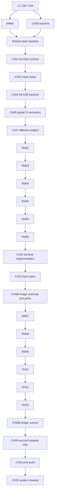

# 统一资源工作台产品化

- 任务分配名：`RM 统一资源工作台`
- 状态：`completed`（唯一 reviewer 已验收并完成本地 RM/CA 集成）
- 负责人：@Timcai06
- 代码审核与最终验收：Codex
- 最后验证时间：2026-08-12
- 起始本地基线：`a33c225398bd4dda069e79ed84d5fc02a3efff96`
- 前置计划：[LC Live 与 Canvas 输出](LC-Live与Canvas输出产品化.md)
- 输入决策：[ADR-0026](../../09-decisions/0026-多模态输入原件与派生表示边界.md)
- 输出决策：[ADR-0027](../../09-decisions/0027-Canvas多形态输出与交互运行时边界.md)
- 工作面架构：[统一 Canvas 工作面](../../02-architecture/04-统一画布工作面.md)
- 联合执行计划：[CA 代码与架构可信化](CA-代码与架构可信化.md)
- 联合执行模式：同一分支、同一工作树、单一代码任务队列

## 最终 Reviewer 结档（2026-08-13）

- RM 候选 `ae7c82276c4d44fa2d7821947513eb5e3a4db4b5` 已由唯一 reviewer 接受，并与
  CA 候选 `e3bf580a3610ca64b6b2deaf560eeaaf2ed67659` 合入本地集成分支。
- Reviewer 在 `908489bc186d4f28e3cffe37c6167e436aca5881` 完成 typed Turn outcome 与 E2E
  集成接缝：真实 Artifact API → generation job → Worker → Studio → Canvas 路径保留，纯壳测试
  使用 DB fixture，学习路径改走当前“打开互动演示/本课产物”入口。
- 联合门禁通过：Turbo unit 25/25（Web 213 files / 1596 tests）、typecheck 25/25 加 E2E、
  PostgreSQL DB 366 与 Worker 54、Migration 17/17、Desktop Chromium 50/50、build 8/8、
  file governance 2002 files 与 `git diff --check`。
- 根 lint wrapper 仅被三个已忽略的 Desktop `out/**` 生成 bundle 阻断；workspace lint 4/4
  通过且未修改生成物。移动 Chromium 与 Firefox 未按最终候选重跑，遵循项目负责人指示。
- Safari、真实麦克风、真实 Provider/MinerU、远端 nightly、真人读屏措辞和发布环境仍是明确
  未验证证据，不被本地自动化 PASS 覆盖。
- 完整联合证据见[RM/CA 最终集成交付与结档证据](../../06-quality/22-RM-CA最终集成交付与结档证据.md)。

## 一、交付目标

本阶段把当前分散在 Composer、来源启停、右侧案边按钮、Studio、Canvas、聊天状态卡和
Live Voice 中的资源交互收敛为一套统一资源工作台。用户在任意时刻都能回答四个问题：

1. 当前 Notebook 已经保存了哪些输入来源和 AI 产物；
2. 下一轮 Agent 实际会读取哪些已就绪、已冻结版本的来源；
3. 当前正在查看、折叠或固定哪些工作对象；
4. Agent 生成了什么、使用了哪些来源，以及如何继续预览、批注、修改和恢复历史版本。

Source 与 Artifact 继续保留各自事实源、版本和权限语义，但通过同一浏览器安全资源摘要、
同一 CanvasResource 打开门禁、同一工作面和同一资源库呈现。右侧 Dock 接管快速发现与恢复，
Studio 的旋转浏览退出并迁移为可搜索、可筛选的“全部资源”管理入口。普通聊天与 Live 只投影
资源状态和引用，不复制资源正文、Renderer、Agent Loop 或附件协议。

Composer 只保留一条清楚的主链：`+ 添加输入 → 选择本轮输出形态 → Agent Turn → Artifact →
Dock/Canvas`。上传和导入不得创建输出；思维导图、Slides、闪卡等快捷模板不得绕过 Turn 直接
创建第二个生成任务。Studio 中的空白新建、手动保存、修订与版本恢复仍可使用既有 Artifact
Mutation，但它们是资源管理动作，不是 Composer 的第二套智能生成入口。

## 二、前置门禁与当前事实

### 2.1 前置门禁

- LC 的 L/LX、C01-C08 与 X01-X04 已由项目负责人于 2026-08-12 签署通过并归档；生成 Markdown
  质量、生成状态卡重复和 Composer 多入口属于不阻塞 LC 的资源体验缺口，统一转入本计划，
  不再回开 LC 或复制旧状态机。
- RM00 及后续代码可以从本次管理员合并后的干净 HEAD 开始；LC 的 Canvas、Live 与 Artifact
  契约作为稳定输入，只允许按 RM 的资源体验目标演进，不改写已归档验收结论。
- 以当前执行分支最后一个已验证提交更新本计划基线；不得用尚未归属、尚未验证的脏
  工作树冒充新线起点，也不等待远端 PR 合并后再重置基线。
- RM 与 CA 直接在同一个本地分支执行，不创建并行工作树，也不把任何远端 PR 的代码、检查或
  审查状态当作本轮输入；需要的能力只以当前分支实际合入代码为准。
- 开始代码任务前必须先把当前脏工作树中的每个文件归属到一个已命名任务并形成可回退提交；
  无法解释归属的修改必须先停止。随后 RM00 与 CA00 在同一个干净 HEAD 上共同冻结事实。

### 2.2 同分支联合执行协议

1. 文档中的“可并行”只表示逻辑和依赖可解耦；本轮同一分支执行时，所有写代码任务进入同一
   队列，同一时刻只允许一个任务持有文件租约。只读审计可以同时进行，但不得写入工作树。
2. 每个任务开始前记录 `HEAD`、`git status --short`、目标文件和允许修改的测试；任务外文件
   不得顺手修改。发现共享 seam 时先更新租约，再由当前任务唯一接线。
3. 每个任务结束时运行定向测试、`pnpm typecheck` 或等价受影响检查、`git diff --check`，记录
   未运行项并形成一个可回退提交；工作树恢复到可解释状态后才释放给下一任务。
4. `tests/e2e/**`、全局 Playwright 配置和 `.github/workflows/**` 的基线恢复与全局语义由
   CA04/CA05 唯一拥有；RM 任务只新增或修改自己命名的资源用例，不在功能任务中重写全局 CI。
5. `.env.example`、`README.md`、`Makefile`、`tooling/env-check.*` 与 `turbo.json` 由 CA03 唯一
   拥有；RM 不修改开发环境或 Provider 配置。当前已有配置改动必须先由原任务收口，CA03 再复核。
6. 消息权威读源、双写对账和切读由 CA08A/CA08B 唯一拥有；RM07/RM08 只消费已冻结读源，
   不在 UI 或资源任务中改变消息表、双写开关或 repository 路由。

### 2.3 已有底座

- `WorkspaceSurface` 已保证 source、artifact、html 与 Studio 工作面互斥；Source 和 Artifact
  在同一槽位内分别使用既有 Renderer，并共享 `ResourceAnnotationLayer`
  （`apps/web/features/workspace/general/workspace-surface-slot.tsx:55-115`）。
- Web Renderer Registry 已注册 PDF、图片、Markdown、文本、DOCX、音频、视频以及思维导图、
  Slides、闪卡、Markdown 文档、音频概览和生成图片
  （`apps/web/features/canvas/web-canvas-resource-registry.ts:26-69`）。
- Source 预览已保留 PDF/DOCX 原件阅读切换，音视频保留原生播放器与转录，不需要创建第二套
  预览器（`apps/web/features/assets/source-resource-renderer.tsx:160-248`）。
- 右侧 `DeskRestRail` 已消费持久化 `SurfacePosition`，但当前只展示非 open 的前 6 项，
  Source 图标还按列表奇偶交替而非真实类型
  （`apps/web/features/workspace/general/desk-rest-rail.tsx:13-73`）。
- `SurfacePosition` 已表达 `source | artifact`、位置、层级与 `open | folded | pinned`，列表协议
  上限为 256；它是私人空间记忆，不是完整资源目录
  （`apps/web/features/workspace/general/surface-position-client.ts:5-25`）。
- Studio 当前一级只有“来源/AI 产物”，二级滚轮负责浏览，并为来源额外提供启停、重命名和
  删除动作（`apps/web/features/studio/studio-workspace.tsx:24-285`、
  `apps/web/features/studio/studio-workspace-options.ts:11-61`）。
- General Turn 已按 `space → context`、`turn → attachment` 投影已启用且有版本的 Source；
  Live 使用冻结的同一资产快照，不需要新的语音附件协议
  （`apps/web/features/workspace/general/use-general-workspace-controller.ts:190-235`）。
- 当前 `PlusMenu` 同时暴露上传/导入与 `create_mind_map/create_slides/create_flashcards/...`，后者
  经确认页直接 POST Artifact；而 Composer 下方 `outputPreference` 又随下一次 Turn 指导 Agent
  Tool 创建 Artifact。两条路径共用同一账本和 Worker，但在产品编排、确认和状态恢复上重复
  （`apps/web/features/composer/plus-menu.tsx:27-84`、
  `apps/web/features/workspace/general/use-general-workspace-controller.ts:340-360`、
  `apps/web/features/canvas/artifact-generation-flow.tsx:56-103`）。
- `canvasSelected`、Canvas tool chip 与 `outputPreference` 表达重叠意图，并通过多个 setter 与
  `PENDING_GENERAL_CANVAS_KEY/PENDING_GENERAL_OUTPUT_PREFERENCE_KEY` 手工同步；Landing 与对话态
  实现不同，已经具备状态漂移条件
  （`apps/web/features/workspace/general/general-chat-entry.tsx:48-115`、
  `apps/web/features/workspace/general/use-general-workspace-controller.ts:371-435`）。
- 当前一轮最多允许 63 份 Live/Turn 上下文，这是与 Runtime 64 个版本段预算对齐的保护上界，
  不是推荐用户同时启用 63 份资料的产品目标
  （`apps/web/features/voice/live-voice-context.ts:1-10`）。
- 项目负责人验收发现：上传的 Markdown Source 预览基本正常，但模型生成的 Markdown Artifact
  排版与内容质量明显较差。现阶段证据只能证明两条输入内容或 Renderer 路径存在差异，不能在
  未回放同一 fixture 前断言是模型 Markdown、Artifact schema 投影还是 Renderer 的问题。
- Artifact 生成期间会出现独立的“正在生成”框，Turn 完成后聊天又长期保留一张产物引用框；
  二者没有形成同一 Artifact identity 驱动的单卡状态迁移，用户会把它们理解为重复产物。

### 2.4 当前主要缺口

1. Dock 只知道空间位置和资源 ID，不知道真实标题、Renderer、处理状态、上下文状态、版本或
   允许动作；超过 6 项时静默不可见。
2. Studio 与 Dock 都能打开同一资源，但一个按全量列表浏览、一个按空间记忆恢复，职责重复且
   用户无法理解两者差别。
3. 资源存在、是否进入本轮上下文、是否在 Dock、是否已打开是四个不同维度，当前 UI 仍把它们
   分散在不同组件和布尔状态中。
4. 上传或生成后的状态会出现在局部面板、聊天状态卡或 Studio，但缺少从“处理中”到“可打开、
   可继续修改、可长期找回”的统一闭环。
5. 普通对话、Live 和 Canvas 已共享底层事实，但资源操作与反馈仍缺少一致的可访问名称、键盘
   顺序、失败恢复和性能预算。
6. Composer 的 `+`、Canvas chip 和“输出方式”同时承担输出意图；直接 Artifact POST 与 Agent
   Tool 又形成两套生成编排，容易出现重复对象、状态漂移、两份确认体验和不同 provenance。
7. Source 上传/导入在 Composer、Studio 与局部面板间仍可能各自维护表单、校验、进度和刷新；
   即使最终命中同一 API，也会形成多个产品口径和重复客户端状态。
8. 生成 Markdown 的低质量尚未被拆分为“模型原始 canonical Markdown”“Artifact 持久内容”与
   “Renderer 最终 DOM”三段证据，贸然只调 CSS 或 Prompt 都可能掩盖真实故障层。
9. Artifact 的 proposed/generating 提示与 ready 引用由两个 UI 投影承载；完成后没有以同一
   `artifactId + version` 原位收敛，导致一轮生成在聊天里呈现两个框。

## 三、范围与非目标

### 3.1 本阶段范围

- 定义 provider-neutral、浏览器安全的 `WorkspaceResourceSummary` 判别联合，只组合现有
  Source、Artifact、CanvasResource、Context Binding 与 SurfacePosition 事实；
- 收敛 Composer 输入/输出边界：`+` 只添加 Source，唯一 `outputPreference` 随 Turn 提交，
  具体产物模板只预填普通 Turn 或进入 Studio 资源动作，不直接创建第二份智能生成任务；
- 收敛所有 Source intake 入口到同一上传/导入 controller、校验、生命周期与资源刷新；Studio、
  Dock 或空状态若提供“添加来源”，只能打开同一个流程，不复制表单、请求和进度状态；
- 将右侧案边栏升级为固定一级 SVG 分类与按需展开的二级资源 Dock；
- 建立发送前可核对的本轮上下文条，并保证普通 Turn 与 Live 冻结同一版本快照；
- 将 Studio 的来源/产物旋转浏览迁移为“全部资源”管理面，提供搜索、筛选、排序和授权动作；
- 保持原件预览、结构化阅读、Agent 表示和 Artifact Renderer/Runtime 的既有安全边界；
- 打通聊天状态卡、Dock、Canvas、版本与 provenance 的 AI 产物闭环；
- 对生成 Markdown 建立原始模型输出、持久 Artifact content 与最终 Renderer DOM 的可回放证据，
  修复真正故障层；并把生成中/成功/失败收敛为同一 Artifact 身份的一张生命周期卡；
- 在 Live 内复用同一资源摘要和只读预览，不退出语音会话、不建立第二份资源状态；
- 增加资源数量、N+1 请求、懒加载、键盘、读屏、reduced-motion、权限与失败恢复证据。

### 3.2 非目标

- 不重做 ADR-0026 的 MinerU、原件存储、派生表示、Worker、降级与 context materialization；
- 不重做 ADR-0027 已完成的 Markdown、mind map、Web App 协议、Renderer 或 Runtime；
- 不在证据表明 Renderer 有缺陷前重写 Markdown 渲染器，也不靠后处理字符串偷偷修补模型输出；
- 不把 Source 与 Artifact 合并成同一数据库聚合根，也不改变其不可变版本身份；
- 不让 SurfacePosition、浏览器缓存或 Dock 顺序成为授权、上下文或资源存在的事实源；
- 不新增第二套预览器、Renderer Registry、Agent Loop、聊天记录、Live 附件协议或生成队列；
- 不删除 Studio/Canvas 为手动空白新建、保存、修订、恢复提供的 Artifact Mutation；只禁止
  Composer 用这些端点绕过 Agent Turn 形成第二条智能生成路径；
- 不让模型输出的任意 HTML/JavaScript 进入主页面；自由 Web App 继续经过版本化协议和隔离 Runtime；
- 不为了视觉统一把 PDF、DOCX、音视频原件改写成 Markdown 原件；
- 默认不新增数据库表。若现有 Source、Artifact、Binding 与 SurfacePosition 无法表达接受的
  产品事实，必须先提交独立 ADR 与正式 Drizzle Migration，不在 UI PR 中顺带加字段。

## 四、核心概念与不变量

| 维度          | 权威事实                                        | UI 可以做什么                              | UI 不得做什么                        |
| ------------- | ----------------------------------------------- | ------------------------------------------ | ------------------------------------ |
| 资源身份      | `resourceKind + resourceId + immutable version` | 展示、打开、按版本定位                     | 用标题、索引或 SVG 位置代替身份      |
| Source 内容   | Asset Version 与原件/派生 Representation        | 原件预览、结构化阅读、启停上下文           | 把派生 Markdown 冒充原件             |
| Artifact 内容 | Artifact 与不可变 Artifact Version              | 预览、编辑、修订、回退、导出               | 原地覆盖历史版本                     |
| 上下文绑定    | Notebook/Turn 绑定与服务端 materialization      | 在发送前启用、停用并展示冻结结果           | 用 Dock 是否可见推断 Agent 已读取    |
| 输出意图      | Turn 请求中的唯一 `outputPreference`            | 选择自动/Markdown/互动产物/Web App         | 用 chip、菜单或 session key 再造状态 |
| 空间工作集    | SurfacePosition `open/folded/pinned`            | 快速恢复、固定、折叠、排序                 | 充当资源目录、权限或上下文事实       |
| 允许动作      | 服务端 CanvasResource `allowedActions`          | 只渲染当前主体获授权动作                   | 根据角色名、资源类型在客户端自行推断 |
| Provenance    | 实际 materialized 的 Source/Representation      | 展示“由哪些冻结版本生成”并重新鉴权打开原件 | 让 Artifact 继承 Source 权限         |

`WorkspaceResourceSummary` 只是一层可缓存投影，最少包含：判别后的资源身份、标题、真实
`rendererId`、生命周期状态、最新/当前版本摘要、服务端授权动作、有限 provenance 摘要，以及当前
用户的 context/surface 状态。它不携带正文、对象存储 key、Provider body、Prompt、Credential、
动态组件或任意脚本。

## 五、目标信息架构与交互

### 5.1 Composer：输入与输出的单一边界

- `+` 只负责上传文件、上传图片和导入网页等 Source 输入；不得再展示或执行
  `create_mind_map/create_slides/create_flashcards/create_note` 等输出创建动作；
- Composer、Studio、Dock 和资源库的“添加来源”必须委托同一个 Source intake 流程；入口可以
  出现在不同工作面，但接受格式、大小限制、上传请求、processing 轮询、错误恢复和列表刷新
  只能各有一份实现；
- Composer 只维护一个 `outputPreference`：`auto`、`markdown_document`、
  `interactive_artifact` 或 `web_app`。选择、恢复、发送和提交成功后的重置都以它为唯一事实；
- 删除独立 `canvasSelected`、重复 Canvas tool chip、`PENDING_GENERAL_CANVAS_KEY` 及其同步代码；
  任何视觉选中态都从 `outputPreference` 派生，Landing 与对话态共用同一恢复函数；
- 思维导图、Slides、闪卡等快捷模板如保留，只能设置输出偏好并预填可编辑草稿，随后走普通
  Agent Turn；不得从 Composer 调用 `/api/v1/chat/artifacts`，也不得在点击时先创建 Job；
- 音频概览等必须绑定已选择 Source 的明确资源操作放入 Studio/资源库创建面，继续走受控确认，
  不伪装成普通 Turn 输出偏好；
- 上传后立即出现 `uploading → processing → ready | failed`；Agent 产物继续由同一聊天状态卡
  呈现 `proposed → generating → ready | failed`，两者进入统一 Dock/资源库但不混淆生命周期；
- 既有直接 Artifact API 只保留给 Studio/Canvas 的空白新建、手动保存、修订、恢复和受控资源
  操作；兼容期若收到旧 Composer create action，只允许转换成草稿/Turn，不得双写。

### 5.2 本轮上下文条：发送前事实

- 只展示当前 Turn 将尝试冻结的 Source，不混入 AI 产物或仅在 Dock 中打开的对象；
- 显示标题、真实类型、长期 `context`/本轮 `attachment`、ready/processing/failed 与质量状态；
- processing、failed、无版本或不可选择的来源不得静默进入请求；发送前明确显示“本轮未带入”；
- 普通 Turn 和 Live ASR final 调用同一 snapshot builder，提交后冻结实际
  `assetId + versionId + representation identity`，不能在异步刷新后漂移；
- 63 份仍是安全上限；产品层默认折叠为摘要和搜索，不渲染 63 个常驻 chip，也不降低 Runtime
  的最终预算校验。

### 5.3 右侧 Dock：当前工作集

Dock 一级使用稳定语义而不是文件后缀：

1. **来源/上下文 SVG**：角标表达已启用/总数，状态点表达 processing/failed；
2. **AI 产物 SVG**：角标表达 generating/new，状态点表达 failed；
3. **全部资源 SVG**：固定在底部，打开资源库，不与内容分类混为一谈。

展开一级后，二级资源才使用真实 PDF、DOCX、图片、音频、视频、Markdown、思维导图、
Slides、闪卡、笔记、生成图片或 Web App 图标。二级条目显示标题、状态、版本和当前打开/固定
状态。单击打开同一 Canvas；关闭后折回原分类；只允许一个分类展开。固定、最近、处理中是
排序或状态，不作为与 Source/Artifact 并列的新分类。

Dock 不再静默 `slice(0, 6)`：主视图保持有界，但必须显示剩余计数并可进入全部资源。摘要加载
必须批量完成，禁止为每个 SVG 发一个资源详情请求；正文、媒体和 Runtime 只在打开时懒加载。

### 5.4 全部资源：长期管理

- 替换 Studio 的旋转浏览，使用适合大量资源的列表/网格和清楚的 Source/Artifact 分组；
- 支持标题搜索、资源类型、生命周期状态、上下文启用状态、更新时间和固定状态筛选；
- Source 动作包括启停、打开、固定、重命名、重试、删除或下载，均按 `allowedActions` 显示；
- Artifact 动作包括打开、固定、查看版本、继续修改、导出或删除，仍通过既有 Artifact 流程；
- 支持 cursor 分页或等价有界加载；筛选不能要求先把所有正文或二进制下载到浏览器；
- 旧 Studio 在管理能力达到行为等价前保留兼容入口；迁移完成后删除重复滚轮和无消费者样式，
  顶部入口改为产品最终确认的“资源”或“资源库”。

### 5.5 Canvas、聊天与 Live

- Canvas 仍是唯一阅读、批注、编辑、修订与版本工作面；Source 原件/结构化阅读和 Artifact
  Renderer/Runtime 不因入口不同而分叉；
- 聊天只保留附件引用、上下文摘要、生成状态卡和产物引用；不把完整资源正文复制进消息 UI；
- Artifact 从 proposed/generating 到 ready/failed/cancelled 始终由同一 `artifactId` 状态卡原位
  转换；ready 后该卡成为可打开入口并自动进入 AI 产物 Dock，不再追加第二张完成引用框；
- Markdown Artifact 必须保留可下载的 canonical Markdown。验收时把同一 Markdown fixture
  分别送入 Source 与 Artifact 渲染路径，并对照持久内容和最终 DOM，先定位生成/投影/渲染层，
  再修对应责任，不能通过来源预览正常就直接推断 Artifact Renderer 正常；
- Canvas 展示有限 provenance，点击 Source 时重新走当前 Notebook 权限和 CanvasResource gate；
- Live 使用同一摘要、上下文快照和只读 Renderer；打开、返回、Escape 不退出语音会话，复杂
  编辑交回同一 Workspace Canvas；退出 Live 后聊天、Dock 和资源版本保持一致。

## 六、原子任务与依赖顺序

每个任务只有在证据完整后才能标记 `PASS`。`RM` 为资源工作台纵切，`RX` 为联合收口。

| 任务                          | 状态        | 交付与验收                                                                                                                                                                                                                                                        |
| ----------------------------- | ----------- | ----------------------------------------------------------------------------------------------------------------------------------------------------------------------------------------------------------------------------------------------------------------- |
| RM00 事实冻结与契约矩阵       | `COMPLETED` | 与 CA00 使用同一干净 HEAD 冻结 Source、Artifact、CanvasResource、Binding、SurfacePosition、Studio、聊天状态卡和 Live 当前所有权；记录 ID/version/status/action 映射、N+1 基线和共享文件租约。                                                                     |
| RM01 统一资源摘要投影         | `COMPLETED` | 在 CA01 终态契约与 CA07 effective subject 契约冻结后，定义严格判别联合、parser 和批量摘要组合；未知 kind/status/version fail closed；不暴露正文、对象 key、Prompt 或 Provider 数据；旧端点保持兼容。                                                              |
| RM02 Composer 单一输入输出链  | `COMPLETED` | `+` 仅保留 Source 输入；所有添加来源入口复用同一 intake controller/校验/进度/刷新；`outputPreference` 成为唯一输出状态；删除 Canvas chip、双 session key 和直接 create action；模板只预填 Turn；证明一次提交至多创建一个 Source intake 与一个 Artifact。          |
| RM03 分类 Dock                | `COMPLETED` | 交付来源、AI 产物、全部资源三个稳定一级 SVG，二级真实类型、状态、固定/打开与剩余计数；删除索引交替图标和静默 6 项截断；无每项详情 N+1。                                                                                                                           |
| RM04 本轮上下文条             | `COMPLETED` | 在 CA01 冻结 terminal/status 语义后，普通 Turn 与 Live 共用唯一 snapshot builder；UI 与实际 request/context snapshot 的 ready 版本集合一致；processing/failed 明确未带入；覆盖上传并发与发送竞争。                                                                |
| RM05 全部资源库与 Studio 迁移 | `COMPLETED` | 搜索、分类、状态/上下文筛选、排序、分页和授权动作完成；Source/Artifact 都能打开同一 Canvas；行为等价后移除旋转浏览及重复样式。                                                                                                                                    |
| RM06 Source 阅读闭环          | `COMPLETED` | PDF/DOCX 原件与结构化阅读、图片、Markdown、文本、音视频预览从 Dock/资源库一致打开；固定一份正常 Markdown Source 作为跨 Renderer 对照基线；派生质量、processing、failed、denied、unavailable 均诚实呈现。                                                          |
| RM07 Artifact 输出闭环        | `COMPLETED` | 在 CA02/CX01 证明终态可恢复、CA08A 冻结消息读源后，先以原始模型输出→持久 content→最终 DOM 三段证据定位并修复生成 Markdown 质量，再让 proposed/generating/ready/failed 共用一张 Artifact 身份卡；Dock、资源库、Canvas 版本和 provenance 不得产生重复对象或假完成。 |
| RM08 Live 资源连续体验        | `COMPLETED` | 在 RM04、RM06、RM07 完成后，Live 内切换上下文、查看来源和只读产物不退出会话；新产物实时进入 Dock；插话、TTS、资源加载失败互不篡改状态，退出后与普通工作区一致；不得改变消息读源。                                                                                 |
| RM09 性能、无障碍与真人验收   | `COMPLETED` | 自动化规模、键盘、ARIA、窄屏、reduced-motion 与失败恢复已验收；真实麦克风、真人读屏措辞和外部 Provider 继续作为明确的非阻塞人工证据。                                                                                                                             |
| RX01 权限与安全收口           | `COMPLETED` | 跨 Notebook/主体、成员撤销、迟到响应、未知 Renderer、恶意派生内容、Web App 隔离和 secret containment 负例通过；provenance 不授权。                                                                                                                                |
| RX02 资源线 CI 证据           | `COMPLETED` | 资源线与集成候选门禁已登记；全局 Playwright/nightly workflow 语义仍由 CA05 维护。                                                                                                                                                                                 |
| RX03 资源事实回写与归档       | `COMPLETED` | 资源、Dock、上下文、Canvas、Studio 与系统级 Turn/Gateway/CI/账本事实已完成 canonical 回写并由 reviewer 集成。                                                                                                                                                     |

联合写入顺序：`LC C08/X04 → RM00+CA00 → CA01 → CA03 → CA04 → CA05 → CA07 →
RM01 → RM02 → RM03 → RM04 → RM05 → RM06 → CA02 → CX01 → CA08A → RM07 → RM08 →
RM09 → RX01 → RX02 → RX03 → CA08B → CA09 → CX02 → CX03`。

斜杠和加号只表示逻辑上可拆分，不授权同一工作树并发写入。任务按文件租约进入单一队列，每个
任务从前一个已验证提交开始。CA08A 只冻结权威读源并做对账，不切读；CA08B 必须等待 RM 的
聊天、Artifact 与 Live 产品行为冻结后再正式切读，避免迁移和产品回归混杂。

### 6.1 最简依赖图

图中实线是本轮同一分支的唯一写入队列。任务虽可提前并行完成只读准备，但取得文件租约、修改、
验证和提交必须沿实线串行推进；图不表达远端 PR 或工作树数量。

- 准备波次：`CA01`、`CA03`、`CA04`、`CA07` 与 `RM01-RM05` 可并行做只读搜索、契约草案、
  fixture 设计和测试分类；这些准备物不直接写入当前工作树；
- 基线门禁：CA03 在现有配置改动所属任务提交后复核，CA04/CA05 在 RM 功能代码前恢复测试
  基线，避免后续无法区分既有失败与 RM 回归；
- 产品门禁：`RM02 Composer 单一输入输出链` 先删除重复编排，随后 RM03-RM06 逐任务提交；
- 接缝门禁：`CA02/CX01/CA08A` 在 RM07 前依次完成，CA08B 只在 RM 资源事实冻结后切读。

准备波次不授权同一工作树并发写入。若多个任务都需要修改
`use-general-workspace-controller.ts`、`general-workspace-layout.tsx`、公共资源摘要契约、
`tests/e2e/**` 或 canonical 架构文档，应由排在前面的当前任务取得独占租约并完成接线；后续任务
只能在该提交之后适配，禁止保留两份未提交实现再人工拼接。

## 七、体验与性能预算

| 指标                 | 自动化阻断目标                                                                   |
| -------------------- | -------------------------------------------------------------------------------- |
| 一级 Dock 展开/收起  | 300 个摘要 fixture 下交互提交 p95 ≤ 100 ms                                       |
| 资源库本地搜索/筛选  | 500 个摘要 fixture 下 p95 ≤ 100 ms，不读取正文                                   |
| 摘要网络请求         | Notebook 首次加载使用有界批量/分页；禁止随可见资源数线性增长的详情 N+1           |
| 预览懒加载           | 未打开资源时不请求 PDF、DOCX、媒体字节、Artifact 正文或启动 Web Runtime          |
| 点击到 Canvas 壳可见 | 固定本地 fixture p95 ≤ 300 ms；内容加载状态随后诚实渐进                          |
| Dock 动画            | 只动画 transform/opacity；桌面交互 ≥ 50 FPS；隐藏标签页暂停；reduced-motion 等价 |
| Composer 单一链路    | 每次提交只有一个 outputPreference；不得同时发 Turn 与 Artifact create 请求       |
| 上下文发送一致性     | UI 确认集合与服务端接受的冻结版本集合 100% 一致，省略项均有稳定原因              |
| 资源数量             | 0、1、6、7、63、256、500 摘要 fixture 均无静默丢失、越界或不可恢复入口           |

网络、Provider、MinerU 与 Worker 的真实端到端耗时单独记录，不得用其波动掩盖浏览器 N+1、
同步渲染或重复解析回归。

## 八、建议文件所有权

| 责任                       | 主要文件或目录                                                                                                                   |
| -------------------------- | -------------------------------------------------------------------------------------------------------------------------------- |
| 资源摘要公共契约           | `packages/canvas-protocol/`，必要的 Web client parser 放 `apps/web/features/canvas/`                                             |
| 摘要服务端组合与权限       | 既有 CanvasResource/Asset/Artifact BFF 组合层；不得进入 Provider Adapter                                                         |
| Composer 输入与输出意图    | `apps/web/features/composer/`、`general-chat-entry.tsx`、`use-general-workspace-controller.ts`；只保留一个 outputPreference 状态 |
| Dock 与空间记忆            | `apps/web/features/workspace/general/desk-rest-rail.tsx`、`surface-position-client.ts`、`use-surface-position-persistence.ts`    |
| 上下文选择与 Turn 快照     | `apps/web/features/workspace/general/use-general-workspace-controller.ts`、`apps/web/features/voice/live-voice-context.ts`       |
| 资源库与 Studio 兼容迁移   | `apps/web/features/studio/`，完成后按真实产品命名迁移目录，避免一 PR 大范围机械改名                                              |
| Source 预览                | `apps/web/features/assets/source-resource-renderer.tsx` 及现有 PDF/DOCX/媒体切换组件                                             |
| Artifact 与 Canvas 工作面  | `apps/web/features/canvas/`、`apps/web/features/workspace/general/workspace-surface-slot.tsx`                                    |
| Live 只读资源投影          | `apps/web/features/voice/`，只消费统一摘要/Renderer，不复制资源客户端                                                            |
| Worker/Representation 输入 | ADR-0026 现有所有权；RM 只消费状态和表示，不在 UI 线修改 MinerU/Worker                                                           |
| 全局 E2E 与 CI             | CA04/CA05 独占 `tests/e2e/` 基线修复、Playwright 全局配置和 `.github/workflows/`；RM 只拥有命名后的资源专项用例                  |
| 消息账本与权威读源         | CA08A/CA08B 独占 `k12-conversation-dual-write.ts` 及相邻切读配置；RM07/RM08 只消费冻结契约                                       |
| Canonical 集成             | RM RX03 写资源产品事实；CA CX03 最后整合共享系统架构、质量和运维文档                                                             |

单文件接近 400 行即评审职责，通常在 600 行前拆分。公共 controller 只做组合，不把搜索、Dock、
资源库、上下文快照和 Canvas 详情全部内联回一个 God Component。

## 九、测试与证据矩阵

| 层级        | 证据                                                                                                                                     |
| ----------- | ---------------------------------------------------------------------------------------------------------------------------------------- |
| Contract    | Source/Artifact 判别、版本身份、生命周期、允许动作、未知字段、兼容响应、最大列表与稳定错误码                                             |
| Unit        | 输入 action 与输出 preference 互斥、模板到草稿、一级/二级分类、真实 Renderer 图标、状态/角标、搜索筛选、snapshot builder、排序确定性     |
| Integration | 一次 Turn 至多创建一个 Artifact；Composer 不直调 create API；批量摘要重新鉴权；Turn/Live 冻结 context；生成任务 → 状态卡/Dock/版本       |
| Browser     | Composer 上传后发送、选择输出方式后生成、快捷模板可编辑、无重复产物；Dock 键盘、资源库筛选、原件预览、Artifact 修订、Live 打开返回       |
| Security    | 跨主体、跨 Notebook、成员撤销、对象 key、Provider body、Prompt、恶意 Markdown/图片 manifest、未知 Renderer、Web App bridge 与 provenance |
| Performance | 0/6/7/63/256/500 摘要、N+1 计数、正文懒加载、Dock/搜索 p95、Canvas 壳、长任务状态刷新与隐藏标签页                                        |
| Human       | Chrome/Safari 各完成一次 PDF/图片输入与 Agent 使用；创建并修改三类产物；Live 查看来源/产物；资源库找回历史版本                           |

CI 使用固定 Source/Artifact fixture、fake Worker/Runtime 和确定性浏览器时钟，不调用真实模型、MinerU
或 Provider。真实转换、真实 Turn 和真人体验使用受保护 canary/本地验收，报告不得包含学生内容、
原文件正文、对象路径、API Key 或 Provider 原始响应。

## 十、风险、触发条件与回退

| 风险                      | 触发信号                                          | 缓解与回退                                                                    |
| ------------------------- | ------------------------------------------------- | ----------------------------------------------------------------------------- |
| 统一摘要变成第三个事实源  | 摘要能修改版本、权限或正文                        | 摘要保持只读投影；动作回到现有 Source/Artifact 服务；缓存按主体/Notebook 失效 |
| Dock 分类与上下文语义混淆 | 用户以为可见即已送给 Agent                        | 独立上下文状态与发送前确认；Dock 只表达工作集                                 |
| 资源库大列表导致 N+1/卡顿 | 请求数随条目线性增长、打开前下载正文              | 批量摘要、cursor 分页、懒加载、性能 fixture；失败时保留旧 Studio 兼容入口     |
| Studio 过早删除           | 新资源库缺少启停、重命名、删除或键盘行为          | 行为等价门禁通过后再删除；可按 feature flag 回退旧入口                        |
| 上下文在发送时漂移        | UI 显示版本与 Turn snapshot 不同                  | 单一 snapshot builder；提交时冻结版本和 representation；刷新不得回写历史      |
| Source/Artifact 权限串联  | 产物 provenance 可直接读取已撤销来源              | 每次打开 Source 重新授权；provenance 只展示 identity，不授予能力              |
| Live 再造资源状态         | 退出 Live 后列表、版本或启停不同                  | Live 只消费 controller 投影；本地只保存瞬时展开/预览状态                      |
| Composer 双入口再次出现   | `+` 直接创建 Artifact，或 chip 与 select 各存状态 | action 类型拆成输入/资源操作；输出只读 Turn preference；契约测试禁止双写      |
| 视觉升级扩大性能成本      | 多个滤镜、常驻循环、低端设备掉帧                  | 使用现有 token/图标库、transform/opacity、暂停策略和 reduced-motion           |
| 与 ADR-0026 后续实现冲突  | RM 修改 MinerU/Worker/representation schema       | RM 只消费 accepted 投影；输入实现缺口回 ADR-0026 所有者独立 PR                |
| CI 重复且成本失控         | docs/UI 小改触发 Provider、全量浏览器和最终门禁   | CA05 维护全局分层；RM 只跑受影响门禁；资源线结档只做一次最终门禁              |
| 同分支任务互相覆盖        | 两个任务同时修改 controller、E2E、配置或账本      | 单一队列、独占文件租约、每任务一个可回退提交；租约外修改立即停止              |

## 十一、阶段门禁与交付节奏

1. **Gate 0 — LC 结档与工作树清场**：项目负责人签署 C08，完成 X04 并归档 LC；把当前所有脏文件
   归属到任务并形成可回退提交，RM00/CA00 冻结同一 HEAD。
2. **Gate A — 可信基线与共享契约**：CA01、CA03、CA04、CA05、CA07 依次 PASS；先冻结终态和
   主体，恢复 clean setup 与完整 E2E 本地基线，再允许 RM 写功能代码。远端 nightly 只登记
   `[待验证]`，不阻塞当前分支推进。
3. **Gate B — 单一产品链与 Web 工作台**：RM01-RM06 按单一队列完成摘要、Composer、Dock、
   上下文、资源库和 Source 阅读；旧
   Studio 保持回退。
4. **Gate C — 终态、账本与 Artifact**：CA02/CX01/CA08A 先提供终态和读源证据，RM07-RM08 再
   完成 Artifact/Live 产品闭环；本 Gate 不执行账本切读。
5. **Gate D — 质量与资源线结档**：RM09、RX01、RX02、RX03 依次完成真人/安全/资源专项证据
   与资源事实回写；全局 CI 文件仍只由 CA05 维护。
6. **Gate E — 架构收口**：CA08B 执行消息账本切读，CA09 只拆本轮实际触达的热点，CX02 做跨
   计划审计，CX03 最后整合共享
   canonical 文档并归档。远端 PR 不属于本轮门禁。

建议每个本地提交只承担一个可命名责任，但不要求每个原子任务单独开远端 PR。契约、服务端投影、
Dock、资源库、上下文发送、Canvas/Live 接线和文档收口形成可逐个回退的提交序列；不得把
MinerU、Provider Adapter、Web Runtime 大改或无关 CI 重构混入 RM 功能提交。

## 十二、预期事实回写

| 稳定事实类型                    | 目标文档                                                           |
| ------------------------------- | ------------------------------------------------------------------ |
| 资源、上下文、Dock 与资源库行为 | `docs/01-product/01-产品定义.md`、`docs/01-product/03-用户流程.md` |
| 统一资源摘要与工作面边界        | `docs/02-architecture/04-统一画布工作面.md`、`01-系统架构现状.md`  |
| 前后端实现与性能约束            | `docs/05-engineering/02-后端工程.md`、`03-前端工程.md`             |
| 测试、E2E 与真人证据            | `docs/06-quality/03-测试与评估.md`及新增 RM 专项验收记录           |
| 运维、缓存与观测                | `docs/07-operations/01-部署与可观测性.md`                          |
| 重大新取舍                      | 优先扩展 ADR-0026/0027；只有出现新的长期不可逆边界时才新增 ADR     |

## 十三、验证证据台账

| 验收项                         | 证据                                                       | 结果      |
| ------------------------------ | ---------------------------------------------------------- | --------- |
| LC C08/X04 前置结档            | 负责人签署、受影响检查、管理员直合授权与 completed 链接    | `pass`    |
| RM00-RM02 契约与单一链路       | 事实矩阵、摘要契约、唯一 outputPreference、无双写证据      | `pending` |
| RM03-RM05 Dock/上下文/资源库   | unit、integration、browser 与 N+1/大列表报告               | `pending` |
| RM06-RM08 Source/Artifact/Live | 原件/派生阅读、版本、provenance、Live 连续体验             | `pending` |
| RM09/RX01/RX02 质量收口        | 性能、键盘、读屏、安全、真人与 affected CI 报告            | `pending` |
| RX03 归档                      | canonical diff、最终本地门禁、commit SHA 与 completed 记录 | `pending` |

## 十四、收尾检查表

- [x] LC C08 已由项目负责人签署，X04 按明确的管理员直合授权完成受影响门禁并归档；
- [ ] RM00-RM09、RX01-RX03 均有可复现证据，失败项已明确转入后续计划；
- [ ] `+` 只添加 Source，输出方式只有一个 `outputPreference`，Composer 不直接创建 Artifact Job；
- [ ] Composer、Studio、Dock 与资源库的添加来源入口只打开同一个 intake 流程，不复制校验、请求、进度或刷新；
- [ ] Canvas chip、`canvasSelected`、`PENDING_GENERAL_CANVAS_KEY` 与 create action 重复编排已删除；
- [ ] 一次用户提交至多创建一个 Artifact；快捷模板只预填可编辑 Turn，Studio Mutation 不被误删；
- [ ] 生成 Markdown 已以三段证据定位并修复真实故障层；正常 Source Markdown 与 Artifact Markdown 使用一致的安全语义和可接受排版；
- [ ] 同一 Artifact 在聊天中只有一张生命周期卡，生成中原位转为 ready/failed/cancelled，不追加重复完成框；
- [ ] 用户可以从上传/创建到上下文确认、对话/Live、Dock、Canvas、版本和资源库完成一条闭环；
- [ ] Source、Artifact、Context Binding、SurfacePosition 和 Resource Summary 没有形成重复事实源；
- [ ] PDF/DOCX/图片/音视频原件与派生表示语义未被 UI 统一改写；
- [ ] Artifact provenance 不授权，Web App 不进入主页面信任域；
- [ ] 大资源集无静默截断、N+1、正文预加载、不可恢复入口或键盘陷阱；
- [ ] 旧 Studio 只在新资源库行为等价后删除，回退路径和迁移测试已验证；
- [ ] 稳定事实已回写 canonical 文档，重大偏差已更新 ADR；
- [ ] 最终全量门禁只运行一次，计划压缩后移入 `completed/`并更新索引。
