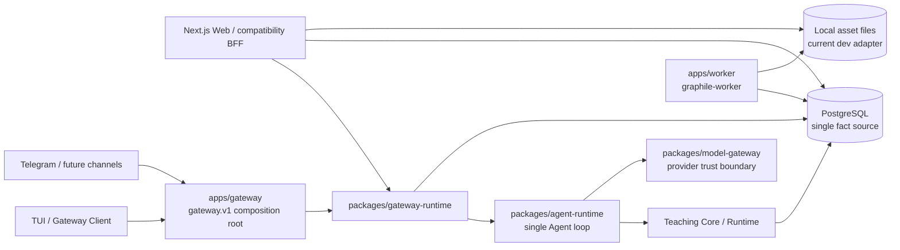
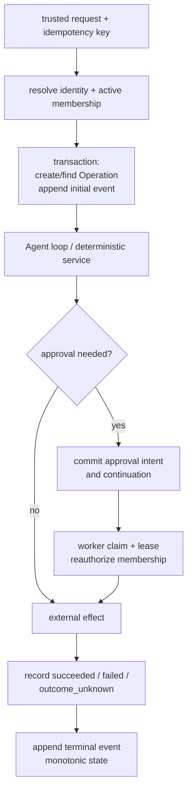

# EduCanvas 后端、数据库与测试审计

- 状态：`reviewed`，本地修复追踪更新于 2026-07-24
- 审计基线：`98ea37f1bc298fb6c718a037127b487af01b0888`
- 审计日期：2026-07-24
- 范围：后端、PostgreSQL、权限、接口、Worker、日志与质量体系
- 不在范围：UI 视觉、三层 Memory 表、Memory Runtime、Context Compiler

## 一、结论

当前底座已经形成可信的模块化单体骨架：PostgreSQL 是事实源，Gateway、Agent
Runtime、Teaching Runtime 和 Worker 的职责边界基本成立；Turn、Continuation、Tool
Effect、Artifact、Knowledge 和教学投影已有相当数量的真实 PostgreSQL 集成证据。它足以
作为未来三层 Memory、原生多模态、协作、渠道和 AI 实验的继续演进基础。

但它**尚不足以安全承载生产部署或扩大协作范围**。本次静态审计确认 3 项 P0：

1. Notebook 成员被撤销后，仍能读取自己旧 Operation 的事件流和待审批信息，并能提交审批
   决定；
2. 学习计划 bootstrap 把过期的 `owner` Membership 当作有效所有权；
3. Learner Profile 写入端允许调用者自行声称 `guardian_declared` 或
   `school_asserted`，绕过已接受的来源可信边界。

此外，匿名删除没有闭合对象文件和渠道账号绑定，上传入口在 10 MiB 业务校验前已经完整
解析 multipart，最新学习域 migration 缺少被文档声称存在的 N-1 证据。以上问题应在
Memory 或家庭/班级协作继续扩面前处理。

本报告没有修改业务代码、Schema、migration journal、Memory 或 UI。

### 1.1 审计后本地修复追踪

下表记录审计完成后的独立本地分支；它不改写审计基线，也不把本地验证写成远程 CI
通过。2026-07-24 再次 fetch 后，`origin/main` 仍为审计基线 `98ea37f`。

| 风险/质量项                            | 本地分支与提交                                           | 当前状态            | 主要证据                                                                                                            |
| -------------------------------------- | -------------------------------------------------------- | ------------------- | ------------------------------------------------------------------------------------------------------------------- |
| A-01 Operation/Approval 撤权后仍可访问 | `fix/20260724-operation-access-revalidation` / `59c9e84` | 已修复，待原子 PR   | 当前 Membership 复核、conversation/notebook 绑定、撤销并发锁；真实 PG 29 文件/121 测试和 Worker 10 文件/27 测试通过 |
| A-04 multipart 先物化后限流            | `fix/20260724-upload-body-limit` / `adbbbb0`             | 已修复，待原子 PR   | `formData()` 前按声明长度与真实流双重限流；Web 50 文件/211 单测及生产构建通过                                       |
| A-07 `0034` migration 证据漂移         | `test/20260724-migration-0034-compatibility` / `47e37ed` | 已补证据，待原子 PR | 真实 Drizzle journal 的 fresh、0033→0034、DDL/journal 回滚与前向重跑；完整 DB/Worker integration 通过               |
| 部署 env guard 负例不足                | `test/20260724-env-check-boundaries` / `7b6ba0d`         | 已补证据，待原子 PR | HTTPS、provider/runtime、URL 凭据、密钥/模型格式与数值边界；tooling 50/50 通过                                      |

A-02/A-03 会改变 Learner Profile/Goal 权威语义；A-05/A-06 需要对象删除
outbox、匿名 identity/channel 最小保留或 FK 决策。它们仍只保留方案，必须先与主 tree
协调，不能在 test tree 内自行编码。以上本地分支均未推送，远程 checks 尚未运行。

## 二、方法与证据边界

### 2.1 基线

审计开始时已执行远程引用拉取；当前 test worktree 干净，HEAD 与 `origin/main` 均为
`98ea37f1bc298fb6c718a037127b487af01b0888`。另外两棵 worktree 当时也指向该提交，但
本次没有切换、清理、重置或修改它们。

事实来源依次为：

1. 当前 checkout 的 Schema、migration SQL、Repository、HTTP 路由和测试；
2. `docs/02-architecture`、`docs/04-data`、`docs/06-quality`、
   `docs/07-operations` 和 accepted ADR；
3. 研究与结档文档，只用于理解目标和待验证项，不替代源码事实。

### 2.2 分类

- **已证实问题**：源码路径足以构成错误或越权，不依赖未来规模；
- **需要实验验证的风险**：静态查询形态、平台行为或故障窗口提示风险，但还缺
  PostgreSQL `EXPLAIN`、Windows 进程实验、恢复演练或负载证据；
- **生产门**：当前代码可用于本地或小规模验证，但在上线前必须补齐的运行证据。

本次没有运行依赖 CVE 审计：受限环境无法访问 registry，因此不能对当前依赖漏洞状态作
结论。

## 三、当前后端与数据拓扑



关键边界：

- `apps/web` 保留兼容 BFF 和 Web SSE；它与 Gateway 的传输不同是既有设计，不构成应被
  强制合并的问题；
- `apps/gateway` 是 client/internal/node HTTP composition root；
- `packages/agent-runtime` 是唯一 Agent loop；
- `packages/model-gateway` 截止 provider SDK 类型、原始响应和密钥；
- `packages/db` 持有 Drizzle Schema、migration 和持久化实现；
- graphile-worker 使用 PostgreSQL 队列表，不另建业务 `worker_jobs` 事实表；
- 当前本地 Asset 文件和数据库元数据属于两个存储面，尚无可靠的删除 outbox 闭环。

证据：`CLAUDE.md`；`apps/gateway/src/server.ts`；
`apps/gateway/src/http/client-routes.ts:69-344`；
`apps/web/server/gateway/web-turn.ts:226-264`；
`packages/agent-runtime/src`；`packages/model-gateway/src`；
`apps/worker/src/tasks`。

## 四、核心表、权威写者与所有权映射

| 领域                            | 当前表/表示                                                                                                   | 主作用域与权威写者                                                                      | 关键约束与审计结论                                                                   |
| ------------------------------- | ------------------------------------------------------------------------------------------------------------- | --------------------------------------------------------------------------------------- | ------------------------------------------------------------------------------------ |
| Identity / Subject              | `platform_users.id`、`personal_agents.user_id`                                                                | Identity Repository；可信入口把 Subject 映射为 platform user，而不是保存独立 subject 列 | Public turn body 不接受 subject/role；本地匿名和注册身份最终映射为 platform user     |
| Workspace / Notebook            | `spaces`                                                                                                      | `owner_subject_id`；Notebook Repository                                                 | 当前代码把 Workspace/Notebook 收敛到 `spaces`，没有第二份 Notebook 事实              |
| Membership / Grant              | `notebook_memberships`、`delegated_grants`                                                                    | Notebook owner / trusted grant path                                                     | 有 `revoked_at`、`expires_at`；部分读路径正确检查，study bootstrap 漏查 expiry       |
| Conversation / Message          | `conversations`、`conversation_messages`、`chat_messages`、`agent_message_parts`                              | Notebook + owner subject；Turn Repository                                               | 正常 turn 会复核 active membership；长会话增长需要稳定分页与归档门                   |
| Handoff                         | `gateway_handoff_tokens`                                                                                      | Gateway Handoff Repository                                                              | token 单次消费有真实 PG 测试；签发端缺撤销/归档负例                                  |
| Source / Representation / Chunk | `knowledge_sources`、`knowledge_documents`、`knowledge_chunks`、source snapshot/version/candidate/citation 表 | Knowledge ingestion/retrieval repositories                                              | 文档/Chunk/检索版本链可扩展多模态表示；当前没有独立通用 Representation 表            |
| Asset                           | `assets`、`asset_versions`                                                                                    | Web Asset service + storage adapter                                                     | DB ownership 明确；本地对象文件删除未进入匿名 purge 事务闭环                         |
| Artifact / Revision / Job       | `artifacts`、`artifact_versions`、`artifact_generation_jobs`，另有 Canvas artifact 表                         | Artifact Repository / Worker                                                            | 版本和生成 Job 已落库；双 artifact 家族需保持语义边界，不能互作隐式真相源            |
| Learner / Goal / Objective      | `learner_profiles`、`learning_goals`、`learning_objectives`                                                   | Study Plan Repository                                                                   | 来源枚举存在，但来源授权未被 Repository 强制                                         |
| Session / Diagnostic            | `lesson_sessions`、`diagnostic_attempts`、`diagnostic_responses`                                              | Teaching/Study repositories                                                             | attempt 幂等存在；跨 owner replay 返回错误类型与 accepted contract 不一致            |
| Mastery / Learning Event        | `learning_events`、`mastery_states`                                                                           | Teaching adapter / deterministic projection                                             | 正常写者先过 domain schema；DB 未约束 score/count/source 等核心不变量                |
| Gateway Route / Channel         | route 为解析结果；binding 表为账号/线程事实                                                                   | Route、Connection、Channel repositories                                                 | turn route 普遍 fail-closed；匿名 purge 未闭合 account binding 生命周期              |
| Delivery                        | `gateway_deliveries`                                                                                          | Gateway delivery repository / Worker                                                    | ack replay 有真实 PG 证据；failed/expired 重试和 attempt cap 无集成证据              |
| Operation / Event               | `agent_operations`、`gateway_operation_events`                                                                | Operation Store                                                                         | event 序号和 replay 已落库；撤销成员后的读授权未复核                                 |
| Approval / Continuation         | `gateway_approvals`、`tool_approval_intents`、`operation_continuations`                                       | Operation Store / Continuation stores                                                   | continuation claim 时会重新授权；approval list/decision 没有同等复核                 |
| Tool Effect / Reconciliation    | `tool_calls`、`tool_effects`                                                                                  | Tool ledger / reconciliation worker                                                     | outcome-unknown、claim、reconcile 已有真实 PG 并发证据                               |
| Node Pairing / Invocation       | `gateway_node_pairings`、`gateway_node_invocations`                                                           | Node Repository                                                                         | actor user + personal agent 共同收窄；session token 本身不可单独撤销                 |
| Worker Job                      | graphile-worker 内部表 + artifact/delivery domain 状态                                                        | Worker task registration                                                                | 应避免把队列 payload 当业务事实；Knowledge ingest 单 Job 上限过大                    |
| 匿名生命周期                    | lifecycle registry + subject-owned tables                                                                     | Anonymous purge service                                                                 | DB 子表覆盖为手工清单；对象文件、platform identity 和 channel account binding 不闭合 |

表定义证据：`packages/db/src/schema.ts:34-2260`、
`packages/db/src/schema/study.ts:21-259`。

### 4.1 Schema 设计总体判断

已观察到的优点：

- UUID 主键、核心 FK、idempotency key、Operation event sequence、artifact version 和
  continuation claim 已普遍进入数据库层；
- Query 通常带 actor、subject、notebook 或 conversation scope；
- Tool Effect 和 continuation 终态通过事务和条件更新保持单调；
- Knowledge 来源、文档、Chunk、turn snapshot/version 和 citation 构成可追溯链。

需要收紧但不应擅自改 migration 的边界：

- `learning_events` 仅有主键、幂等键和 session sequence；`mastery_states` 仅有复合
  主键。score `[0,1]`、计数非负、`correct <= attempts`、source/version 等仍依赖
  Teaching adapter。当前正常写者会解析 domain schema，因此这是 P2 纵深防御缺口，而
  不是已证实的模型旁路；
- JSONB 用于 provider/tool/context 快照和事件 payload 是合理的边界，但必须保持 size
  上限、Schema 版本和最小化日志；不能让 Memory/checkpoint 直接成为教学权威写者；
- 没有证据支持此时引入 Redis、独立向量库、图数据库或 RLS。应用层授权可以继续作为
  主防线，但关键 owner/source/invariant 应在 Repository 和数据库层各有一道闭合。

## 五、权限链与权限矩阵

目标授权链应为：

```text
HTTP / channel identity
  -> trusted Subject / platform user
  -> active, unexpired Notebook membership
  -> resource belongs to the same Notebook / actor audience
  -> operation or tool permission
  -> scoped Repository query
```

### 5.1 当前 Notebook 角色

| 权限                  | owner | editor | contributor | viewer |
| --------------------- | :---: | :----: | :---------: | :----: |
| `notebook.read`       |  是   |   是   |     是      |   是   |
| `conversation.create` |  是   |   是   |     是      |   否   |
| `conversation.reply`  |  是   |   是   |     是      |   否   |
| `source.write`        |  是   |   是   |     是      |   否   |
| `artifact.write`      |  是   |   是   |     是      |   否   |
| `membership.manage`   |  是   |   是   |     否      |   否   |
| `notebook.manage`     |  是   |   否   |     否      |   否   |

这是代码和测试的实际合同：
`packages/gateway-core/src/routing.ts:27-82`、
`packages/gateway-core/src/contracts.test.ts:127-128`。同文件顶部注释却声称 editor
不能管成员、contributor 不能创建对话或写 Source；这是 P3 文档漂移。家庭/班级引入
teacher、guardian、student 前必须先以 ADR/contract 明确新角色映射，不能从这段过时
注释推断。

### 5.2 正向证据

- Public client envelope 只接受 message/notebook/conversation/parts，Principal 由服务端
  注入：`packages/gateway-core/src/envelopes.ts:117-129`、
  `apps/gateway/src/http/client-routes.ts:246-307`；
- 正常 Gateway route 检查 active/unexpired membership：
  `packages/db/src/gateway/route-repository.ts:29-119`；
- Web turn persistence 再次按 conversation + subject 收窄：
  `packages/db/src/platform-turn-repository.ts:135-178`；
- Node invocation 用 `actorUserId + agentId` 收窄：
  `packages/db/src/gateway/node-repository.ts:168-210`、`:216-335`、`:457-508`；
- Channel 消息进入同一 Gateway route 解析：
  `apps/telegram/src/index.ts:104-118`。

### 5.3 已证实的授权缺口

#### P0-A：撤销成员仍可访问 Operation / Approval

Client API 在 session auth 后直接暴露 operation list、event replay、approval list 和
approval decision：`apps/gateway/src/http/client-routes.ts:128-143`、`:223-243`、
`:325-344`。底层查询只校验 `actorUserId`：

- `packages/db/src/gateway/approval-repository.ts:28-41`；
- `packages/db/src/gateway/operation-store.ts:168-283`、`:646-725`。

它们没有像正常 turn 或 continuation claim 那样重新检查当前 Notebook membership。
Event payload 可包含 assistant delta、citation/evidence、artifact progress：
`packages/gateway-core/src/events.ts:62-177`。因此被移出共享 Notebook 的旧成员仍可读取
共享对话衍生内容和待审批元数据，并能对旧 approval 提交决定。这满足本项目 P0 的
“越权”定义。

修复边界：集中实现 operation 当前访问判定，并覆盖 `describe/listRecent/listEvents/
requestCancellation/listPending/resolveApproval`；撤销 contributor 的所有读、取消和
审批负例必须用真实 PostgreSQL 验证。

#### P0-B：过期 owner Membership 仍可 bootstrap 学习计划

`notebook_memberships` 明确存在 `expires_at` 和 `revoked_at`：
`packages/db/src/schema.ts:132-165`。但
`packages/db/src/study-plan-repository.ts:241-272` 仅要求 `role='owner'` 且
`revokedAt IS NULL`，不判断 `expiresAt`，也没有以 `spaces.ownerSubjectId` 建立独立
owner 事实。过期 owner row 因而仍能创建/归档该 Notebook 的 Goal 和 Objective。

#### P0-C：Learner Profile 来源可被调用者伪造

Accepted contract 把 declaration source 视为可信边界，并保留
`school_asserted` 给未来已验证学校入口：
`docs/04-data/02-学习计划与诊断.md:13`、
`docs/09-decisions/0022-学习者画像与学习计划可信边界.md:17-23`。但
`packages/db/src/study-plan-repository.ts:177-221` 只校验形状后原样写入
`declarationSource` 和 `declaredByUserId`，`:232-282` 没有来源特定授权。当前调用者可把
self declaration 提升为 guardian/school assertion，绕过权威事实来源边界。

### 5.4 其他权限风险

- Client/Node session 是自包含 HMAC bearer；tokenId 不持久化也不复核，单个泄漏 token
  只能等待 TTL、用户/节点停用或全局 secret rotation：
  `apps/gateway/src/client-auth.ts:47-143`、
  `apps/gateway/src/http/client-routes.ts:98-114`、
  `apps/gateway/src/http/node-routes.ts:51-92`。当前归为 P2；生产控制面上线前需提供
  targeted revoke/session version；
- channel binding 的 activate/resolve 自身不重查 Notebook membership，但 inbound
  message 随后仍过 route resolver。当前未证实内容越权，应补 revoked-member Telegram
  集成实验；
- bootstrap/admin bearer 能为任意 userId 签发 session 是已记录的高信任控制面设计；
  未发现它暴露到普通 Web，但部署必须证明网络隔离和 secret rotation。

## 六、输入校验与可信边界

| 层               | 应负责                                                           | 当前判断                                                               |
| ---------------- | ---------------------------------------------------------------- | ---------------------------------------------------------------------- |
| HTTP/parser      | transport、content type、body/upload hard limit、auth header     | Zod 前多数路由有 transport guard；multipart 在 hard limit 前被完整解析 |
| Zod contract     | 字段集合、类型、枚举、UUID/URL、batch/page 上限                  | Gateway contracts 普遍 `.strict()`；public body 不能带 principal/role  |
| Domain invariant | 状态组合、权威来源、业务时间、确定性教学事实                     | Turn/Tool/Teaching 多数存在；Learner Profile 来源授权缺失              |
| Repository       | trusted identity 绑定、scope、transaction、idempotency、并发条件 | 正常 turn 强；Operation/Approval 和 study bootstrap 存在 scope 漏洞    |
| Database         | FK、unique、check、sequence、不可违反的数值范围                  | 核心 FK/unique 较好；Learning Event/Mastery 的数值和来源约束偏弱       |

#### P1：multipart 在大小拒绝前已经物化

`apps/web/server/assets/asset-upload-http.ts:11-24` 直接
`await request.formData()`；10 MiB 上限直到
`apps/web/server/assets/asset-upload.ts:127-140` 才检查 `File.size`。攻击者可让运行时先
缓冲远大于业务上限的 multipart body，再收到 413。现有测试只证明 content type、正常
文件和已物化 File 的大小校验，未证明传输层提前拒绝。应在反向代理和应用 parser 前均
设置 hard limit，并用流式/超限请求验证内存行为。

其他判断：

- Source 原文和模型输出必须保持“不可信内容”标签；当前 model-gateway/provider
  boundary 和 deterministic teaching writer 方向正确；
- unknown/extra fields 在主要 Gateway contracts 中拒绝；
- 学习事件正常入口在 `packages/db/src/teaching-adapters.ts:237-260` 解析 domain schema
  后落库，当前未发现模型直接写 Mastery；
- Trace、checkpoint、turn context snapshot 只能是派生/运行证据，不能成为 Profile、
  Goal、Mastery 或未来 Memory 权威写者。

## 七、API 与错误一致性

| 场景              | Gateway client/internal/node   | Web BFF                    | 结论                                                |
| ----------------- | ------------------------------ | -------------------------- | --------------------------------------------------- |
| 校验错误          | code + HTTP 400                | `jsonError` code/message   | transport 可不同，稳定 code 必须同义                |
| 未认证            | 401                            | cookie/local identity 语义 | 合理差异                                            |
| 无权限            | 403 或 fail-closed             | scoped Repository          | Operation/Approval 撤销后漏复核                     |
| 不存在/隐藏所有权 | 404/route not found            | resource not found         | Diagnostic replay ownership drift 当前误报 conflict |
| 冲突/幂等重放     | 409/typed persistence code     | stable error code          | 多数已区分                                          |
| 过期              | typed expiry error             | 对应 Web code              | Membership expiry 在 study bootstrap 漏掉           |
| SSE resume        | operation id + sequence replay | Web SSE compatibility      | Event sequence 落库；应保持 terminal 单调           |
| retryability      | 部分 error 映射/`retryAfter`   | Web 可带 retry hint        | 尚未形成跨入口完整矩阵                              |

具体漂移：

- `packages/db/src/study-diagnostic-repository.ts:96-110` 把 foreign
  student/goal/session 的 attempt replay 也抛
  `DiagnosticAttemptConflictError`；accepted contract 要求 ownership drift 返回
  `StudyPlanNotFoundError`，只把同 owner 不同答案视为 conflict；
- `apps/gateway/src/http/common.ts:86-149` 没有显式映射
  `identity_not_found`；`packages/db/src/gateway/identity-repository.ts:25-78`
  可产生该错误，最终会退化为 500，而不是稳定的 not-found/conflict；
- 不应为了表面统一重写 Web BFF/Gateway transport；应建立相同业务情形到稳定 code、
  status、retryable、terminal 的 contract test。

## 八、事务、并发与恢复

### 8.1 核心流程图



### 8.2 已有强证据

- Continuation/approval：真实 PostgreSQL 覆盖 claim、lease、restart、SIGKILL、竞争和
  重新授权；
- Tool effect：ledger、idempotency、outcome-unknown、reconciliation 有真实 PG
  interleaving；
- 学习 Session/bootstrap：存在失败补偿和重复请求测试；
- Knowledge、Artifact、Notebook privacy：有真实 PG integration；
- Handoff consume：单次消费和重放有数据库证据。

相关测试：
`packages/db/src/operation-continuation*.integration.test.ts`、
`packages/db/src/tool-effect*.integration.test.ts`、
`packages/db/src/learning-session-compensation.integration.test.ts`、
`packages/db/src/knowledge-*.integration.test.ts`、
`packages/db/src/platform-artifact*.integration.test.ts`、
`packages/db/src/notebook-privacy.integration.test.ts`。

### 8.3 缺口

- `packages/db/src/gateway/delivery-repository.ts:39-53` 的
  failed/expired retry-reset 分支没有真实 PG 覆盖；现有
  `gateway-channel-delivery.integration.test.ts:87-162` 只证明 ack replay；
- Handoff issue 未直接覆盖无权限/已归档 conversation，consume 测试不能替代签发授权；
- Gateway client HTTP 的 bearer + active identity + DB-backed handoff/connect 主要以
  in-memory route test 证明，缺少完整数据库合同测试；
- Knowledge ingest 允许单 Job 最多 `10_000 * 20_000` 字符，并在一个事务中批量写入：
  `apps/worker/src/tasks/ingest-knowledge-document.ts:15-55`、
  `packages/db/src/knowledge-source-repository.ts:116-151`。这是 P2 容量/队列 payload 风险；
- Worker lease/cancel/restart 的 domain-specific 覆盖不均匀，不能用 continuation 的强
  证据泛化到 delivery、ingest 和 artifact 每条任务。

## 九、Migration 与兼容性

### 9.1 当前证据

- Drizzle journal 当前到 `0034_dapper_tag`：
  `packages/db/drizzle/meta/_journal.json:240-248`；
- migration suite 使用临时真实数据库证明 fresh apply，并为多个历史纵切提供 additive
  N-1 测试；
- Tool Effect `0033` 有专门 additive migration test：
  `packages/db/src/tool-effect-reconciliation-migration.integration.test.ts:68-109`。

### 9.2 已证实的证据漂移

#### P1：`0034` 没有达到 README 声称的验证级别

`packages/db/README.md:70` 声称所有 migration 都已通过 fresh 和 historical upgrade。
但 `packages/db/src/migrations.integration.test.ts:68-110` 的 fresh assertions 没有
`learner_profiles`、`learning_goals`、`learning_objectives`、
`diagnostic_attempts`、`diagnostic_responses`；也没有 `0033 -> 0034` 专项 additive
测试。Schema 可能可以 fresh apply，但 FK、CHECK、partial unique 和 N-1 升级语义没有
被该声明对应的测试证明。

修复应是独立测试 PR，不直接重生 migration：从 `0033` fixture 升到 `0034`，断言新表、
约束、索引、旧数据不变和失败重跑行为。

### 9.3 生产 migration 门

- 现有 SQL 以普通 `CREATE INDEX` / `ALTER TABLE` 为主；在当前小表上可接受，但生产大表
  前需按 migration 逐条评估锁级别、回填窗口、默认值重写和 forward-fix；
- downward rollback 不是默认策略；应明确 expand/backfill/contract 和 N-1 兼容窗口；
- 备份、PITR、restore 后重放删除清单和“被删除匿名数据不复活”仍是文档中的生产门，
  没有 runnable restore artifact：
  `docs/04-data/data-design.md:220-228`；
- 任何涉及 Memory、Profile/Goal/Mastery 权威语义、Schema barrel 或 journal 的修改，
  必须先与主 tree 协调。

## 十、匿名数据、日志与隐私

### 10.1 已证实问题

#### P1：匿名 purge 没有闭合对象文件

`packages/db/src/anonymous-data-lifecycle.ts:91-423` 删除 DB 中 Asset 和相关内容；
`apps/web/server/assets/asset-storage.ts:22-57` 把文件写到本地对象目录。purge 没有调用
storage delete，也没有 object deletion outbox。数据库删除后，学生上传原文件仍保留。
这是隐私删除不闭合，不只是孤儿文件清理问题。

#### P1：匿名 identity / channel account binding 留存并破坏重连

生命周期 registry 删除 `spaces`、conversation、operation 等 subject-owned 内容，但
不删除 `platform_users`、`personal_agents` 和
`gateway_channel_account_bindings`。匿名 Web 又能创建 channel connection：
`apps/web/app/api/v1/connections/connect/route.ts:24-42`、
`packages/db/src/gateway-connection-repository.ts:110-220`。Space 删除会级联 thread
binding，但 account binding 仍指向保留的 platform user/agent；同一匿名 cookie 返回时，
existing non-revoked account binding 可触发 idempotency conflict，而不是真正重连。

这里必须先决定匿名 identity 最小保留、渠道撤销和对象删除清单；若需要新增 outbox 或
修改 FK，属于需与主 tree 协调的 Schema 工作。

#### P2：生命周期 coverage test 是手工清单自证

`packages/db/src/anonymous-data-lifecycle.test.ts:8-62` 把手写的
`currentSubjectOwnedTables` 传给 registry coverage。它会发现“调用者提供的清单”与
registry 不同，却不会自动发现 Schema 新增了 subject-owned table。因此测试名所表达的
未来门禁比实际能力更强。应从 Drizzle metadata/显式 owner annotation 生成独立清单，
或在 migration review 中强制声明生命周期。

### 10.2 日志

- Gateway observability 只记录 route label、status、duration、operation id 和 event
  type，没有看到 request body、token、provider raw body：
  `apps/gateway/src/observability.ts:11-87`；
- Knowledge ingestion task 在 info log 中记录 source/document UUID：
  `apps/worker/src/tasks/ingest-knowledge-document.ts:95-97`。它不是直接秘密，但比其他
  maintenance task 的低基数日志更易形成学生资源关联；现有测试只 mock task wrapper，
  不断言日志最小化；
- Audit event 与 debug log 仍需在保留期、删除后最小残留和 actor/resource/correlation
  可查询性上形成明确合同。不要把完整 Prompt Snapshot、Source 原文或 tool output 写入
  普通日志。

## 十一、性能与容量

| 风险                                       | 当前必须修 / 规模触发            | 证据与建议                                                        |
| ------------------------------------------ | -------------------------------- | ----------------------------------------------------------------- |
| multipart 先物化后限流                     | 当前必须修                       | `request.formData()` 在 10 MiB 检查前执行                         |
| Operation/event/approval 撤销后访问        | 当前必须修                       | 安全问题，不是容量问题                                            |
| Knowledge 单 Job 约 2 亿字符理论上限       | 当前收紧安全上限；压测后定批次   | ingest task + repository 双重上限仍过大                           |
| `listDocuments(sourceId)` 无界             | 随来源文档增长触发               | `knowledge-source-repository.ts` 应加稳定 cursor/page limit       |
| Session recent 查询索引顺序                | 需要 `EXPLAIN`                   | filter student/grade/course，现有索引中间含 knowledge node        |
| Active study goal 按 `updated_at` 排序     | 需要 `EXPLAIN`                   | lesson session 索引偏 `last_activity_at`                          |
| 普通 migration index build                 | 生产数据量触发                   | 上线前 capture lock/elapsed/plan，必要时 ADR 决定 concurrent 路径 |
| Event/message/chunk/revision/delivery 增长 | 容量阈值触发                     | 保持 `(scope, sequence/time, id)` 稳定分页；先量测再分区          |
| JSONB payload                              | 当前设置输入上限，长期量测 TOAST | 不以拆基础设施代替 size/version contract                          |
| 高频 polling / single sequence hotspot     | 并发阈值触发                     | 用 operation/notebook 级负载测试确认，不提前引入缓存              |

需要捕获的基线：P50/P95/P99、扫描/返回行比、sort spill、lock wait、dead tuple、队列延迟、
单 Notebook 并发和单 Conversation 长度。没有这些证据前，不建议 Redis、pgvector、
图数据库或分区。

## 十二、代码边界与依赖

第二代 Hybrid Ports 的关键依赖方向仍成立：Gateway Core 不依赖 HTTP/DB，Agent Runtime
维持单循环，Provider 类型截止于 model-gateway，composition root 没有发现第二套 Runtime。

但“不得再次产生超级大源码文件”的守卫没有覆盖真实热点：

| 文件                                                | 行数 |
| --------------------------------------------------- | ---: |
| `packages/db/src/schema.ts`                         | 2274 |
| `packages/db/src/anonymous-data-lifecycle.ts`       |  837 |
| `packages/db/src/platform-turn-repository.ts`       |  813 |
| `packages/db/src/knowledge-retrieval-repository.ts` |  812 |
| `packages/db/src/platform-artifact-repository.ts`   |  735 |
| `packages/db/src/gateway/operation-store.ts`        |  726 |
| `packages/db/src/chat-repository.ts`                |  676 |
| `packages/teaching-core/src/learning-projection.ts` |  665 |
| `packages/db/src/turn-ledger-repository.ts`         |  624 |

`tooling/runtime-module-size-boundary.test.mjs:102-253` 只检查选定文件，没有覆盖这些模块。
这是 P2 可维护性和审查可靠性问题。拆分顺序应按可命名职责（contract、query、
transaction、mapping、test support）进行，不为降行数制造 forwarding layer，也不在
Memory 主线变更 Schema barrel 时抢改。

多数 dependency boundary test 是 package.json allowlist 或源码字符串扫描；它们能阻止
常见漂移，却不是完整 import graph。model-gateway 的 package-wide 扫描相对更强。应先对
安全关键边界升级 AST/import graph 证据，不必一次重写全部守卫。

## 十三、测试覆盖矩阵

| 层级                                | 当前证据                                                     | 主要缺口                                                                   | 评级           |
| ----------------------------------- | ------------------------------------------------------------ | -------------------------------------------------------------------------- | -------------- |
| Core pure unit                      | Gateway/Agent/Teaching contracts 和状态机较完整              | 角色注释漂移；部分 error semantics                                         | 中强           |
| Repository unit                     | mapping/branch tests 较多                                    | mock 不能证明 PG 锁/unique/FK                                              | 中             |
| 真实 PostgreSQL integration         | continuation、effect、identity、knowledge、artifact、privacy | revoked operation、expired study owner、profile provenance、delivery retry | 强但有高风险洞 |
| HTTP/API contract                   | Gateway route/server tests                                   | DB-backed bearer + active identity + connect/handoff；跨入口 error matrix  | 中             |
| Authorization negative              | Node、Notebook privacy、viewer 等                            | 撤销后 Operation/Approval；过期 membership；guardian/school source         | 弱于正向       |
| Concurrency/interleaving            | continuation/effect/ledger 很强                              | delivery、ingest、artifact cancel 并不等价覆盖                             | 中强           |
| Migration compatibility             | fresh apply + 多个 additive slice                            | `0033 -> 0034`、restore/PITR、large-table lock                             | 中             |
| Worker integration                  | Graphile task 与 continuation 有证据                         | delivery failure/expiry、ingest partial crash、artifact restart            | 中             |
| Fault injection                     | SIGKILL/outcome_unknown/compensation                         | 每个 Worker flow 的提交点矩阵不齐                                          | 中             |
| Security/privacy                    | strict contracts、低敏日志、privacy fixture                  | object deletion、revocation/session revoke、dependency CVE 状态            | 中弱           |
| E2E                                 | chat/learning/artifact/visual/pipeline/sandbox               | Gateway control plane、channel revoke、匿名 purge 全生命周期               | 中             |
| Windows/local startup               | env/orchestrator subprocess + static PowerShell guard        | 无真实 Windows 进程树、PID reuse、partial core runtime proof               | 弱             |
| Module/dependency/composition guard | selected size/allowlist/string guard                         | 巨型 DB 文件未纳入；间接/动态 import 漂移                                  | 中弱           |

### 13.1 Windows 特别风险（待实验）

`start-educanvas.ps1:169-170` 的 PID 文件只记录整数；
`stop-educanvas.ps1:5-22` 读取 PID 后只按当前进程 ID 递归停止，没有校验 executable、
start time 或运行实例 nonce。若 EduCanvas 进程已崩溃且 PID 被系统复用，存在误停其他
进程树的静态风险。`tooling/windows-startup-boundary.test.mjs:8-53` 只读文本且不覆盖
stop 脚本运行语义。

该项暂列“需要 Windows 实验验证的 P1 风险”，不能在 macOS 静态审计中宣称已经复现。
应在 Windows CI fixture 中证明 instance fencing、partial-start rejection、Gateway/Web
readiness 和 descendant-only shutdown。

## 十四、未来能力承载矩阵

| 未来能力          | 当前可复用底座                                                                          | 阻塞项                                                                            | 判断                       |
| ----------------- | --------------------------------------------------------------------------------------- | --------------------------------------------------------------------------------- | -------------------------- |
| 三层 Memory       | Subject/Notebook/Conversation scope、Source snapshot、event/citation、single Agent loop | 本报告不授权 Memory Schema；先修 revoke、来源可信边界和删除闭环                   | 架构可承载，安全门未过     |
| 原生多模态        | Asset/version、Knowledge source/document/chunk、model-gateway trust boundary            | multipart hard limit、对象删除、Representation contract/size budget               | 可渐进扩展，不需先换数据库 |
| 家庭/班级协作     | Membership/grant、private agent、Notebook privacy                                       | 现有四角色合同与 teacher/guardian/student 未对齐；撤销后访问、guardian provenance | 当前不可安全扩面           |
| 更多学习 Workflow | Session/Goal/Objective/Diagnostic/Event/Mastery、deterministic writer                   | 过期 owner、profile provenance、0034 migration evidence、DB invariant             | 修 P0/P1 后可扩            |
| 渠道接入          | account/thread binding、delivery、handoff、Gateway route                                | 匿名 binding 删除、delivery retry、revoked member channel E2E、session revoke     | 小规模试验可用，生产未闭合 |
| AI 实验           | Node pairing/invocation、artifact jobs、tool effect                                     | resource quota、cancel/restart、payload/log privacy、教学事实禁止模型直写         | 受控实验可用               |
| 生产部署          | env check、structured log、migration runner、PostgreSQL queue                           | P0、backup/PITR/restore、Windows fence、CVE/负载/慢查询证据                       | 不可宣称 production-ready  |

## 十五、风险清单

### 15.1 已证实问题

| ID   | 等级 | 问题                                                                 | 直接证据                                                                           |
| ---- | ---- | -------------------------------------------------------------------- | ---------------------------------------------------------------------------------- |
| A-01 | P0   | 被撤销成员仍可读 Operation events/approvals 并提交 approval decision | `client-routes.ts:128-143,223-243,325-344`；`operation-store.ts:168-283,646-725`   |
| A-02 | P0   | 过期 owner Membership 仍可 bootstrap 学习计划                        | `study-plan-repository.ts:241-272`；`schema.ts:145-165`                            |
| A-03 | P0   | Learner Profile 的 guardian/school provenance 可由调用者自报         | `study-plan-repository.ts:177-221,232-282`；ADR-0022                               |
| A-04 | P1   | multipart 在 10 MiB 校验前完整物化                                   | `asset-upload-http.ts:11-24`；`asset-upload.ts:127-140`                            |
| A-05 | P1   | 匿名 purge 删除 DB row 但不删除 Asset 对象文件                       | `anonymous-data-lifecycle.ts:374-390`；`asset-storage.ts:22-57`                    |
| A-06 | P1   | 匿名 channel account binding/identity 未随内容生命周期闭合           | `anonymous-data-lifecycle.ts` registry；`gateway-connection-repository.ts:110-220` |
| A-07 | P1   | `0034` 缺少 README 所声称的 fresh assertion 与 N-1 专项证据          | `migrations.integration.test.ts:68-110`；`_journal.json:243-248`                   |
| A-08 | P2   | Diagnostic foreign-owner replay 暴露为 conflict 而非 not found       | `study-diagnostic-repository.ts:96-110`                                            |
| A-09 | P2   | Gateway `identity_not_found` 退化为 INTERNAL_ERROR                   | `http/common.ts:86-149`；`identity-repository.ts:25-78`                            |
| A-10 | P2   | Client/Node bearer session 无单 token revoke                         | `client-auth.ts:47-143`                                                            |
| A-11 | P2   | Learning Event/Mastery DB 不变量主要依赖单一正常写者                 | `schema.ts:2019-2080`；`teaching-adapters.ts:237-260`                              |
| A-12 | P2   | Delivery failed/expired retry 分支无真实 PG 证据                     | `delivery-repository.ts:39-53`；delivery integration test                          |
| A-13 | P2   | 匿名 lifecycle coverage 是手工清单自证                               | `anonymous-data-lifecycle.test.ts:8-62`                                            |
| A-14 | P2   | Knowledge ingest 单任务上限和单事务规模过大                          | `ingest-knowledge-document.ts:15-55`；`knowledge-source-repository.ts:116-151`     |
| A-15 | P2   | 多个 600–2274 行 DB/Teaching 文件未被 size guard 覆盖                | 文件行数；`runtime-module-size-boundary.test.mjs:102-253`                          |
| A-16 | P2   | Worker ingest log 暴露稳定 source/document UUID                      | `ingest-knowledge-document.ts:95-97`                                               |
| A-17 | P3   | Notebook role 注释与实际合同相反                                     | `gateway-core/src/routing.ts:1-70`；contracts test                                 |
| A-18 | P3   | Handoff issue 和 DB-backed Gateway auth 负例不足                     | handoff/client route tests                                                         |

### 15.2 需要实验验证的风险与生产门

| ID   | 暂定等级           | 需要的实验                                                                      |
| ---- | ------------------ | ------------------------------------------------------------------------------- |
| E-01 | P1                 | Windows PID reuse + crash 后 stop fixture，验证不会杀非 EduCanvas 进程          |
| E-02 | P1 production gate | 从真实 backup/PITR restore，重放 deletion manifest，证明匿名数据不复活          |
| E-03 | P1 production gate | 可信环境运行 production dependency audit/SBOM；当前不能判定 CVE                 |
| E-04 | P2                 | 对 study/session 两条真实查询执行 `EXPLAIN (ANALYZE, BUFFERS)`                  |
| E-05 | P2                 | revoked member 的 Telegram/channel end-to-end，证明 binding 不能绕过 route      |
| E-06 | P2                 | failed/expired delivery 的多 worker interleaving、attempt cap 和 crash recovery |
| E-07 | P2                 | Knowledge ingest 上限、队列 payload、事务时间、cancel/restart 负载实验          |
| E-08 | P2                 | event/message/chunk/revision 表达到阈值后的分页、索引和 vacuum 基线             |

本次没有把“更优雅”升级为高风险，也没有把尚未复现的 Windows/查询计划问题写成已发生
故障。

## 十六、建议的原子 PR 队列

每个 PR 只做一个可回滚纵切；前三项先于 Memory、协作扩面和生产工作。

1. `fix/20260724-operation-access-revalidation`（本地 `59c9e84`）
   - 集中复核 active/unexpired membership；
   - 覆盖 list/describe/events/cancel/approval list/decision；
   - 真实 PostgreSQL 撤销并发与 HTTP 负例。
2. `fix/20260724-study-owner-expiry`
   - 区分实际 `spaces.ownerSubjectId` 与委托 membership；
   - 拒绝 expired/revoked owner；
   - 不改变 Memory 或 Mastery Schema。
3. `fix/20260724-profile-provenance`
   - self 必须自报、guardian 必须有 active grant、school 暂时 fail-closed；
   - 若 contract 需变化，先补 ADR-0022 amendment。
4. `fix/20260724-upload-body-limit`（本地 `adbbbb0`）
   - parser 前声明长度/真实流 hard limit + 超限和畸形 multipart 测试。
5. `test/20260724-migration-0034-compatibility`（本地 `47e37ed`）
   - `0033 -> 0034` additive fixture 和 fresh constraint assertions；
   - 真实 Drizzle journal 的故障回滚与前向重跑；
   - 不重写已发布 SQL。
6. `fix/20260724-diagnostic-ownership-error`
   - foreign ownership 返回 not found；同 owner payload conflict 保持 409。
7. `test/20260724-delivery-retry-recovery`
   - failed/expired/reset/attempt cap/双 worker/crash。
8. `test/20260724-gateway-postgres-auth`
   - bearer、active identity、handoff/connect、revocation 的 DB-backed HTTP contract。
9. `test/20260724-windows-process-fencing`
   - Windows CI 执行级 start/stop fixture；实现修改另开 fix PR。
10. `refactor/20260724-split-operation-store`
    - 先按 access/query/event/approval 职责拆分，保持 public port；
    - 之后逐个拆 platform turn、artifact、knowledge 和 lifecycle。
11. `test/20260724-lifecycle-schema-coverage`
    - 建立独立的 owner/lifecycle metadata 事实源。
12. `docs/20260724-notebook-role-contract`
    - 修正注释并在引入家庭/班级角色前固定 permission matrix。
13. `test/20260724-env-check-boundaries`（本地 `7b6ba0d`）
    - production HTTPS、provider/runtime、密钥/模型格式和整数边界负例；
    - 断言错误输出不回显 URL 凭据或非法密钥。

以下只提交方案并等待主 tree 协调：

- Asset object deletion outbox、匿名 identity/channel FK 或 retention Schema；
- Learning Event/Mastery CHECK、Profile/Goal 权威语义变更；
- 新 Memory 表、Memory migration、Context Compiler；
- Schema 大拆分、migration journal/index barrel；
- RLS、pgvector、Redis、图数据库和 Gateway/Web 传输重写。

## 十七、验证要求

本报告 PR 的验证门：

```text
Prettier
git diff --check
```

后续 P0/P1 权限、事务、恢复修复必须至少执行：

```text
pnpm lint
pnpm run typecheck
pnpm test:unit
make integration
make build
make e2e
git diff --check
```

其中 Operation、Membership、Profile provenance、Delivery 和匿名生命周期必须使用真实
PostgreSQL/Worker 证据。远程 CI 与本地验证应分开报告；本地通过不能写成远程已绿。
